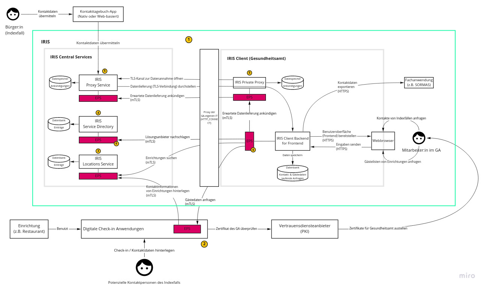
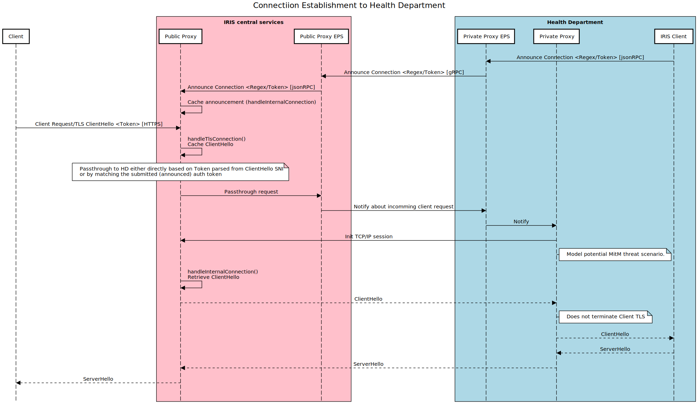

# Dokumentation IT-Anwendungssicherheitskonzept von IRIS

## Vorwort
Dieses Dokument erklärt das IT-Anwendungssicherheitskonzept von IRIS. 

Es ist inhaltlich in sich geschlossen und soll dem/der Lesenden ein umfassendes Verständnis des IT-Sicherheitskonzepts ohne Hinzunahme weiterer Unterlagen ermöglichen.

Allgemeine und technische Dokumentation für Gesundheitsämter und Lösungsanbieter, die IRIS nutzen möchten befindet sich in den entsprechenden [GitHub-Repositories](https://github.com/iris-connect/).
Der Quellcode von IRIS wird ebenfalls auf GitHub offen einsehbar sein (Open Source) bzw. ist es in Teilen bereits.

Das IRIS-Projekt wurde im Oktober 2020 in Kooperation zwischen dem [Innovationsverbund
Öffentliche Gesundheit](https://www.inoeg.de/) und der [Björn Steiger Stiftung](https://www.steiger-stiftung.de/) gemeinnützig initiiert und finanziert, es
besteht keine Gewinnerzielungsabsicht.


## Status
Dieses Dokument hat **Entwurfsstatus**. Es wird aktiv erarbeitet.

Teile der nachfolgend beschriebenen Komponenten, Prozesse und Maßnahmen sind bereits umgesetzt. 
Manche befinden sich aktuell in der Umsetzung. Andere sind erst geplant und sollen zeitnah umgesetzt werden. 
Eine Kenntlichmachung diesbezüglich ist aktuell nicht vorgesehen.

|Version|Datum|Erläuterung|
|---|---|---|
|v0.1|17.05.2021|Übermitteln an die HiSolutions AG im Zuge des Onboardings
|v0.2| |
Contributions welcome!

---
# Inhaltsverzeichnis
- [Einleitung](#einleitung)
  * [Was ist IRIS?](#was-ist-iris)
  * [Verfolgt IRIS einen zentralen oder dezentralen Ansatz?](#verfolgt-iris-einen-zentralen-oder-dezentralen-ansatz)
- [Systemübersicht](#systemübersicht)
  * [Akteure (Actors)](#akteure-actors)
  * [Komponenten (Components)](#komponenten-components)
  * [Prozesse (Processes)](#prozesse-processes)
  * [Sicherheit](#sicherheit)
- [Zu schützende Werte](#zu-schützende-werte)
  * [Datenobjekte (Data Objects)](#datenobjekte-data-objects)
  * [Prozessobjekte (Process Objects)](#prozessobjekte-process-objects)
- [Angreifer, Bedrohungen und Annahmen](#angreifer-bedrohungen-und-annahmen)
  * [Angreifer, Angreiferpotential, Motivation und Ziele](#angreifer-angreiferpotential-motivation-und-ziele)
  * [Bedrohungen (Threats)](#bedrohungen-threats)
  * [Annahmen (Assumptions)](#annahmen-assumptions)
- [Sicherheitsziele (Objectives)](#sicherheitsziele-objectives)
- [Sicherheitsanforderungen (Requirements)](#sicherheitsanforderungen-requirements)
- [Maßnahmen (Mitigations)](#maßnahmen-mitigations)
  * [Definition der Maßnahmen](#definition)
  * [Zuordnung der Maßnahmen zu den Sicherheitszielen](#zuordnung-zu-den-sicherheitszielen)
  
---


# Einleitung
## Was ist IRIS?
IRIS ist eine digitale Schnittstelle zum Einsatz in Gesundheitsämtern. Sie ermöglicht digital erfasste Daten von
Bürgern und Veranstaltungsorten im Rahmen eines aktuellen Pandemiegeschehens im Bedarfsfall anzufragen und zur
Weiterverarbeitung an die in den Gesundheitsämtern verwendeten Fachanwendungen zu übergeben.

Der Fokus von IRIS liegt auf einem offenen pluralistischen Charakter: Eine Vielzahl innovativer Lösungen und Anbieter
haben sich seit März 2020 mit einer breiten Lösungspalette zur digitalen Kontaktdatenerfassung etabliert.
Zum einen gibt es auf Seiten der Bürger:innen und Einrichtungsbetreibenden viele digitale Lösungen, die
Pandemie-relevante Daten aus verschiedensten Anwendungsszenarien vorhalten. Zum anderen existieren auch auf Seiten der
Gesundheitsämter gute digitale Fachanwendungen, um schnell agieren zu können.

IRIS fungiert hier als Gateway für all diese Lösungen, um die Daten sicher und standardisiert an die Fachanwendungen
im Gesundheitsamt zu übergeben. Mit dem Ziel, die Mitarbeitenden im Gesundheitsamt an den Stellen zu entlasten,
die digital, datenschutzrechtlich und CoronaSchVO-konform möglich sind.

## Verfolgt IRIS einen zentralen oder dezentralen Ansatz?
IRIS verfolgt deswegen **einen dezentralen Ansatz**.

Das Aufbauen einer **sicheren** kritischen Infrastruktur gilt in der IT als anspruchsvolle Aufgabe.
Das Aufbauen einer **sicheren** und gleichzeitig **dezentralen** kritischen Infrastruktur bildet die Königsdisziplin.
Wenn auch die erstgenannte Variante meist einen geringeren Aufwand in der Entwicklung bedeutet, ist sie nicht nachhaltig, weil mit höheren Risiken für Sicherheit, Datenschutz und Robustheit des Gesamtsystems verbunden.

Deswegen verfolgt IRIS einen dezentralen Ansatz bei der Architektur, Kommunikation und Datenhaltung.
So ist z.B. vorgesehen, dass Lösungsanbieter und Bürger:innen angefragte Daten direkt an ein Gesundheitsamt übersenden können, anstatt dafür das zentrale Gateway als Kommunikationsvermittler in
Anspruch zu nehmen.

In seiner **ersten Ausbaustufe** stellt IRIS zunächst noch Komponenten und Dienste bereit, die zentral organisiert und betrieben werden.
Das hat verschiedene Gründe, auf die in diesem Papier eingegangen wird. Diese zentralen Komponenten werden in den **nächsten Ausbaustufen** Schritt für Schritt durch dezentrale Entsprechungen ersetzt.

# Systemübersicht
Dieses Kapitel gibt eine Übersicht über IRIS und die darin vorliegenden IT-Komponenten, Akteure und Anwendungsfälle (Use cases).

IRIS besteht aus
* Einem zentralen Gateway, bei dem alle teilnehmenden digitalen Lösungen "registriert" sind. Dieses Gateway stellt den
  angeschlossenen Gesundheitsämtern und Anbietern zentrale Services bereit, z.B. das Vermitteln von Anfragen aus den
  Gesundheitsämtern an die angeschlossenen Lösungen und das Rück-Vermitteln der angefragten Daten an die
  Gesundheitsämter.
* Einer Benutzerschnittstelle in den Gesundheitsämtern (Client), über die Mitarbeitende die erfassten Daten der
  Bürger:innen und Einrichtungen anfragen und abrufen können.

IRIS tritt als Vermittler zwischen den Gesundheitsämtern und den verschiedenen digitalen Lösungen auf.
Es erfolgt insbesondere keine zentrale Speicherung der übermittelten Daten.

Das Verschlüsseln von personenbezogenen Daten findet direkt in der jeweiligen an IRIS angebundenen Anwendung statt.
Das Entschlüsseln erfolgt im IRIS-Client-Backend, also quasi im Gesundheitsamt. Hinzu kommt Transportverschlüsselung
mittels TLS/HTTPS. Im IRIS-Client liegen die Daten dann unverschlüsselt. Vor der Datenabfrage durch ein Gesundheitsamt
liegen diese ausschließlich bei der angebundenen Anwendung und nicht im IRIS-System.

*Schaubild der Akteure, Komponenten und typischen Use Cases von IRIS*


## Akteure (Actors)
Nachfolgend werden die Akteure aufgeführt und erläutert, die im IRIS-System vertreten sind:

### Kurzreferenz der Akteure

|ID|Erläuterung|
|---|---|
|A.HealthDepartment| Gesundheitsamt (GA)
|A.HealthDepartment.Admin| Administrator:innen des GA
|A.HealthDepartment.Employee| Mitarbeitende des GA (ex Administrator:innen)
|A.HealthDepartment.SrvProv| IT-Dienstleister eines GA
|A.IRISSrvProvider| IT-Dienstleister (Hoster) von IRIS
|A.DTrust| D-Trust GmbH / Bundesdruckerei GmbH
|A.ExtSecurityAuditor| Externer IT-Sicherheitsprüfer
|A.Callcenter| Support-Callcenter
|A.OnboardingTeam| Onboarding Team der IRIS-Organisation
|A.DevTeam| Das Software-Entwicklungs-Team der IRIS-Organisation
|A.OpenSrcCommunity| Open Source Community um IRIS
|A.SolutionProvider| Anbieter:in einer digitalen Lösung
|A.SolutionUser| Endnutzer:in einer digitalen Lösung|


### Erläuterung der Akteure
### A.HealthDepartment - Gesundheitsamt (GA)
Gesundheitsämter nutzen IRIS, um bei verschiedenen anderen Akteuren digital vorliegende Kontaktdaten oder Gästedaten anzufragen und zu beziehen.
Diese Daten verwenden sie direkt oder in einer digitalen Fachanwendung (z.B. SORMAS), zum Abwickeln einer Kontakt-Nachverfolgung oder Ereignis-Nachverfolgung.

In einem GA können verschiedene Personengruppen unterschieden werden, die im Kontext von Zugriffsrechten gesondert zu betrachten sind:
#### A.HealthDepartment.Admin - Administrator:innen des GA
#### A.HealthDepartment.Employee - Mitarbeitende des GA (ex Administrator:innen)
Unter den Mitarbeitenden kann ggf. weiter zwischen *internen Mitarbeitenden* und *externen Mitarbeitenden* (z.B. vorübergehend unterstützende Soldat:innen der Bundeswehr) unterschieden werden.

### A.ServiceProvider - Dienstleister
#### A.HealthDepartment.SrvProv - IT-Dienstleister eines GA
Viele Gesundheitsämter betreiben ihre IT-Infrastruktur nicht im eigenen Haus, sondern greifen dafür auf einen IT-Dienstleister zurück.
Das kann ein IT-Dienstleister auf kommunaler, Landes- oder Bundesebene sein, der dem Gesundheitsamt Hosting- und PKI-Dienstleistungen anbietet.
#### A.IRISSrvProvider - IT-Dienstleister (Hoster) von IRIS
Die Infrastruktur von IRIS wird von einem externen Dienstleister - der AKDB - betrieben. Die [AKDB](https://www.akdb.de/) ist eine Anstalt des öffentlichen Rechts und ein deutscher IT-Dienstleister für Kommunalverwaltungen.
Sie hostet die Produktiv- und Entwicklungssysteme des IRIS-Systems. Darunter fallen die zentralen Komponenten und Dienste, die nicht von den Lösungsanbieter:innen oder GÄ bzw. dessen IT-Dienstleister
betrieben werden.
#### A.DTrust - D-Trust GmbH / Bundesdruckerei GmbH
Die [D-Trust GmbH](https://www.d-trust.net/) ist der Vertrauensdiensteanbieter der Bundesdruckerei-Gruppe und bietet einen Zertifizierungsservice an.
Sie stellt den an IRIS angeschlossenen Gesundheitsämtern signierte X.509-Zertifikate aus, mit denen sie Daten verschlüsseln,
entschlüsseln und digital signieren können.

Jedes GA benötigt drei Schlüsselpaare bzw. Zertifikate.

1. Ein TLS-Zertifikat. Dieses erhält das GA im Rahmen des Onboardings von der Bundesdruckerei bzw. dessen Vertrauensdienstanbieter D-Trust.
   Alle Kommunikationsverbindungen, die im Kontext von IRIS mit einem GA aufgebaut werden, sind damit auf Transport-Schicht geschützt.
   Die D-Trust wird als CA vorausgesetzt (gepinnt). Andere CAs werden am Ausstellen von Zertifikaten auf die Domain des GA gehindert, indem ein CAA-Record im DNS gesetzt wird.
   Entspricht ein beim Verbindungsaufbau vorgezeigtes Zertifikat nicht den Vorgaben, wird der Verbindungsversuch sofort abgebrochen.

   Details des Zertifikats:
  * Extended Validation (EV)
  * Beinhaltet die Domain des GA
  * Extended key usage: TLS Client Authentication, TLS Server Authentication
  * Subject Alternative Name (SAN) Extension: Mehrere Einträge, welche die Gruppenrollen des Zertifikatsinhabers attestieren (z.B. Gruppe ```health-departments```)
2. Ein Signaturzertifikat. Dieses wird vom GA benutzt, um digitale Signaturen zu erstellen. Siehe dazu M.DigitalSignatures.
3. Ein E2E-Encryption-Zertifikat. Mit dem zugehörigen öffentliche Schlüssel können Daten an ein GA auf Anwendungsebene verschlüsselt werden (Inhaltsverschlüsselung).
   Eine zweite Verschlüsselungsschicht auf Anwendungsebene zusätzlich zur Transportverschlüsselung mit TLS bringt in bestimmten Use Cases einen Mehrwert.

#### A.ExtSecurityAuditor - Externer IT-Sicherheitsprüfer
Die [Hisolutions AG](https://www.hisolutions.com/) ist ein erfahrener Beratungsspezialist für Security und IT-Management.
Sie prüft das IT-Sicherheitskonzept und versucht ggf. noch nicht identifizierte Risiken aufzudecken, die dokumentiert und anschließend durch angemessenen Maßnahmen mitigiert werden.
#### A.Callcenter - Support-Callcenter
Je nach Auftragsumfang kann den GÄ ein Callcenter bereitgestellt werden, das einen 1st-Level-Support über eine Telefon-Hotline anbietet. 
Dieser Kundenservice wird über die Dienstleistungs-GmbH der Björn Steiger Stiftung angeboten.

### A.IRIS - Die IRIS-Organisation
#### A.OnboardingTeam - Onboarding Team der IRIS-Organisation
Das Onboarding Team ist eine Organisationseinheit innerhalb der IRIS-Organisation, die dafür zuständig ist, neue GÄ und Lösungsanbieter an IRIS anzuschließen und über den gesamten Anbindungsprozess hinweg zu begleiten.
##### IRIS-CA
Die IRIS Organisation betreibt eine selbstsignierte Signing-CA. Jeder Lösungsanbieter muss seinen Public-Key, den er einsetzen möchte von dieser CA im Rahmen des Onboardings signieren lassen bzw. sich ein Zertifikat ausstellen lassen.
Zu jedem Schlüssel hinterlegt der Anbieter einen Identifier (Public-Key-Fingerprint) im Service Directory, wo dieser bspw. von GÄ abgerufen werden kann. Die IRIS-CA wird als CA vom IRIS-Gateway und den GÄ vorausgesetzt (gepinnt).
Entspricht ein beim Verbindungsaufbau vorgezeigter Public-Key nicht den Vorgaben, wird der Verbindungsversuch sofort abgebrochen.
Ebenso wird von den GÄ vorausgesetzt, dass das IRIS Gateway sich beim Aufbau von mTLS-Verbindungen mit einem eigenen, von der IRIS-CA signierten Zertifikat ausweist.

#### A.DevTeam - Das Software-Entwicklungs-Team der IRIS-Organisation
Das Dev-Team ist eine Organisationseinheit innerhalb der IRIS-Organisation, die dafür zuständig ist, den Code und die Architektur von IRIS ständige weiterzuentwickeln und die Entwicklungstätigkeit der Open Source Community zu koordinieren.
#### A.OpenSrcCommunity - Open Source Community um IRIS
Die Open Source Community um IRIS ist eine lose organisierte Gemeinschaft von Personen und Institutionen, die durch Reviews, Programmierung und
Diskussion maßgeblich zur Weiterentwicklung und hohen Qualität von IRIS beitragen, rechtlich gesehen jedoch von der IRIS-Organisation losgelöst sind.

### A.SolutionProvider - Anbieter:in einer digitalen Lösung
Seit Beginn der Pandemie hat sich eine Vielzahl von Anbietern mit einer breiten Lösungspalette zur digitalen Kontakt- und Gästedatenerfassung
auf dem Markt etabliert, die Pandemie-relevante Daten aus verschiedensten Anwendungsszenarien vorhalten.

Anbieter unterscheiden sich in zwei Dimensionen:
* Art der angebotenen Lösung
* Art der Datenhaltung

*Kurzreferenz der Anbieterarten*
<table>
  <tr>
    <th>Art der Lösung</th>
    <th colspan="20">Art der Datenhaltung</th>
  </tr>
  <tr>
    <th></th>
    <th>zentral</th>
    <th>dezentral</th>
  </tr>  <tr>
    <th>Kontaktdaten-Erfassung </th>
    <td></td>
    <td>z.B. <i><a href="https://digitales-wartezimmer.org/">Digitales Wartezimmen</a></i> (Browser),<br> <i><a href="https://de.wikipedia.org/wiki/Corona-Warn-App">Corona-Warn-App</a></i> (mobile App)</td>
  </tr>
  <tr>
    <th>Gästedaten-Erfassung</th>
    <td>z.B. <i><a href="https://www.luca-app.de/">luca-App</a></i></td>
    <td></td>
  </tr>
</table>

Ausgehend von der Art der Lösung, die bereitgestellt wird gibt es
* Anbieter (Kontakttagebuch):  
  Ein Anbieter, der eine Lösung zur Erfassung der Begegnungen einer Privatperson mit anderen Privatpersonen (der Kontakte) bereitstellt. Diese werden von Privatpersonen genutzt.
* Anbieter (Gästeliste):  
  Ein Anbieter, der eine Lösung zur Erfassung des Aufenthalts von Privatpersonen in einer Einrichtung (z.B. einem Restaurant) oder anderweitigen Örtlichkeit bereitstellt. Diese werden von Einrichtungsbetreibenden (z.B. Restaurantinhaber:in und Angestellten) genutzt.

Ausgehend von der Art der Datenhaltung gibt es Anbieter, bei denen
* Daten zentral (in einem Backend) gespeichert werden
* Daten dezentral (z.B. in einer App) gespeichert werden
* Daten in einem Browser eingegeben werden

und von dort jeweils ans Gesundheitsamt übertragen werden können.

Es ergeben sich entsprechend:
* Anbieter (Gästeliste, zentral):  
  Ein Anbieter (Gästeliste), bei dem die Endgeräte der Nutzer:innen über ein Backend (Server) des Anbieters mit dem GA kommunizieren.
* Anbieter (Gästeliste, dezentral):  
  Ein Anbieter (Gästeliste), bei dem die Endgeräte der Nutzer:innen direkt mit dem GA kommunizieren.

#### Anbieter:in Schlüssel
Jeder Lösungsanbieter muss im Rahmen des Onboardings einen Public-Key vorlegen, zu dem er von der IRIS-CA ein signiertes Zertifikat erhält.
Zu jedem Schlüssel wird ein Identifier (Public-Key-Fingerprint) im Service Directory hinterlegt, wo dieser von GÄ abgerufen werden kann.
Die IRIS-CA wird beim Aufbau von mTLS-Verbindungen zum IRIS-Gateway und zu den GÄ vorausgesetzt.
Entspricht ein beim Verbindungsaufbau vorgezeigter Public-Key nicht den Vorgaben, wird der Verbindungsversuch sofort abgebrochen.

### A.SolutionUser - Endnutzer:in einer digitalen Lösung
Endnutzer:innen einer Lösung können Privatpersonen oder Einrichtungsbetreibende (z.B. Restaurantinhaber:in und Angestellte) sein.
Sie können analog zu den Lösungsanbietern daran genauer unterschieden werden, welchen Art der Datenhaltung und des Endgeräts die von ihnen genutzte Lösung vorsieht. Also mobile App, Browser oder mittelbar über ein zentrales Backend.

## Komponenten (Components)
### C.IRIS.ProdEnv - Produktivsystem von IRIS
Das Produktivsystem läuft auf einem eigenen Kubernetes Cluster beim IT-Dienstleister von IRIS. Es beinhaltet die zentralen Komponenten und Dienste. 
Diese sind in [C.IRIS.CentralServices](#ciriscentralservices---zentrale-komponenten-und-dienste-iris-gateway) beschrieben.

### C.IRIS.StagingEnv - Das Stangingsystem von IRIS
Das Stangingsystem läuft auf einem eigenen Kubernetes Cluster beim IT-Dienstleister von IRIS. Es beinhaltet die gleichen Komponenten wie das Produktivsystem. 

### C.GA.IRISClient - IRIS-Client eines Gesundheitsamts
Der IRIS-Client stellt eine Benutzeroberfläche bereit, mit der Mitarbeitenden des GA IRIS aus einem Browser heraus nutzen können. 
Er wird auf einem Server im Gesundheitsamt (bzw. bei dessen IT-Dienstleister) installiert.

Der IRIS-Client besteht im weiteren Sinne aus folgenden Komponenten, die später näher betrachtet werden:
* Einem Frontend-Server
* Einem Backend-Server
* Dem Private Proxy des GA
* Dem EPS des GA

Weiterhin hat er folgende Laufzeit-Abhängigkeiten, die in diesem Dokument nur stellenweise näher betrachtet werden:
* Eine PostgreSQL-Datenbank: Das Backend benutzt eine PostgreSQL-Datenbank für die Verwaltung der Benutzer und für die Speicherung der offenen Kontaktdaten- und Gästedaten-Anfragen.
* Einen Webserver: Für die Bereitstellung des Frontends über eine sichere TLS-Verbindung wird ein Webserver benötigt. 
  Dieser muss in der Lage sein die statische Webanwendung auszuliefern und Anfragen an das Backend weiterzuleiten.
* Proxy Server: In vielen GÄ werden ausgehende Verbindungen über einen Proxy-Server geroutet. 
  Der IRIS-Client stellt eine Konfigurationsmöglichkeit dafür zur Verfügung.

#### C.GA.IRISClient.FE - Frontend des IRIS-Clients
#### C.GA.IRISClient.BE - Backend des IRIS-Clients
#### C.GA.PrivateProxy - Private Proxy eines GA
Jedes GA verfügt über einen Private Proxy.
Dieser nimmt keine TCP-Verbindungen entgegen und verbindet sich stattdessen aktiv mit dem öffentlichen Proxy-Server des IRIS-Gateways, wenn eine Verbindung für ihn verfügbar ist.
Er leitet diese Verbindung (wiederum ohne TLS zu terminieren) an einen internen Server des GA weiter, der sie dann bearbeiten kann.

### C.IRIS.CentralServices - Zentrale Komponenten und Dienste (IRIS-Gateway)
Die zentralen IRIS-Komponenten und -Dienste werden vom externen IT-Dienstleister von IRIS gehostet.
#### C.IRIS.EPS - Endpoint Server und Public Proxy
Der EPS des IRIS-Gateways kommuniziert mit den EPS-Komponenten der Gesundheitsämter und Anbietern bzw. Clients. Er bietet einen TLS-Passthrough-Proxy-Dienst, der eingehende TLS-Verbindungen von öffentlichen Clients an einen internen Server in einem Gesundheitsamt weiterleiten kann, ohne die TLS-Verbindung zu terminieren.
Der EPS beinhaltet einen öffentlichen Proxy, der im IRIS-Gateway steht. Dieser nimmt auf einem öffentlich zugänglichen TCP-Port eingehende TLS-Verbindungen entgegen, und auf einem anderen TCP-Port Verbindungen von privaten Proxy-Servern.

#### C.IRIS.ServiceDir - Service Directory (Serviceverzeichnis)
##### Allgemeines
Das Service Directory ist ein zentraler Dienst mit angeschlossener Datenbank, die Informationen darüber enthält, welche Anbieter und GÄ an IRIS angeschlossen sind, wie diese erreicht werden können und welche Dienste sie anbieten. 
Es ist aus einer Reihe von Änderungsdatensätzen aufgebaut. Jeder Änderungssatz enthält den Namen eines Akteurs, einen Abschnitt und die eigentlichen Daten, die geändert werden sollen.

Mithilfe des Service Directory können Betreiber von EPS-Komponenten (GÄ, Anbieter, zentrale IRIS-Dienste) feststellen, ob und wie sie sich mit einem anderen EPS-Server verbinden können. 
Betreiber, die nur über ausgehende Verbindungen verfügen - in der Regel GÄ -, können das Service Directory nutzen, um zu erfahren, dass sie möglicherweise asynchrone Antworten von anderen EPS-Betreibern (z.B. dem Location Service) erhalten und dann ausgehende Verbindungen zu diesen herstellen, über die sie Antworten erhalten können. 
Betreiber können das Service Directory auch verwenden, um festzustellen, ob sie eine Nachricht von einem bestimmten anderen Betreiber annehmen sollen.

Der EPS des Service Directory stellt einen JSON-RPC-Server bereit, der als Kommunikationsschnittstelle für alle Betreiber dient. 
Neue Datensätze können über dessen JSON-RPC-API an das Service Directory übermittelt und bestehende darüber abgerufen werden.

##### Sicherheit
Alle Änderungen im Service Directory werden **kryptografisch signiert**. Dazu besitzt jeder Akteur im EPS-System ein Paar ECDSA-Schlüssel und ein dazugehöriges Zertifikat. 
Das Service Directory akzeptiert Änderungen nur dann, wenn sie vom richtigen Akteur signiert worden sind. 
Umgekehrt müssen auch Akteure, die Daten vom Service Directory abrufen zunächst deren Signatur verifizieren, bevor sie sie weiter verarbeiten.
Genaueres zu den Schlüsseln und dem Signieren erläutern [M.PKI](#mpki---einsatz-von-pki) und [P.UpdateSvcDir](#psvcdirupdate---aktualisieren-des-datenbestands-des-service-directory).

Zusätzlich implementiert das Service Directory einen **gruppenbasierten Berechtigungsmechanismus**. 
Derzeit existieren nur Ja/Nein-Berechtigungen (d.h. ein Mitglied einer bestimmten Gruppe kann eine bestimmte Dienstmethode entweder aufrufen oder nicht). 
Feinkörnigere Berechtigungen (z.B. damit ein Anbieter von Kontaktverfolgungen nur seine eigenen Einträge im Dienst "location" bearbeiten kann) müssen von den Diensten selbst (in iesem Fall vom Locations Service) implementiert werden. 
Zu diesem Zweck stellt jeder EPS dem jeweils angeschlossenen Dienst Informationen über die aufrufende Gegenstelle zur Verfügung. 
Diese enthalten den aktuellen Eintrag des Aufrufers aus dem Service Directory, sodass der aufgerufene Dienst den Aufrufer leicht identifizieren und autorisieren kann.

#### C.IRIS.LocationService (Einrichtungsverzeichnis)
Der Location Service verwaltet einen Index der Örtlichkeiten, die bei den verschiedenen App Anbietern registriert sind.
Auf diese Weise können die GÄ Anfragen stellen, und den Mitarbeitern eine vereinfachte Suchoberfläche bieten, die die benötigte Zeit für eine Kontaktnachverfolgung reduziert.
#### C.IRIS.Datenbank - Datenbank der zentralen Dienste
Die zentralen Dienste verfügen über seperate oder gemeinsame Datnbanken (PostgreSQL), in denen sie Daten persistieren. 
Aktuell werden weder die Datenbank, noch die Verbindungen zwischen ihr und den zentralen Diensten verschlüsselt.

#### C.SolProv.EPS - EPS eines Anbieters
Die Anbieter-Komponenten werden vom Anbieter selbst gehostet und verwaltet.

Der EPS dient dem Anbieter als zentrale Kommunikationsschnittstelle im IRIS-System. Der EPS verwaltet die Authentifikation und Verschlüsselung der Verbindung zu den Gesundheitsämtern auf Transportebene und stellt sicher, dass Zertifikate und Schlüssel korrekt geprüft wurden, bevor Anfragen für den Anbieter überhaupt sichtbar gemacht werden.

#### C.SolProv.Backend - Backend eine Anbieters
Anbieter betreiben in der REgel ein eigenes Backend, das über den [C.SolProv.EPS](#csolproveps---eps-eines-anbieters) an das IRIS-System angeschlossen ist. 
Das Backend verfügt immer über einen gRPC-Server, mit dem es mit der gRPC-Schnittstelle dem EPS des Anbieters spricht, um eingehende Anfragen anzunehmen und zu bearbeiten oder ausgehende Verbindungen zu anderen EPS-Betreibern aufzubauen.

### C.GA.Sol - Fachanwendung eines GA
Eine vom GA eingesetzte digitale Fachanwendung (z.B. Octowear oder SORMAS), in die die Daten, welche durch IRIS ermittelt wurden eingespeist werden.

### C.SolProv.Sol - Digitale Lösung eines Anbieters
#### C.SolProv.Sol.Central - Lösung mit Backend (lokale oder zentrale Datenhaltung)
z.B. Webanwendung wie Digitales Wartezimmer oder das Gäste-Tracing-System der Pizzeria Mio
#### C.SolProv.Sol.Local - Mobile App (lokale Datenhaltung)
Mobile Apps und Web-Apps (Kontakttagebücher)

## Prozesse (Processes)
Im Folgenden werden die Prozesse beschrieben, die es bei IRIS gibt. Die Übersicht erfolgt auf zwei Abstraktionsstufen:
* Zunächst werden allgemeine Anwendungsfälle (Use Cases) beschrieben
* Darauf aufbauend erfolgt eine differenzierte Betrachtung der involvierten Teilprozesse

*Kurzübersicht der Prozesse bei IRIS*

|ID | Prozess| Erläuterung
|---|---|---|
|P.Onboarding.HD | Onboarding eines GA| Ein GA wird an IRIS angeschlossen.
|P.Onboarding.HD.Certs | Ausgabe von Zertifikaten an ein GA| Das GA beantragt in einem geregelten Verfahren Zertifikate bei der D-Trust. Diese validiert die Identität des GA in einem sogenannten [Extended Validation (EV)](https://en.wikipedia.org/wiki/Extended_Validation_Certificate) Verfahren und übersendet anschließend die ausgestellten Zertifikate.
|P.Onboarding.HD.SvcDir | Eintragen eines GA im Service Directory| Das Rollout-Team trägt ein GA im Service Directory ein. Anschließend ist es für Anbieter erreichbar.
| | |
|P.Onboarding.SolProv | Onboarding eines Lösungsanbieters| Ein Lösungsanbieter wird an IRIS angeschlossen.
|P.Onboarding.SolProv.Org | Organisatorisches Onboarding eines Anbieters| Das Rollout-Team und der Anbieter führen gemeinsam den ersten (organisatorischen) Teil des Onboardings durch. Der Anbieter übergibt dabei die von IRIS angeforderten Unterlagen: Unterschriebene AGB und Code of Conduct, ein Whitepaper, sowie Dokumentation zum Datenschutz- und dem IT-Sicherheitskonzept der Lösung.
|P.Onboarding.SolProv.Certs | Ausgabe von Zertifikaten an einen Anbieter| Das Rollout-Team stellt Zertifikate für einen Anbieter aus. Dabei übermittelt der Anbieter eine Anfrage mit kryptographischem Schlüsselmaterial, für das er Zertifikate zurückerhält.
|P.Onboarding.SolProv.SvcDir | Eintragen eines Anbieters im Service Directory| Das Rollout-Team trägt einen Anbieter im Service Directory ein. Anschließend ist dieser für GÄ erreichbar.   
| | |
|P.SvcDir.Query | Abrufen des Service Directory| Ein GA fordert das Übersenden von Kontaktdaten an. Dieser Prozess wird von GÄ und Anbietern initiiert.
|P.SvcDir.Update | Aktualisieren des Datenbestands des Service Directory | Das Hinzufügen, Ändern oder Entfernen von Einträgen im Service Directory. Dieser Prozess kann von einem GA, Anbieter oder der IRIS-Organisation initiiert werden.
|P.LocationsSvc.Update | Aktualisieren des Datenbestands des Location Service | Das Hinzufügen, Ändern oder Entfernen von Locations, für die ein Lösungsanbieter Dienste erbringt. Dieser Prozess kann von nur von einem Anbieter initiiert werden.
|P.HDRequestData | Stellen einer Anfrage zur Datenübermittlung | Ein GA fordert das Übersenden von Kontaktdaten bei Anbietern an. Dieser Prozess wird nur von GÄ initiiert.
|P.RevokeCert | Widerruf von Zertifikaten | Die IRIS-Organisation widerruft eines ihrer Zertifikate.
|P.OrgSecIncident | Behandeln sicherheitsrelevanter Ereignisse | Das Anstoßen eines geregelten sogenannten Incident Response-Prozesses. Dieser kann durch unterschiedliche Sicherheitsereignisse ausgelöst werden, z.B. durch das Melden einer kritischen Sicherheitslücke oder einen Angriff auf IRIS. 

### Beschreibung der Prozesse
#### P.Onboarding.HD
Im Rahmen des Onboardings werden organisatorische und technische Schritte durchgeführt, an deren Ende ein GA in der Lage ist, IRIS vollumfänglich zu benutzen. 
Dazu zählen
* Das Beantragen der nötigen Zertifikate beim Vertrauensdiensteanbieter für GÄ in Form eines sogenannten [Extended Validation (EV)](https://en.wikipedia.org/wiki/Extended_Validation_Certificate) Verfahrens
* Das Installieren und Konfigurieren des IRIS-Clients beim GA, sowie zugehöriger Zugriffsrechte und Zertifikate
* Das initiale Registrieren des GA im Service Directory

##### P.Onboarding.HD.Certs
##### P.Onboarding.HD.SvcDir

#### P.Onboarding.SolProv
Im Rahmen des Onboardings werden organisatorische und technische Schritte durchgeführt, an deren Ende ein Anbieter in der Lage ist, IRIS vollumfänglich zu benutzen.
Dazu zählen
* Das Beantragen der nötigen Zertifikate bei der IRIS-Organisation in Form eines sogenannten [Certificate Signing Requests (CSR)](https://de.wikipedia.org/wiki/Certificate_Signing_Request)
* Das Installieren und Konfigurieren einer EPS-Komponente beim Anbieter, sowie zugehöriger Zugriffsrechte und Zertifikate
* Das initiale Registrieren des Anbieters im Service Directory durch das Rollout-Team
* Bei Anbietern von Lösungen zur Besuchsdatenerfassung das initiale Eintragen der Einrichtungen, für die Daten verwaltet werden, in den Location Index

*Schaubild des Onboardings für eine Lösung zur Besuchsdatenerfassung und anschließender Anfrage durch ein GA*


##### P.Onboarding.SolProv.Org
##### P.Onboarding.SolProv.Certs
##### P.Onboarding.SolProv.SvcDir
### P.SvcDir.Query - Abrufen des Service Directory
### P.SvcDir.Update - Aktualisieren des Datenbestands des Service Directory
### P.LocationsSvc.Query - Abrufen des Location Service
### P.LocationsSvc.Update - Aktualisieren des Datenbestands des Location Service

### P.HDRequestData
#### HDRequestData.Request - Stellen der Anfrage durch ein GA (Hinweg)

#### HDRequestData.Response - Beantworten der Anfrage durch einen Anbieter (Rückweg)
Es hat sich eine Vielzahl von Anbietern mit einer breiten Lösungspalette zur digitalen Kontakt- und Gästedatenerfassung
etabliert. Da es verschiedene Konzepte gibt, wie die Daten gespeichert (zentral oder dezentral) und verschlüsselt
(symmetrisch oder asymmetrisch) bzw. wie die Schlüssel verwaltet werden (PKI, manuell, etc.) kann keine allgemeingültige
Aussage über den Ablauf getroffen werden.

Vielmehr müssen verschiedene Szenarien unterschieden werden, beispielsweise:

1. Lösung mit zentral gespeicherten Daten, die mit einem öffentlichen Schlüssel des Betreibers verschlüsselt sind:

* Datenabfrage vom Gesundheitsamt geht ein (Location, Zeitraum, öffentlicher Schlüssel des GA) signiert vom GA Zertifikat.
* EPS verifiziert die Abfrage (Autorisierung und Authentifizierung)
* EPS leitet die Abfrage an die App
* App meldet dem Betreiber das Vorliegen einer Datenabfrage vom Gesundheitsamt und verlangt die nötige Interaktion
* Betreiber bestätigt die Abfrage, womit die Daten in seinem Client abgefragt und entschlüsselt werden, um sie dann wieder mit dem GA Schlüssel verschlüsselt an den App-Server zu übertragen
* App-Server leitet die verschlüsselten Daten an den EPS weiter
* EPS leitet die Daten an den IRIS-Client des Gesundheitsamtes (dieser Schritt ist stark vereinfacht...)

2. Lösung mit gespeicherten Daten, die mit dem privaten Schlüsseln eines App-Anbieters verschlüsselt sind:

* Datenabfrage vom Gesundheitsamt geht ein (Location, Zeitraum, öffentlicher Schlüssel des GA) signiert vom GA Zertifikat.
* EPS verifiziert die Abfrage (Autorisierung und Authentifizierung)
* EPS leitet die Abfrage an die App
* App meldet dem Betreiber das Vorliegen einer Datenabfrage vom Gesundheitsamt
* App-Server holt sich den privaten Schlüssel, entschlüsselt die abgefragten Daten, um sie dann wieder mit dem GA Schlüssel zu verschlüsseln
* App-Server leitet die verschlüsselten Daten an den EPS weiter
* EPS leitet die Daten an den IRIS-Client des Gesundheitsamtes (dieser Schritt ist stark vereinfacht...)

### P.RevokeCert
### P.OrdSecIncident

#### Indexfall-Nachverfolgung
Bei einer Indexfall-Nachverfolgung möchte ein GA das Kontakttagebuch einer spezifischen Indexfall-Person (IP) anfragen und verarbeiten. Abhängig von den zu Verfügung stehenden Mitteln der IP werden hier folgende Unterprozesse unterschieden:
Kontakttagebuch-Anfrage über...
- (1) Smartphone App
- (2) Webanwendung


In beiden Fällen findet die erste Kontaktaufnahme zur IP per E-Mail statt. In dieser E-Mail befindet
sich ein Token, der die IP authorisiert, für den bestehenden Nachverfolgungsfall ein Kontakttagebuch beim GA zu hinterlegen.
Der IP ist nun freigestellt, ob sie das Kontakttagebuch per Smartphone-App (z.B. CWA) oder per Webanwendung schickt. In beiden Fällen verlassen sensible Daten der IP das Gerät nur über eine Ende-zu-Ende verschlüsselte Verbindung zum Gesundheitsamt.


*Webanwendung*
Der Nutzer klickt den Link in der E-Mail für die Kontaktübertragung per Webanwendung, und wird direkt zum digitalen Wartezimmer weitergeleitet. Der Link enthält bereits den Token, der den Nutzer als IP gegenüber dem GA ausweist. Außerdem enthält der Token die Domain des GA, dass das Kontakttagebuch angefragt hat.


*Smartphone App*
Der Nutzer scannt mit seinem Smartphone einen in der E-Mail enthaltenen QR Code, der denselben Token enthält wie der Link für die Webanwendung. Verschiedene Kontakttagebücher-Apps (wie z.B. die CWA) können sich auf diese URL registrieren und auf das Scannen des QR-Codes reagieren.


Ist eine kompatible Anwendung (kA) mit dem E-Mail Token gestartet, werden anschließend die verfügbaren GA-Schlüssel und Zertifikate von einem IRIS Server abgerufen. Die kA kann nun die gelieferten Schlüssel auf Authentizität prüfen und zusammen mit der Identität des anfragenden GA aus dem Token eine Ende-zu-Ende verschlüsselte Verbindung zum betreffenden GA aufbauen.


Hat die IP ihre Kontakte eingetragen oder abgerufen, werden diese zusammen mit dem Token mit dem GA-Schlüssel verschlüsselt und über die TLS Verbindung an das GA übertragen.

## Sicherheit
Im folgenden Kapitel werden allgemeine, komponentenübergreifende Sicherheitsmaßnahmen beschrieben. Dazu werden Richtlinien wie der
OWASP Application Security Verification Standard 4.0 (ASVS) oder technische Richtlinien wie BSI TR-03161 für
Sicherheitsanforderungen an digitale Gesundheitsanwendungen hinzugezogen.

## S.TLS - Einsatz von Verschlüsselung auf Transportebene
Alle Kommunikationsverbindungen, die von oder zu IRIS-Komponenten über das Internet aufgebaut werden sind auf der Transportebene mit TLS und starken Cipher-Suites geschützt.

* Direkte Verbindungen zwischen IRIS-Gateway und einem GA
* Direkte Verbindungen zwischen IRIS-Gateway und einem Lösungsanbieter / Client
* Direkte Verbindungen zwischen einem GA und einem Lösungsanbieter / Client
* Indirekte Verbindungen zwischen einem GA und einem Lösungsanbieter / Client über den Broker Proxy

## S.AppLayerEnc - Einsatz von Verschlüsselung auf Anwendungsebene
Zusätzlich zur Transportverschlüsselung besteht die Möglichkeit, Daten auf Anwendungsebene für ein spezifisches GA zu verschlüsseln.

> Todo: Beschreibung der Fälle, in denen eine Anwendungsverschlüsselung erfolgt

## S.Authentication - Einseitige Authentifizierung von Kommunikationspartnern
> Siehe auch S.3 Einsatz von PKI.
> 
Bei jedem Kommunikationsaufbau im IRIS-Ökosystem wird mindestens eine der Parteien über TLS authentifiziert. Dazu wird die definierte PKI verwendet.

## S.MutualAuthentication - Beidseitige Authentifizierung von Kommunikationspartnern
> Siehe auch S.3 Einsatz von PKI.

Wo möglich werden bei einem Kommunikationsaufbau die beteiligten Parteien nicht nur einseitig über TLS, sondern beidseitig über mTLS authentifiziert. Dazu wird die in Maßnahme S.3 definierte PKI verwendet.

## S.OrgSeparation - Organisationelle Trennung
Beim Design von IRIS wurde an mehreren Stellen eine organisationelle Trennung von Vertrauensbereichen angestrebt, um sicherzustellen, dass ein bösartiges Fehlverhalten bzw. die Kompromittierung eines Akteurs alleine nicht ausreicht, um Schaden anzurichten.

1. Organisationelle Trennung beim Ausstellen von Zertifikaten für GÄ:  
   Die IRIS-Organisation ist Betreiber des Public Proxy, der Kommunikation in die GÄ vermittelt.
  * Daher werden die TLS-Zertifikate für die GÄ nicht von der IRIS-Organisation ausgestellt, sondern von einer dritten Stelle, der Bundesdruckerei bzw. D-Trust.
  * Das TLS-Zertifikat wird auf eine Domain ausgestellt, die unter Kontrolle des jeweiligen GA ist.
  * Zusätzlich setzt jedes GA in ihrem DNS einen sogenannten Certificate Authority Authorization (CAA) Record.
    Das ist eine Angabe, die alle CAs darüber informiert, dass nur die D-Trust berechtigt ist, TLS-Zertifikate auf die Domain auszustellen, unter welcher das GA erreichbar ist. Alle CAs müssen sisch daran halten.
  * So wird sichergestellt, dass es selbst im Falle einer Kompromittierung der IRIS-Organisation und des Gateways unmöglich ist, Kommunikation umzuleiten und mit einem TLS-Zertifikat zu entschlüsseln, das von einer anderen CA ausgestellt worden ist, als der D-Trust.
2. Organisationelle Trennung bei Einträgen ins Service Directory:  
   Die IRIS-Organisation ist Betreiber des Service Directory, das sensible Informationen über GÄ oder Anbietern beinhaltet (z.B. deren Public-Key-Fingerprints oder Endpunkte).
   Daher müssen alle darin enthaltenen sensiblen Einträge vom jeweiligen GA bzw. Anbieter mit deren Signaturschlüssel digital signiert werden. Dieser Signaturschlüssel ist ausschließlich dem jeweiligen GA bzw. Anbieter bekannt.
   So wird sichergestellt, dass selbst im Falle einer Kompromittierung des Service Directory die darin enthaltenen Einträge nicht unbemerkt manipuliert werden können.

## S.ExtDataCenter - Externes Rechenzentrum
Die Produktiv- und Entwicklungssysteme werden in einem externen Rechenzentrum der des IT-Dienstleisters von IRIS mit Standort in Deutschland betrieben. Das Rechenzentrum hat redundante Stromversorgung und Internet-Verbindung, sowie mehrere Brandzonen.

Optimierungspotential:
* Geo-Redundanz: Alles läuft in einem RechenzentruS. Es gibt zwar noch einen zweiten Standort, dessen Infrastruktur ist aber noch nicht angeschlossen.
* Verteilen über Brandzonen: Momentan laufen alle VMs gemeinsam in einer Brandzone.

## S.HASetupProd - Hochverfügbarkeits-Setup der Produktivumgebung
Die zentralen Komponenten in der Produktivumgebung werden als Kubernetes-Cluster mit Docker-Containern betrieben.

Durch den Einsatz von Kubernetes wird sichergestellt, dass die Container-Anwendungen automatisiert und angepasst auf die aktuelle Lastsituation skaliert und verwaltet werden können. Das Kubernetes-Cluster wird als High-availability (HA) Cluster mit mehrere Coordinators und Nodes betrieben, auf denen die Services redundant laufen können. Ein Multi-Master-Setup schützt vor einer Vielzahl von Fehlermodi, vom Ausfall eines einzelnen Worker Nodes bis hin zum Ausfall des etcd-Dienstes des Master-Nodes. Dabei werden wichtige Komponenten auf mehrere Master repliziert, sodass bei Ausfall eines Master, die anderen den Cluster am Laufen halten.

Optimierungspotential:
* Die Datenbank ist aktuell nicht im HA-Setup konfiguriert.

## S.AccessControl - Einsatz einer Zugriffsverwaltung
Es sind an mehreren Stellen Benutzer- und Rollenmanagementsysteme vorgesehen, die sicherstellen, dass nur berechtigte Akteure Zugriff auf kritische Komponenten und Prozesse haben.
Dabei werden zwei Arten von Zugriffsverwaltungen eingesetzt:

1. Eine Passwort-basierte Zugriffskontrolle, ggf. mit einer Zwei-Faktor-Authentifizierung für den Zugriff auf Admin-Konsolen bei Dienstleistern der IRIS-Organisation (z.B. beim Zugang Webhosting-Konsolen oder GitHub-Accounts)
2. Eine rollenbasierte Zugriffskontrolle für den Zugriff auf IRIS-Dienste (z.B. beim Ändern von Informationen zu angebotenen Diensten durch einen Anbieter im Service Directory)

Die Vergabe der Berechtigungen erfolgt basierend auf einer Funktionstrennung (Segregation of Duties) und dem Least Privilege-Prinzip.
Ersteres bedeutet, dass unterschiedliche Funktionen unterschiedlichen Rollen zugeordnet werden. Letzteres bedeutet, dass eine Rolle nur die zur Ausübung ihrer Funktion wirklich notwendigen Berechtigungen besitzt.
Insgesamt wird darauf geachtet, dass keine unverhältnismäßige Konzentration von Berechtigungen in einer einzelnen Rolle bzw. bei einer einzelnen Organisationseinheit stattfindet.

Zu den geschützten Komponenten und Prozessen zählen:
* Der administrative Zugriff auf die Infrastruktur beim IT-Dienstleister von IRIS durch Mitglieder der IRIS-Organisation
* Das Ausrollen eines neuen Software-Release auf der Produktivumgebung durch die IRIS-Organisation
* Das Veröffentlichen eines neuen Software-Release durch das Entwicklungs-Team von IRIS
* Das Ausstellen von Zertifikaten für Anbieter durch das Rollout-Team von IRIS
* Das Registrieren von Gesundheitsämtern und Anbietern im Service Directory durch das Rollout-Team von IRIS


## S.SecEventLogging - Protokollieren sicherheitsrelevanter Ereignisse
Sicherheitsrelevante Ereignisse werden von allen Komponenten geloggt. Sicherheitsrelevante Ereignisse umfassen bspw.
* Authentication success / failure
* Authorization (Access Control) Failures
* Session Management Failures, z.B. Cookie Session Modification
* Verwendung von Funktionen mit höherem Risiko, z. B. Hinzufügen oder Löschen von Benutzern, Änderungen von Berechtigungen, Erstellen oder Löschen von Tokens

Sensible Daten wie Passwörter, Schlüsselmaterial oder personenbezogene Daten werden in den Logs nicht vermerkt oder vorher maskiert, gehasht oder verschlüsselt.

## S.SecReview - Externes Review des Sicherheitskonzept
* Das IT-Sicherheitskonzept wurde in Zusammenarbeit mit Experten aus der Fach-Community erarbeitet.
* Zusätzlich wurde die [Hisolutions AG](https://www.hisolutions.com/), ein erfahrener Beratungsspezialist für Security und IT-Management damit beauftragt, das IT-Sicherheitskonzept zu prüfen und ggf. noch nicht identifizierte Risiken aufzudecken.
  Diese werden dokumentiert und durch angemessenen Maßnahmen mitigiert.
* IRIS ist ein Open Source Projekt und unterliegt dadurch der ständigen Aufmerksamkeit der interessierten Fach-Community. Sicherheitslücken und Probleme können in einem geregelten "Responsible Disclosure"-Prozess an die IRIS-Organisation gemeldet werden. So können Probleme behoben werdern bevor sie offengelegt werden.

## S.PenetrationTesting - Durchführen von Penetration Testing
Ein Penetration Testing des IRIS-Systems durch einen externen Dienstleister ist geplant. Aufgedeckte Schwachstellen werden dokumentiert, behoben und die Patches durch Re-Tests verifiziert.

Die geprüften Komponenten, sowie die Testergebnisse werden zu einem späteren Zeitpunkt an dieser Stelle dokumentiert.

## S.LoadTesting - Durchführen von Load Testing
Ein Load- und Performance-Testing ist geplant. Dabei wird eine hohe Nutzlast auf dem System simuliert, um potenzielle Leistungsengpässe (sogenannte Bottlenecks) und Anforderungen an benötigte Resourcen frühzeitig zu identifizieren.
Die Testergebnisse werden zu einem späteren Zeitpunkt an dieser Stelle dokumentiert.

Die geprüften Komponenten, sowie der Testbericht werden zu einem späteren Zeitpunkt an dieser Stelle dokumentiert.

# Zu schützende Werte
Im Folgenden werden die durch Gegenmaßnahmen zu schützende Informationen oder Ressourcen beschrieben.

## Datenobjekte (Data Objects)
Im Folgenden werden die Informationen, die in Form von Daten(objekten) in IRIS vorliegen bzw. durch IRIS hindurch
fließen beschrieben.

Damit ähnliche Datenobjekte später gemeinsam adressiert werden können, werden sie in Datenklassen zusammengefasst:

|ID|Datenklasse| 
|---|---|
|DK.1| Medizinische Daten|
|DK.2| Geheimes Schlüsselmaterial|
|DK.3| Personenbezogene Daten|
|DK.4| Metadaten|
|DK.5| Übermittelte Kontaktdaten|
|DK.6| Übermittelte Gästedaten|

In der folgenden Übersicht werden die Datenobjekte in den verschiedenen Komponenten zusammengetragen.

> Hinweis: Die Übersicht verwendet die Begriffe "Gruppe" und "Untergruppe". Diese sind nicht deckungsgleich mit den zuvor
> definierten "Datenklassen" und sollen nur eine bessere Übersicht ermöglichen.

|ID| Gruppe|Untergruppe| Datenobjekte||
|---|---|---|---|---|
| |Übermittelte Kontaktdaten|||
| | |Meldende Person |Vorname, Nachname, Geburtsdatum, Geschlecht, Straße und Hausnummer, Stadt, PLZ, Telefonnummer, E-Mail-Adresse|
| | | | Angaben zu Enge und Dauer des Kontakts |
| | | | Symptome (Art, Datum Symptombeginn)
| | | | Angaben zu Vorerkrankungen und Schwangerschaft
| | | | Ort des relevanten Kontakts (z.B. Gastronomiebetrieb, religiöse Einrichtung)|
| | | | Datum des relevanten Kontakts|
| | | | Quelle aus der man von dem Kontakt erfahren hat (z.B. persönlicher Kontakt, CWA, öffentliche Einrichtung)|
| | | | IP-Adresse|
| | | | Metadaten|
| | | Kontaktperson|
| | | | Vorname, Nachname, Telefonnummer, E-Mail-Adresse|
| | | | Corona-Testergebnis|
| |Übermittelte Gästedaten||
| | | | Vorname, Nachname, Geburtsdatum, Geschlecht, Straße und Hausnummer, Stadt, PLZ, Telefonnummer, E-Mail-Adresse| |
| | | | Beginn- und Endzeitpunkt des Aufenthalts| |
| | | | Aufenthaltsbereich (z.B. Tischnummer)| |
| | | | Metadaten|
| | | | weitere?| |
| |IRIS Gateway||||
| | | | Domain|
| | | | Domain-Zertifikat|
| | | | Privater Schlüssel des Domain-Zertifikats|
| | | | Signing CA Zertifikat|
| | | | Privater Schlüssel des CA-Zertifikats|
| | | | Proxy-Konfiguration|
| | | Service Directory|||
| | | | Liste der IDs zurückgezogener Zertifikate|
| | | | Bezeichnung des Service-Anbieters (z.B. GA Leipzig, Digitales Wartezimmer)|
| | | | Angebotene Services|
| | | | Service Endpoint|
| | | | Public Key Fingerprint|
| | | Location Service|||
| | | | Kurzbezeichnung der Location (z.B. Pizzeria Mio)|
| | | | Offizielle Bezeichnung (z.B. Pizzeria Mio GmbH)|
| | | | Anschrift|
| | | | Telefonnummer|
| | | | E-Mail-Adresse|
| | | | E-Mail-Adresse Inhaber|
| | | | Vor- und Nachname einer Ansprechperson|
| | | | IDs der verzeichneten Service-Anbieter für die Location|
| | | OCSP Service|
| | | | Zertifikatsperrliste (Certificate Revocation List, CRL)|
| | | EPS|?|
| | | Datenbank|?|
| | | E-Mail-Client|?|
| |GA bzw. dessen IT-Dienstleister||
| | | | Domain|
| | | | Domain-Zertifikat|
| | | | Privater Schlüssel des Domain-Zertifikats|
| | | | DNS-Records für die Domain|
| | | | Client-Zertifikat|
| | | | Liste gültiger (Authentifizierungs-)Tokens|
| | Anbieter||
| | | | (Domain?)Zertifikat|
| | | | Privater Schlüssel des Zertifikats|
| | | | Privater Schlüssel für Application Layer Encryption|
| |IRIS Business IT||
| | | | Whitepaper, Sicherheits- und Datenschutzkonzepte registrierter Lösungen|

> Ggf. kann an dieser Stelle eine weitere Übersicht noch die möglichen Informationsflüsse über vorher zu
> definierende Kommunikationsverbindungen darstellen.

## Prozessobjekte (Process Objects)
### Kurzübersicht
|ID|Erläuterung|
|---|---|
|PO.TLSConnEst| Aufbau einer TLS-Verbindung (TLS-Handshake) zwischen Client und GA
|PO.EPSConnEst| Aufbau einer mTLS-Verbindung zwischen zwei EPS-Komponenten

### Erläuterungen
### PO. TLSConnEst - Aufbau einer TLS-Verbindung (TLS-Handshake) zwischen Client und GA
Das folgende Sequenzdiagramm veranschaulicht den genauen technischen Ablauf des TLS-Handshakes unter Beteiligung der EPS- und Proxy-Komponenten des GA und der zentralen IRIS-Dienste.

*Darstellung des Aufbaus einer TLS-Verbindung vom Client (Browser oder mobile App) in ein GA*


### PO.EPSConnEst - Aufbau einer mTLS-Verbindung zwischen zwei EPS-Komponenten

# Angreifer, Bedrohungen und Annahmen

## Angreifer, Angreiferpotential, Motivation und Ziele
Im Betrieb von IRIS rechnen wir damit, Angreifern der unten genannten Kategorien zu begegnen. Unser Bedrohungsmodell basiert auf den hier genannten Angriffstypen, und die Sicherheitsziele von IRIS sollten unter diesen Angreifermodellen weitgehend unverletzt bleiben.
### Typ 1- Opportunistischer Angreifer
Angreifertyp 1 hat begrenzte technische Mittel und Fähigkeiten, und nimmt keinen gezielten Angriff auf IRIS vor. Stattdessen erwarten wir, dass dieser Angreifertyp die Anwendung auf Neugier untersucht, und versucht undokumentiertes Verhalten aufzudecken und möglicherweise den Betrieb der Anwendung zu stören.

*Fähigkeiten*
- Web Security Basics (Injection, OWASP Top 10 etc.)
-

*Mögliche Entitäten*
- neugierige, technisch kompetente Bürger
- Sicherheitsforscher
- GitHub Nutzer, die die Anwendung testen wollen ohne uns zu informieren
- Großangelegte Malware-Angrifer, die Zero-Days (z.B. Ransomware) nutzen, um möglichst viele Systeme zu infizieren

*Motivationen*
- Ruhm
- Datenschutz

*Ziele*
- die Sicherheit von IRIS verbessern
- den Betrieb von IRIS stören

### Typ 2- Gezielter externer Angreifer
Angreifertyp 2 hat vergleichbare technische Kompetenz wie Angreifer 1, doch plant für bösartige Zwecke IRIS zu kompromittieren. Hierzu gehört unter anderem organisierte Kriminalität. Unter diese Kategorie fällt auch Industriespionage und Sabotage durch Falschmeldungen oder Entwendung von Informationen.

*Fähigkeiten*
- alles von Typ 1
- DDOS
- Phishing

*Mögliche Entitäten*
- technisch kompetente, organisierte Kriminalität
- Industriespione

*Motivationen*
- Geld
- Datendiebstahl

*Ziele*
- Erpressung durch Betriebsstörung
- Wettbewerbsvorteile durch Falschemldung oder leaken von Infektionsdaten

### Typ 4- Insider-Angreifer
Angreifertyp 4 ist aus Angreifertyp 3 angeleitet, mit dem Unterschied, dass dieser Angreifertyp Zugang zu Insiderinformationen (über den Quellcode hinaus) und eventuell sogar zu Produktionssystemen hat. Der Angreifer könnte außerdem auch bei einem App Provider sitzen und dessen Systeme kontrollieren.

*Fähigkeiten*
- alles von Typ 2
- Kontrolle von App Providern
- Kontrolle über einzelne IRIS Systeme

*Mögliche Entitäten*
- verärgerte Mitarbeiter
- bestochene Mitarbeiter

*Motivationen*
- siehe Typ 2
- persönliche Genugtuung

*Ziele*
- siehe Typ 2
- öffentliche Bloßstellung von Projektverantwortlichen/ Politischen Unterstützern

### Typ 5- Nation-State Angreifer
Angreifertyp 5 hat enorme technische Kapazität, inklusive der Möglichkeit von Supply-Chain Angriffen. Das Hauptziel liegt in der Störung der Pandemiebekämpfung.

*Fähigkeiten*
- alles von Typ 3
- Supply Chain Angriffe
- Spear Phishing

*Mögliche Entitäten*
- staatliche Geheimdienste

*Motivationen*
- geopolitische Besserstellung des Angreifers

*Ziele*
- Pandemiebekämpfung behindern


## Bedrohungen (Threats)
### Klassische Bedrohungen
|ID|Bedrohung|
|---|---|
| T.DataLoss| Datenverlust
| T.DataTheft| Datendiebstahl
| T.Malware| Malwarebefall / Viren, Trojaner, ...)
| T.SysFailure| Systemausfall
| T.Personnel| Personeller Ausfall, insbesondere von Administratoren

### Spezifische Bedrohungsszenarien
### T.1 Bösartiger Anbieter
#### T.1.1 Hinzufügen falscher Einrichtungen zum Location Service (Beanspruchen nicht-registrierter Einrichtungen)
##### Szenario
Ein (Gästelisten-)Anbieter fügt (massenhaft) Einrichtungen hinzu, die bisher von keinem anderen Anbieter im Index
registriert worden sind. Auf diesem Weg werden unberechtigte Anfragen eines GAs an Einrichtungen ermöglicht,
die bei IRIS nicht registriert sind. Diese Anfragen erhält der bösartige Anbieter.
##### Motivation
1. Schädigen von konkurrierenden Einrichtungen
2. Behindern der Arbeit an IRIS angeschlossener GÄ
##### Ziele
1. Kenntnis darüber erhalten, ob, wann und wie viele Infektionsfälle bei bestimmten Einrichtungen auftreten.
2. Falsche Gästedaten ins GA übermitteln.

#### T.1.2 Hinzufügen falscher Einrichtungen zum Location Service (Überlagerung registrierter Einrichtungen)
##### Szenario
Ein (Gästelisten-)Anbieter fügt (massenhaft) Einrichtungen hinzu, die bei anderen Anbieter registrierte
Einrichtungen überlagern. Diese Einrichtungen können dabei mit demselben oder leicht abweichendem Namen
(z.B. Str. statt Straße) im Location Service hinterlegt werden. Auf diesem Weg können Anfragen eines GAs an
die Anbieter, die die legitimen Einrichtungen verwalten, abgefangen werden.
##### Motivation
1. Schädigen von konkurrierenden Einrichtungen
2. Behindern der Arbeit an IRIS angeschlossener GÄ
##### Ziele
1. Kenntnis darüber erhalten, ob, wann und wie viele Infektionsfälle bei bestimmten Einrichtungen auftreten.
2. Falsche Gästedaten ins GA übermitteln.

### T.2 Bösartiger Indexfall
#### T.2.1 Übermitteln fingierter Kontaktdaten an ein GA
##### Szenario
Ein Indexfall übermittelt absichtlich falsche Kontaktdaten an ein GA.
##### Motivation
1. Ausgewählte Personen gegenüber einem GA in Erklärungsnot bringen
2. Einschränken der Arbeits- und Bewegungsfreiheit ausgewählter Personen
3. Behindern der Arbeit an IRIS angeschlossener GÄ
##### Ziele
1. Eine unberechtigte Quarantäneanordnung gegen ausgewählte Personen erwirken.

### T.3 Bösartiges IRIS Gateway
#### T.3.1 Kompromittiertes Anbieterverzeichnis
##### T.3.1.1 Impersonation eines Anbieters gegenüber den GÄ
###### Szenario
Ein Angreifer fügt falsche Endpoints und Public-Key-Fingerprints zum Anbieterverzeichnis hinzu bzw. ändert bestehende
Einträge ab. Dadurch werden Anfragen der GÄ an die manipulierten Endpunkte umgeleitet, die unter der Kontrolle des
Angreifers stehen. Der Angreifer tritt hierbei dem anfragenden GA als Anbieter gegenüber (Impersonation), was vom GA
nicht bemerkt wird, weil der Angreifer den Fingerprint seines Public Keys im Anbieterverzeichnis hinterlegt hat.
###### Motivation
1. Reputationsschaden für ausgewählte Anbieter durch Zuliefern falscher Daten verursachen
2. Finanziellen Schaden für ausgewählte Anbieter durch ausbleibenden Traffic verursachen
###### Ziele
1. Falsche Gästedaten und Kontaktdaten ins GA übermitteln.
2. Verletzung der Authentizität eines Anbieters

##### T.3.1.2 DoS-Angriff auf die GÄ
###### Szenario
Ein Angreifer löscht das Anbieterverzeichnis oder hinterlegt falsche Public-Key-Fingerprints zu ausgewählten Anbietern.
Dadurch können die GÄ keine Anbieter mehr erreichen bzw. der Aufbau von mTLS-Verbindungen zu Anbietern schlägt fehl.
###### Motivation
1. Behindern der Arbeit an IRIS angeschlossener GÄ
2. Reputationsschaden für das IRIS Projekt verursachen
3. Finanziellen Schaden bei ausgewählten Anbietern durch ausbleibenden Traffic verursachen
###### Ziele
1. Störung der Verfügbarkeit ausgewählter Anbieter für alle GÄ

#### T.3.2 Kompromittierter Location Service
Diese Bedrohung enthält die Bedrohungen
* T.1.1 (Hinzufügen falscher Einrichtungen zum Location Service (Beanspruchen nicht-registrierter Einrichtungen))
* T.1.2 (Hinzufügen falscher Einrichtungen zum Location Service (Überlagerung registrierter Einrichtungen))

##### T.3.2.1 Diebstahl sensibler Daten zu Einrichtungen
###### Szenario
Ein Angreifer liest sensible Daten aus dem Location Service aus.
###### Motivation
1. Verfolgung vulnerabler (z.B. religiöser, politischer) Gruppierungen
2. Marktanteile der registrierten Anbieter herausfinden
###### Ziele
1. Vertrauliche Adressdaten registrierter Einrichtungen erlangen

#### T.3.3 Kompromittierter EPS

### T.4 Bösartiges Gesundheitsamt
#### T.4.1 Kompromittiertes FE
#### T.4.2 Kompromittiertes BFE
#### T.4.3 Kompromittierter EPS


### T.5 Externe Angreifer
#### T.5.1 DoS-Angriffe
##### T.5.1.1 DoS-Angriff auf zentrale IRIS Komponenten
##### T.5.1.2 DoS-Angriff auf GA-Komponenten
##### T.5.1.3 DoS-Angriff auf Anbieter-Komponenten

### T.6 Injections
#### T.6.1 JSON/CSV-Injection
#### T.6.2 SQL-Injection

## Annahmen (Assumptions)
* Externe CAs sind jederzeit vertrauenswürdig

# Sicherheitsziele (Objectives)
Damit später angemessene Schutzmaßnahmen als Antwort auf die Gefährdungen ergriffen werden können muss zunächst
definiert werden, welche Sicherheitsziele mit den Maßnahmen erreicht werden sollen. Ebenso muss definiert werden,
wie hoch die Bedeutung eines jeden Sicherheitsziels ist.

Dafür werden als erstes folgende Schutzbedarfskategorien definiert:

|Schutzberafskategorie|Erklärung|
|---|---|
|"normal"| Die Schadensauswirkungen sind begrenzt und überschaubar.
|"hoch"| Die Schadensauswirkungen können beträchtlich sein.
|"sehr hoch"| Die Schadensauswirkungen können ein existenziell bedrohliches, katastrophales Ausmaß erreichen.

Der Schutzbedarf eines Objekts, handele es sich dabei um eine Information oder einen Geschäftsprozess, hängt vom
Schutzbedarf derjenigen Informationen und Prozesse ab, für deren Bearbeitung es benötigt wird. Um solche Abhängigkeiten
abzubilden werden folgende Vererbungsprinzipen für den Schutzbedarf definiert:

|Vererbungsprinzip|Erklärung|
|---|---|
|Maximumprinzip (M)| Der Schutzbedarf des betrachteten Objekts ergibt sich aus dem höchsten Schutzbedarf aller ihm untergeordneten Objekte.
|Abhängigkeit (A)| Der Schutzbedarf eines Objekts überträgt sich auf andere Objekte, wenn es von deren Unversehrtheit abhängig ist.
|Verteilungseffekt (V)| Der Schutzbedarf des betrachteten Objekts kann niedriger sein als der Schutzbedarf der einzelnen ihm untergeordneten Objekte.
|Kumulationseffekt (K)| Der Schutzbedarf des betrachteten Objekts ist höher als der Schutzbedarf der einzelnen ihm untergeordneten Objekte.
|Keine Vererbung|

Für Datenobjekte wird der Schutzbedarf (wenn möglich) nicht einzeln, sondern über die Datenklassen bestimmt.
Ein Datenobjekt kann dabei mehreren Datenklassen zugeordnet sein. Ist dies der Fall, so ergibt sich der Schutzbedarf
des Datenobjekts aus dem jeweils höchsten Schutzbedarf der Klassen, denen es zugeordnet wurde (Maximumprinzip).

|Datenklasse|Schutzbedarf|Erklärung| 
|---|---|---|
|Medizinische Daten|sehr hoch||
|Geheimes Schlüsselmaterial|sehr hoch|
|Personenbezogene Daten|hoch||
|Metadaten|normal||
|Übermittelte Kontaktdaten|normal||
|Übermittelte Gästedaten|normal||

Die folgende Übersicht definiert nun die eigentlichen Schutzziele (Objectives) und ordnet sie den Bedrohungen und
Annahmen zu:

|ID|Zielobjekt/Zielgruppe|Schutzziel|Schutzbedarf|Begründung|Bedrohungen|Annahmen|
|---|---|---|---|---|---|---|
| |Service Directory|
|O. | | Vertraulichkeit| normal | Das Service Directory beinhaltet keine vertraulichen Informationen.
|O. | | Integrität| normal
|O. | | Verfügbarkeit| normal
| | Location Service|
|O. | | Vertraulichkeit| hoch
|O. | | Integrität| hoch
|O. | | Verfügbarkeit| normal
|O. | | Unabstreitbarkeit| hoch
| |Transparent Proxy|
|O. | | Vertraulichkeit| normal
|O. | | Integrität| normal
|O. | | Verfügbarkeit| hoch | Kumulationseffekt: Ein GA hat hohe Verfügbarkeitsanforderungen. Da ein Proxy beliebig viele GÄ (jedoch immer mehr als eins) bedient ergibt sich ein sehr hoher Schutzbedarf. Allerdings können mehrere Proxies redundant zur Verfügung gestellt werden. Durch diesen Verteilungseffekt reduziert sich der Schutzbedarf auf ein hohes Niveau.
| |IRIS Datenbank|
|O. | | Vertraulichkeit| normal
|O. | |  Integrität| normal
|O. | |  Verfügbarkeit| normal
| |IRIS Gateway Produktivumgebung|
|O. | | Vertraulichkeit
|O. | | Integrität
|O. | | Verfügbarkeit|sehr hoch|Kumulationseffekt: Wenn die Produktivumgebung nicht verfügbar ist, ist IRIS für alle GÄ und Anbieter nicht mehr nutzbar.
| |Service Directory|
|O. | | Vertraulichkeit| normal
|O. | | Integrität| hoch
|O. | | Verfügbarkeit| normal


> Hinweis: Sollte die Übersicht der Schutzziele zu groß werden kann sie in drei separate Tabellen umstrukturiert werden,
> nämlich für Prozessobjekte, Datenobjekte und Komponenten.


# Sicherheitsanforderungen (Requirements)
|ID|Erläuterung|
|---|---|
| R.RegProvider| Anbieter können IRIS erst nach einer Registrierung der Organisation nutzen
| R.RegHD| Gesundheitsämter können IRIS erst nach einer Registrierung der Organisation nutzen
| R.AuthIRIS| Die Identität des IRIS-Gateways muss von Gesundheitsämtern, Anbietern und Clients eindeutig authentifiziert werden können
| R.AuthEPSGA| Die Identität des öffentlichen Endpunkts eines Gesundheitsamts (der Proxy) muss von Anbietern, Clients und dem IRIS-Gateway eindeutig authentifiziert werden können
| R.TransportConfPers| Die über IRIS übermittelten personenbezogenen Daten dürfen weder am IRIS-Gateway noch im Transit einsehbar sein
| R.TransportConfNonPers| Die über IRIS übermittelten nicht-personenbezogenen Daten dürfen nicht im Transit einsehbar sein
| R.TransportConfNonPers_HDProv| Die über IRIS an ein Gesundheitsamt übermittelten Daten können erst beim Betreiber der GA-IT entschlüsselt werden 
| R.TransportConfNonPers_HD| Die über IRIS an ein Gesundheitsamt übermittelten Daten können erst im GA entschlüsselt werden
| R.DataEconomy| IRIS-Dienste dürfen nur das notwendige Minimum an Daten zur Verfügung stellen, von einem Gesundheitsamt oder Anbieter zur sachgerechte Erfüllung der jeweiligen Aufgabe benötigt wird (Datensparsamkeit)
| R.SpoofingHD| Es muss unmöglich sein, dass die IRIS-Organisation einen GA-Verschlüsselungsendpunkt erstellen und an IRIS-System anbinden kann
| R.AuthDataHD| Die Daten, die in ein Gesundheitsamt eingeliefert werden, müssen einem Vorgang im GA zugeordnet und darüber authentifiziert werden können
| R.HighAvailability| Die (zentralen) IRIS-Dienste müssen hochverfügbar sein und dürfen nur innerhalb festgelegter Zeiten oder zur Hauptbetriebszeit minimal unterbrochen werden.
| R.AbuseDetection| Missbrauch (z.B. Übermitteln falscher Daten an ein Gesundheitsamt) muss detektierbar sein
| R.SecRiskHDApps| Durch den Einsatz von IRIS darf sich kein Sicherheitsrisiko für andere Anwendungen ergeben, die neben IRIS im Gesundheitsamt eingesetzt werden
| R.AccessAuthAutor| Zugriff auf schützenswerte Daten und Funktionen darf nur nach erfolgreicher Authentifizierung und Autorisierung erfolgen
| R.SecEventLogging| Sicherheitsrelevante Ereignisse müssen protokolliert werden
| R.MandatoryAcccessControl| Der Zugang zu Daten und Verwaltungsschnittstellen muss durch Zugangskontrolle geschützt werden
| R.BackupRestore| Es muss ein Datensicherungskonzept (Backup/Restore) implementiert sein
| R.UserRoleMngmnt| Verantwortungsbereiche müssen durch ein Rechte- und Rollenkonzept getrennt werden
## Zuordnung zu den Sicherheitszielen

<table>
  <tr>
    <th>Schutzziel</th>
    <th colspan="20">Maßnahmen</th>
  </tr>
  <tr>
    <td></td>
    <td>M.AAA</td>
    <td>M.BBB</td>
    <td>M.CCC</td>
    <td>M.DDD</td>
  <tr>
    <td>O.AAA</td>
    <td>X</td>
    <td>X</td>
    <td>X</td>
    <td>X</td>
  </tr>
  <tr>
    <td>O.BBB</td>
    <td></td>
    <td>X</td>
    <td></td>
    <td>X</td>
  </tr>
  <tr>
    <td>O.CCC</td>
    <td>X</td>
    <td>X</td>
    <td></td>
    <td>X</td>
  </tr>
</table>
