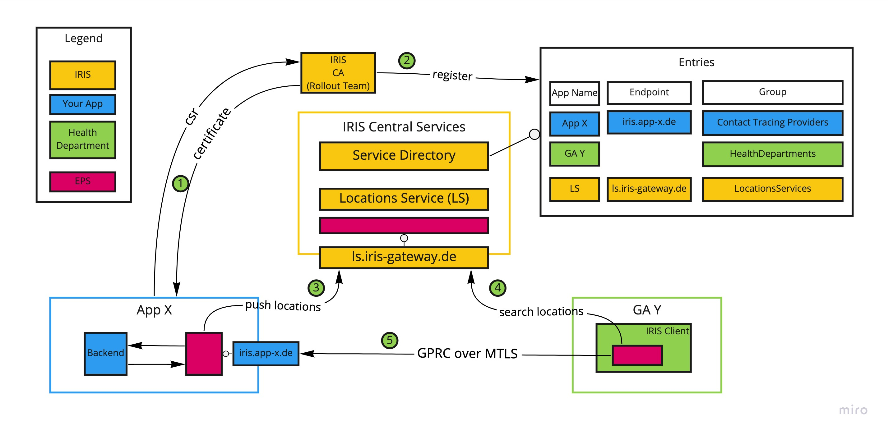

# IRIS Connect
# Technische Sicherheitsdokumentation 

## Vorwort
Dieses Dokument gibt eine technische Sicht auf das Sicherheitskonzept von IRIS Connect und beschreibt die Systemarchitektur, Prozesse, sowie Maßnahmen, mit denen Informationen und die Informationstechnik geschützt werden. Es ist inhaltlich in sich geschlossen und soll dem/der Lesenden ein umfassendes technisches Verständnis der Architektur und der Schutzmaßnahmen ohne Hinzunahme weiterer Unterlagen ermöglichen.

Allgemeine Dokumentation für Gesundheitsämter und Lösungsanbieter, die IRIS Connect nutzen möchten befindet sich in den entsprechenden [GitHub-Repositories](https://github.com/iris-connect/).

Fachliche Fragen zum Inhalt dieses Dokuments dürfen gerne per E-Mail an security@iris-connect.de gestellt werden.

IRIS Connect wurde im Oktober 2020 in Kooperation zwischen dem [Innovationsverbund Öffentliche Gesundheit](https://www.inoeg.de/) und der [Björn Steiger Stiftung](https://www.steiger-stiftung.de/) gemeinnützig initiiert und finanziert.
Es besteht keine Gewinnerzielungsabsicht.

## Status
Version: 1.0  
Datum: 11.06.2021  
Nächste geplante Überarbeitung: KW 25

| Version | Datum | Erläuterung |
|---|---|---|
| v0.1 | 17.05.2021 | Initiale intern kommunizierte Version.
| v1.0 | 11.06.2021 | Bereits vorliegende Vorab-Ergebnisse aus der Projektzusammenarbeit mit der HiSolutions AG wurden eingepflegt. Erste offizielle Version zur Herausgabe.

Hinweis:
> In Ergänzung zur vorliegenden *Technischen Sicherheitsdokumentation* ist derzeit ein Projekt zur Erstellung eines Sicherheitskonzepts nach BSI IT-Grundschutz mit einem externen Partner (der [Hisolutions AG](https://www.hisolutions.com/)) in Gange. 
> Gegenstand des Projektes sind eine Begleitung der Bedrohungsmodellierung, sowie der Erstellung eines Sicherheitskonzeptes nach BSI IT-Grundschutz inkl. einer Risikoanalyse. 

# Inhaltsverzeichnis
- [1 Einleitung](#1-einleitung)
    * [1.1 Was ist IRIS Connect?](#11-was-ist-iris-connect)
    * [1.2 Verfolgt IRIS Connect einen zentralen oder dezentralen Ansatz?](#12-verfolgt-iris-connect-einen-zentralen-oder-dezentralen-ansatz)
    * [1.3 Contributions und Responsible Disclosure](#13-contributions-und-responsible-disclosure)
- [2 Systemübersicht](#2-systemübersicht)
    * [2.1 Abgrenzung des Informationsverbunds](#21-abgrenzung-des-informationsverbunds)
    * [2.2 Allgemeines](#22-allgemeines)
    * [2.3 Akteure (Actors)](#23-akteure-actors)
    * [2.4 Komponenten (Components)](#24-komponenten-components)
    * [2.5 Prozesse (Processes)](#25-prozesse-processes)
- [3 Sicherheit (allgemein)](#3-sicherheit-allgemein)
- [4 Zu schützende Werte](#4-zu-schützende-werte)
    * [4.1 Datenobjekte (Data Objects)](#41-datenobjekte-data-objects)
    * [4.2 Prozessobjekte (Process Objects)](#42-prozessobjekte-process-objects)
- [5 Angreifer und Bedrohungen](#5-angreifer-und-bedrohungen)
    * [5.1 Angreifer, Angreiferpozential, Motivation und Ziele](#51-angreifer-angreiferpotenzial-motivation-und-ziele)
    * [5.2 Spezifische Bedrohungen (Threats)](#52-spezifische-bedrohungen-threats)
- [6 Sicherheitsziele (Objectives)](#6-sicherheitsziele-objectives)
- [7 Sicherheitsanforderungen (Requirements)](#7-sicherheitsanforderungen-requirements)

# 1 Einleitung
## 1.1 Was ist IRIS Connect?
IRIS Connect ist eine digitale Schnittstelle zur sicheren Übertragung von digital erfassten Kontaktdaten wie Kontakttagebücher und Gästelisten an Gesundheitsämter vor dem Hintergrund des aktuellen Pandemiegeschehens. Über  IRIS Connect können diese Daten im Bedarfsfall bei Anwendern von digitalen Lösungen zur Erfassung von Gästelisten und Kontakttagebüchern angefragt und anschliessend zur Weiterverarbeitung an die in den Gesundheitsämtern verwendeten Fachanwendungen übergeben werden.

Hintergrund ist, dass inzwischen eine Vielzahl von Lösungsanbietern digitale Lösungen zur Kontaktdatenerfassung für unterschiedlichste Einsatzszenarien anbieten, die teilweise sehr stark auf die Anforderungen der Gesundheitsämter an die Umsetzung spezifischer Hygienekonzepte zugeschnitten sind. Auf Seiten der Gesundheitsämter haben sich derweil digitale Fachanwendungen bei der Weiterverarbeitung von Kontaktdaten durchgesetzt. Bislang besteht ein Medienbruch zwischen diesen Systemen, der knappe Ressourcen in den Gesundheitsämtern bindet.

IRIS Connect fungiert hier als Schnittstelle, um Kontaktdaten sicher und standardisiert an die Fachanwendungen im Gesundheitsamt zu übergeben mit dem Ziel, die Mitarbeitenden im Gesundheitsamt zu entlasten

## 1.2 Verfolgt IRIS Connect einen zentralen oder dezentralen Ansatz?
IRIS Connect verfolgt nach den Prinzipien Security und Privacy by Design einen **dezentralen Ansatz**. Kontaktdaten werden **Peer-to-Peer** und **Ende-zu-Ende-verschlüsselt** übertragen. Auf den Einsatz zentraler Komponenten wurde bei der Verarbeitung vertraulicher Kontaktdaten verzichtet. Eine solche zentrale Architektur ist nicht nachhaltig, weil damit höheren Risiken für Sicherheit, Datenschutz und Robustheit des Gesamtsystems verbunden sind. Zentrale Datenhaltung ist grundsätzlich anfälliger für Datenpannen, die gleichzeitig einen ausgeweiteten Personenkreis betreffen. Der Ausfall einer zentralen Komponente verursacht einen höheren Verfügbarkeitsschaden für das Gesamtsystem.

Der dezentrale Ansatz bei der Architektur, Kommunikation und Datenhaltung von IRIS Connect sieht beispielsweise vor, dass Lösungsanbieter und Bürger:innen angefragte Daten direkt an ein Gesundheitsamt übersenden können, anstatt dafür einen zentral betriebenen Dienst zur Kommunikationsvermittlung in Anspruch zu nehmen.

## 1.3 Contributions und Responsible Disclosure
IRIS Connect ist Open Source und wird im Rahmen eines Open Development gemeinsam mit der Community weiterentwickelt. Beiträge zum Projekt, ob in Form von Anregungen, Diskussion, Code oder Kritik sind explizit erwünscht und gerne gesehen. Dabei sind die [Contribution Guideline](https://github.com/iris-connect/iris-client/blob/develop/README.adoc#participation) und der [Code of Conduct]((https://github.com/iris-connect/iris-documentation/blob/main/CODE_OF_CONDUCT_community.md) ) für die Community zu beachten.

Sicherheitslücken und andere sicherheitsrelevante Hinweise können in einem geregelten "Responsible Disclosure"-Prozess an das IRIS-Team gemeldet werden. Der Prozess wird in der Security Policy des jeweiligen GitHub-Repository beschrieben. Auf diesem Weg kann die Community dazu beitragen, dass Sicherheitslücken schon behoben sind bevor sie der breiten Öffentlihckeit offengelegt werden.

## 1.4. Anmerkungen
Schutzmaßnahmen (gekennzeichnet mit einem **S**), die sich auf einzelne Akteure, Komponenten oder Prozesse beziehen werden an den entsprechenden Stellen direkt mit dokumentiert.
Allgemeine oder übergreifende Schutzmaßnahmen werden gebündelt in [Kapitel "3 Sicherheit (allgemein)"](#3-sicherheit-allgemein) behandelt.

# 2 Systemübersicht
## 2.1 Abgrenzung des Informationsverbunds
IRIS Connect und dementsprechend der Informationsverbund bestehen aus
* Einer Benutzerschnittstelle in den Gesundheitsämtern (IRIS-Client), über die Mitarbeitende digital erfasste Daten der Bürger:innen und Einrichtungen anfragen und abrufen können.
* Einem verteilten Netzwerk von Endpoint-Servern (EPS), das den verschiedenen Akteuren bei IRIS Connect eine dezentrale und Ende-zu-Ende-verschlüsselte Peer-to-Peer-Kommunikation ermöglicht.
* Einem zentralen Verzeichnisdienst und einem Proxy-Dienst. Lösungsanbieter "registrieren" sich bei dem Verzeichnisdienst und werden so für Gesundheitsämter im IRIS-System für dezentrale Peer-to-Peer-Kommunikation erreichbar. Der Proxy-Dienst hingegen vermittelt Datenlieferungen aus Webbrowsern und Apps, die nicht auf die dezentrale Peer-to-Peer-Kommunikation zurückgreifen können, weiter an in die Gesundheitsämter.

Nicht Gegenstände des Informationsverbunds sind:
* die Apps und Fachanwendungen zur Kontakt- und Gästedatenerfassung. Die Umsetzung angemessener Schutzmaßnahmen liegt in der Verantwortung der jeweiligen App bzw. Fachanwendung. Das IRIS-Team kann keine fachlichen Security-Audits der Apps bzw. Fachanwendungen durchführen, die sich an IRIS Connect anschließen wollen.
* die Fachanwendungen der Gesundheitsämter (z.B. SORMAS). Die Umsetzung angemessener Schutzmaßnahmen liegt in der Verantwortung des Herausgebers der Fachanwendung.
* die Infrastruktur der Gesundheitsämter, die nicht von IRIS oder deren Vorgaben erfasst ist. Die Umsetzung angemessener Schutzmaßnahmen für die Infrastruktur der Gesundheitsämter liegt in der Verantwortung der jeweiligen IT-Verantwortlichen.
* der Webbrowser der Gesundheitsämter. Die Umsetzung angemessener Schutzmaßnahmen für die Infrastruktur der Gesundheitsämter liegt in der Verantwortung der jeweiligen IT-Verantwortlichen.
* die Infrastruktur beauftragter Dritter, wie des Support-Callcenters oder Domain- und Mail-Lösungsanbieters von IRIS Connect. Dabei liegt ersteres im Verantwortungsbereich der Björn Steiger Stiftung als Auftraggeber.

## 2.2 Allgemeines
Das folgende Schaubild visualisiert die Architektur und erklärt die zentralen Bestandteile.

*Schaubild der Akteure, Komponenten und typischen Use Cases von IRIS Connect*

| Nummer | Bezeichnung | Erklärung |
| --- | --- | --- |
|1| IRIS Connect | IRIS Connect unterteilt sich in *IRIS Services* und den *IRIS-Client*. Erstere werden im Rechenzentrum der [AKDB](https://www.akdb.de/) gehostet und vom [IRIS Connect Team](https://github.com/iris-connect) verwaltet. Der IRIS-Client wird mitsamt einer Dokumentation zum Download für die IT-Teams der Gesundheitsämter bereitgestellt. |
|2| Lösung zur digitalen Kontaktdatenerfassung| Ein weiterer wichtiger Teilnehmer in IRIS Connect sind die Lösungen zur digitalen Kontaktdatenerfassung. Diese stammen zum größten Teil aus der Initiative [Wir für Digitaliserung](https://www.wirfuerdigitalisierung.de/). |
|3| Suchregister   (Locations Service) | Damit Einrichtungen, bei denen eine digitale Kontaktdatenerfassung im Einsatz ist vom Gesundheitsamt gefunden werden können, stellt IRIS Connect ein zentrales Suchregister zur Verfügung. Die Daten im Suchregister werden von den Kontaktdatenerfassungs-Lösungen bereitgestellt. |
|4| Service Directory | Das vom IRIS Connect Team verwaltete Service Directory enthält Einträge für alle teilnehmenden Akteure um IRIS Connect. Zudem werden die Berechtigungen der Kommunikationsbeziehungen hier hinterlegt. |
|5| IRIS Proxy Service | Der IRIS Proxy Service ermöglicht es Bürger:innen und Lösungsanbieter, Daten aktiv in ein Gesundheitsamt zu schicken. Dafür stellt der Proxy eine autorisierte Verbindung zwischen einer App bzw. einem Browser und einer Proxy-Komponente im Gesundheitsamt her. Der IRIS-Client im Gesundheitsamt muss dafür keine eingehenden Verbindungen zulassen. |
|6| Endpunktserver (EPS)| Herzstück der Punkt-zu-Punkt Kommunikation ist der IRIS [Endpunktserver (EPS)](https://iris-connect.github.io/eps/docs/). Dabei handelt es sich um eine Komponente, die dezentral bei allen Akteure des IRIS Connect Systems installiert wird. Die Kommunikation erfolgt gesichert über mTLS. |

Personenbezogene Daten werden zwischen den angebundenen Lösungen und den GÄ immer Ende-zu-Ende-verschlüsselt übertragen.
Dafür wird eine Transportverschlüsselung mit TLS/HTTPS eingesetzt bzw. mTLS bei Kommunikation über das EPS-Netzwerk.
Entschlüsselt wird erst im IRIS Client Backend des jeweiligen GA. Der IRIS Proxy Service leitet TLS-Verbindungen weiter an das jeweilige GA, ohne sie zu terminieren (TLS-Passthrough).
Erst im IRIS-Client liegen die Daten dann unverschlüsselt vor.
Zusätzlich ist eine zusätzliche Inhaltsverschlüsselung gemäß Anforderung der Datenschutzkonferenz möglich.

Die Kommunikation im EPS-Netzwerk findet immer in Form von gRPC, das mit mTLS abgesichert ist. Kommunikation zwischen einem EPS und der Komponente, die den EPS nutzt läuft über JSON-RPC, das über TLS abgesichert ist.
Kommunikation zwischen den IRIS Services und Clients (Webbrowser oder Apps), die von Bürger:innen oder Einrichtungsbetreibenden genutzt werden läuft über HTTPS.
Das IRIS Client Frontend im GA (oder genauer gesagt der Webbrowser, in dem die Webanwendung läuft) und das Backend des IRIS-Clients kommunizieren miteinander über HTTPS.

Vor der Datenabfrage durch ein Gesundheitsamt liegen Daten ausschließlich bei der angebundenen Lösung und nicht im IRIS-System.
Es erfolgt insbesondere keine zentrale Speicherung der übermittelten Daten.

## 2.3 Akteure (Actors)
Nachfolgend werden die Akteure aufgeführt und erläutert, die im IRIS-System vertreten sind.

### Kurzreferenz der Akteure

|ID|Erläuterung|
|---|---|
|A.HealthDepartment| Gesundheitsamt (GA)
|A.HealthDepartment.Admin| Administrator:innen des GA
|A.HealthDepartment.Employee| Mitarbeitende des GA (ex Administrator:innen)
|A.HealthDepartment.SvcProv| IT-Dienstleister eines GA
|A.IRISSvcProvider| IT-Dienstleister (Hoster) von IRIS Connect
|A.TrustProv| Vertrauensdiensteanbieter und Zertifikatsstelle
|A.ExtSecurityAuditor| Externer IT-Sicherheitsprüfer
|A.Callcenter| Support-Callcenter
|A.OnboardingTeam| Onboarding Team von IRIS Connect
|A.DevTeam| Software-Entwicklungs-Team von IRIS Connect
|A.OpenSrcCommunity| Open Source Community um IRIS Connect
|A.SolutionProvider| Lösungsanbieter (z.B. einer Anwendung zur Gästedatenerfassung)
|A.SolutionUser| Endnutzer:in einer digitalen Lösung| (Bürger:innen oder Einrichtungsbetreibende)

### Erläuterung der Akteure
### A.HealthDepartment - Gesundheitsamt (GA)
Gesundheitsämter nutzen IRIS Connect, um bei verschiedenen anderen Akteuren digital vorliegende Kontaktdaten oder Gästedaten anzufragen und zu beziehen.
Diese Daten verwenden sie direkt weiter oder überführen sie in eine digitale Fachanwendung (z.B. SORMAS) zwecks Kontakt- oder Ereignisnachverfolgung.

In einem GA können verschiedene Personengruppen unterschieden werden, die im Kontext von Zugriffsrechten gesondert zu betrachten sind:

#### A.HealthDepartment.Admin - Administrator:innen des GA
Die Administrator:innen eines Gesundheitsamts konfigurieren den IRIS-Client des GA und haben umfangreichere Berechtigungen als andere Mitarbeitende, unter anderem Zugriff auf die geheimen Schlüssel (Zertifikate) des jeweiligen GA. 

Das Pflegen der Nutzerverwaltung fällt in den Verantwortungsbereich der Administrator:innen und erfolgt in der Regel in Abstimmung mit den Mitarbeitenden des GA. 
Es muss sichergestellt werden, dass nur berechtigte Personen Zugriff erhalten, eine saubere Trennung von Accounts erfolgt und nicht länger benötigte Accounts entfernt werden. 

#### A.HealthDepartment.Employee - Mitarbeitende des GA (ex Administrator:innen)
Die Mitarbeitenden des GA sind die Endnutzer:innen des IRIS-Clients. Unter ihnen kann im Kontext von Zugriffsrechten ggf. weiter zwischen *internen Mitarbeitenden* und *externen Mitarbeitenden* (z.B. vorübergehend unterstützende Soldat:innen der Bundeswehr) unterschieden werden. 
Das Pflegen der Nutzerverwaltung liegt dabei im Verantwortungsbereich der Administrator:innen des GA, bzw. bei dessen IT-Dienstleister.

##### S.PKI.HealthDepartment
Jedes GA benötigt fünf Schlüsselpaare bzw. Zertifikate. Die ersten zwei Zertifikate werden von der Bundesdruckerei (BDr) bzw. deren Vertrauensdiensteanbieter D-Trust ausgestellt:

1. Ein TLS-Zertifikat für das IRIS-Client-Backend des GA  
   Anwendungsfall: Identität des GA im Internet (TLS/HTTPS). Alle Kommunikationsverbindungen, die im Kontext von IRIS Connect aus einem Browser oder einer App heraus mit einem GA aufgebaut werden, sind damit auf Transportebene geschützt.
   Die D-Trust wird als CA vorausgesetzt (gepinnt). Andere CAs werden am Ausstellen von Zertifikaten auf die Domain des GA gehindert, indem ein CAA-Record im DNS gesetzt wird. Entspricht ein beim Verbindungsaufbau vorgezeigtes Zertifikat nicht den  Vorgaben, wird der Verbindungsversuch sofort abgebrochen. Im Zuge des Antragsprozesses muss eine Organisationsvalidierung (OV) durchlaufen werden.

2. Ein Signaturzertifikat für Vertreter:in des GA  
   Anwendungsfall: Identität des GA im EPS-Netzwerk. Siehe dazu S.DigitalSignatures.

Liegen diese vor, müssen drei weitere Zertifikate vom GA oder dessen IT-Dienstleister, je nachdem, wer den IRIS-Client betreibt, erstellt werden. Dafür ist kein Zutun der Bundesdruckerei nötig.

3. Ein mTLS-Zertifikat für den EPS-Server des IRIS-Client-BFF des GA  
   Anwendungsfall: Absicherung der Kommunikation zwischen EPS-Servern.

4. Ein mTLS-Zertifikat für den EPS-Server des IRIS Private Proxy des GA  
   Anwendungsfall: Absicherung der Kommunikation zwischen EPS-Servern.

5. Ein Ende-zu-Ende-Zertifikat für das IRIS-Client-Backend des GA  
   Anwendungsfall: Umsetzung der Datenschutzkonferenz-Anforderung an Betreiber von digitaler Kontaktdatenerfassung, wonach zusätzlich zur Transportverschlüsselung (TLS) eine zweite Verschlüsselungsschicht auf Anwendungsebene (Inhaltsverschlüsselung) umzusetzen ist.

### A.ServiceProvider - Dienstleister
#### A.HealthDepartment.SvcProv - IT-Dienstleister eines GA
Viele Gesundheitsämter betreiben ihre IT-Infrastruktur nicht im eigenen Haus, sondern greifen dafür auf einen IT-Dienstleister zurück.
Das kann ein IT-Dienstleister auf kommunaler, Landes- oder Bundesebene sein, der dem Gesundheitsamt Hosting- und PKI-Dienstleistungen anbietet.

#### A.IRISSvcProvider - IT-Dienstleister (Hoster) von IRIS Connect
Die Infrastruktur von IRIS Connect wird von einem externen Dienstleister – der AKDB – betrieben. Die [AKDB](https://www.akdb.de/) ist eine Anstalt des öffentlichen Rechts und ein deutscher IT-Dienstleister für Kommunalverwaltungen.
Sie hostet die Produktiv- und Entwicklungssysteme von IRIS Connect. Darunter fallen die zentralen Komponenten und Dienste, die nicht von den Lösungsanbietern oder GÄ bzw. dessen IT-Dienstleistern
betrieben werden.

#### A.TrustProv - Vertrauensdiensteanbieter
Die [D-Trust GmbH](https://www.d-trust.net/) ist der Vertrauensdiensteanbieter der Bundesdruckerei-Gruppe. Sie stellt den an IRIS Connect angeschlossenen Gesundheitsämtern signierte X.509-Zertifikate aus, mit denen sie Daten verschlüsseln,
entschlüsseln und digital signieren können.

#### A.ExtSecurityAuditor - Externer IT-Sicherheitsprüfer
Die [Hisolutions AG](https://www.hisolutions.com/) ist ein erfahrener Beratungsspezialist für Security und IT-Management.
Sie unterstützt bei der Erstellung eines IT-Sicherheitskonzeptes nach IT-Grundschutz sowie einer Bedrohungsmodellierung.

#### A.Callcenter - Support-Callcenter
Je nach Auftragsumfang kann den GÄ ein Callcenter bereitgestellt werden, das einen 1st-Level-Support über eine Telefon-Hotline anbietet.
Dieser Kundenservice wird über die Dienstleistungs-GmbH der Björn Steiger Stiftung angeboten.

### A.IRIS - Das IRIS-Team
#### A.OnboardingTeam - Onboarding Team von IRIS Connect
Das Onboarding Team ist eine Organisationseinheit innerhalb des IRIS-Teams, die dafür zuständig ist, neue GÄ und Lösungsanbieter an IRIS Connect anzuschließen und über den gesamten Anbindungsprozess hinweg zu begleiten.

#### Sicherheit
Das IRIS-Team betreibt eine selbstsignierte Signing-CA (S.PKI.IRIS-CA). Jeder Lösungsanbieter muss im Rahmen des Onboardings einen Certificate Signing Request (CSR) an die IRIS-CA stellen. Diese stellt ihm die nötigen Zertifikate aus.
Die Public-Key-Fingerprint der zugehörigen Schlüssel werden im Service Directory hinterlegt, wo sie von den GÄ abgerufen werden können.
Die IRIS-CA wird von den IRIS Services und den GÄ als einzig mögliche CA vorausgesetzt (gepinnt).
Entspricht ein beim Verbindungsaufbau vorgezeigter Public-Key nicht den Vorgaben, wird der Verbindungsversuch sofort abgebrochen.
Ebenso wird von den GÄ vorausgesetzt, dass die IRIS Services sich beim Aufbau von mTLS-Verbindungen mit einem eigenen, von der IRIS-CA signierten Zertifikat ausweist.

#### A.DevTeam - Das Software-Entwicklungs-Team von IRIS Connect
Das Dev-Team ist eine Organisationseinheit innerhalb des IRIS-Teams, die den Code und die Architektur von IRIS Connect weiterentwickelt und die Entwicklungstätigkeit der Open Source Community koordiniert.

#### A.OpenSrcCommunity - Open Source Community um IRIS Connect
Die Open Source Community um IRIS Connect ist eine lose organisierte Gemeinschaft von Personen und Institutionen, die durch Reviews, Programmierung und
Diskussion maßgeblich zur Weiterentwicklung und hohen Qualität von IRIS Connect beitragen, rechtlich gesehen jedoch vom IRIS-Team losgelöst sind.

### A.SolutionProvider - Lösungsanbieter
Lösungsanbieter schließen sich an IRIS Connect an, um Daten aus ihren Lösungen zur digitalen Kontakt- und Gästedatenerfassung den Gesundheitsämtern zur Verfügung zu stellen. 
Es gibt eine Vielzahl sehr verschiedener Lösungsanbieter. Sie unterscheiden sich in mehreren Dimensionen: Art der angebotenen Lösung, Art der Datenhaltung, Art der Schlüsselverwaltung und Art der Anbindung an IRIS Connect.

Unterscheidung anhand der Art der Anbindung an IRIS Connect:
* Anbindung erfolgt über das EPS-Netzwerk, das eine dezentrale und Ende-zu-Ende-verschlüsselte Peer-to-Peer-Kommunikation mit den GÄ ermöglicht.
* Anbindung erfolgt über IRIS Proxy Service, der Datenlieferungen aus Webbrowsern und Apps, die nicht auf die dezentrale Peer-to-Peer-Kommunikation zurückgreifen können, an GÄ vermittelt.

Unterscheidung anhand der Art der Lösung:
* Lösung zur Erfassung von persönlichen Kontakttagebüchern
* Lösung zur Erfassung von Gästen in einer Einrichtung (z.B. einem Restaurant) oder anderweitigen Örtlichkeit

Unterscheidung anhand der Art der Datenhaltung:
* Daten werden zentral (in einem Backend) gespeichert
* Daten werden dezentral (z.B. in einer App) gespeichert
* Daten werden in einem Browser eingegeben und nach Übermittlung nicht persistiert

#### Sicherheit
Jeder Lösungsanbieter muss im Rahmen des Onboardings einen Public-Key vorlegen, zu dem er von der IRIS-CA ein signiertes Zertifikat erhält (S.PKI.SolProv).
Zu jedem Schlüssel wird ein Identifier (Public-Key-Fingerprint) im Service Directory hinterlegt, wo dieser von GÄ abgerufen werden kann.
Die IRIS-CA wird beim Aufbau von mTLS-Verbindungen zwischen den Lösungsanbietern, den IRIS Services und den GÄ vorausgesetzt.
Entspricht ein beim Verbindungsaufbau vorgezeigter Public-Key nicht den Vorgaben, wird der Verbindungsversuch sofort abgebrochen.

Das Umsetzen angemessener Schutzmaßnahmen in der jeweiligen App bzw. Fachanwendung liegt in der Verantwortung der Entität, die sie zur Verfügung stellt. 
Das IRIS-Team kann explizit keine fachlichen Security-Audits der Apps bzw. Fachanwendungen durchführen, die sich an IRIS Connect anschließen wollen.
Allerdings verlangt das IRIS-Team das Vorlegen eines Whitepapers, as die Lösung beschreibt, sowie ein Datenschutzkonzept und ein Sicherheitskonzept. 
Diese Unterlagen werden vom IRIS-Team aufbewahrt.

### A.SolutionUser - Endnutzer:in einer digitalen Lösung
Endnutzer:innen einer digitalen Lösung können Privatpersonen oder Einrichtungsbetreibende (z.B. Restaurantinhaber:in und Angestellte) sein.
In diesem Dokument werden sie analog zu den Lösungsanbietern daran unterschieden, ob die Lösung, die sie nutzen um Daten an aein Gesundheitsamt zu übermitteln über das EPS-Netzwerk oder den IRIS Proxy Service angebunden ist.

## 2.4 Komponenten (Components)
### C.IRIS.ProdEnv - Produktivsystem von IRIS Connect
Das Produktivsystem läuft auf einem eigenen Kubernetes Cluster beim IT-Dienstleister von IRIS Connect. Es beinhaltet die zentralen Komponenten und Dienste.
Diese sind in [C.IRIS.Services](#cirisservices---zentrale-komponenten-und-dienste-iris-gateway) beschrieben.

### C.IRIS.StagingEnv - Das Stangingsystem von IRIS Connect
Das Stangingsystem läuft auf einem eigenen Kubernetes Cluster beim IT-Dienstleister von IRIS. Es beinhaltet die gleichen Komponenten wie das Produktivsystem.

### C.GA.IRISClient - IRIS-Client eines Gesundheitsamts
#### Allgemeines
Der IRIS-Client setzt sich zusammen aus einem Backend-Server (inkl. EPS) und einem Private Proxy (inkl. EPS). 
Er stellt den Mitarbeitenden des jeweiligen GA eine Benutzerschnittstelle in Form einer Webanwendung bereit, die den Zugang zu IRIS Connect und Interaktion mit den angeschlossenen Lösungsanbietern ermöglicht.
Um den IRIS Client zu nutzen, verwenden Mitarbeitende des GA einen herkömmlichen Webbowser, in dem sie Kontaktdaten der Bürger:innen und Einrichtungen anfragen und entgegennehmen können.
Der Browser baut dabei eine HTTPS-Verbindung zum IRIS-Client auf, der entweder direkt auf einem Server im Gesundheitsamt oder bei dessen IT-Dienstleister installiert ist.
Dieser kommuniziert wiederum über seinen EPS bzw. den Private Proxy des GA nach draußen.

Der IRIS-Client hat folgende Laufzeit-Abhängigkeiten, die in diesem Dokument nur stellenweise näher betrachtet werden:
* Eine PostgreSQL-Datenbank: Das IRIS Client Backend benutzt eine PostgreSQL-Datenbank für die Verwaltung der Benutzer und für die Zwischenspeicherung der offenen Kontaktdaten- und Gästedaten-Anfragen.
* Einen Webserver: Für die Bereitstellung der Webanwendung über eine sichere TLS-Verbindung wird ein Webserver benötigt.
  Dieser muss in der Lage sein eine statische Webanwendung auszuliefern und Anfragen an das IRIS-Client-Backend weiterzuleiten.
* GA-eigener Proxy Server: In vielen GÄ werden ausgehende Verbindungen über einen Proxy-Server geroutet.
  Der IRIS-Client stellt eine Konfigurationsmöglichkeit dafür zur Verfügung.

##### Sicherheit

Der IRIS-Client implementiert eine passwortbasierte Zugriffsbeschränkung und ein Rollensystem mit den Rollen "Normaler Benutzer" und "Administrator" (s. S.IRISClient.AccessControl). 
Mitarbeitenden des GA müssen sich mit einem Benutzernamen und einem Passwort authentisieren.

Zusätzlich muss die Infrastruktur, auf der der IRIS-Client betrieben wird so konfiguriert werden, dass ein Nutzerzugriff nur aus der Infrastruktur (z.B. IP-Bereich) des jeweiligen GA möglich ist. Das Umsetzen dieser Konfiguration liegt im Verantwortungsbereich des jeweiligen GA bzw. dessen IT-Dienstleisters. 

Die Authentifizierung wird vom Client-Backend-for-Frontend durchgeführt.
Ist ein Benutzer erfolgreich authentifiziert, wird er mit einem JSON Web Token (JWT) im Rahmen seiner Rolle autorisiert und erhält eine Sitzung (Session) im Client.
Informationen für die Authentifikation und Autorisierung werden im weiteren Verlauf der Sitzung mithilfe dieses Tokens ausgetauscht, das bei jeder Anfrage vom Browser mitgeschickt wird.
Es beinhaltet den Nutzernamen des authentifizierten GA-Mitarbeitenden, die Nutzerrolle und die Gültigkeitsdauer des Tokens, nach deren Ablauf die Sitzung entweder ausläuft oder automatisch verlängert wird.
Die Integrität der des Tokens wird mit HMAC512 (Keyed-Hash Message Authentication Code) geschützt und der Hashwert vor jeder Verarbeitung einer Nutzeranfrage vom Client-Backend-for-Frontend überprüft.

Sollte ein Token nach dem Senden an den Browser manipuliert worden sein (z.B. um eine höhere Berechtigung vorzutäuschen), schlägt die Überprüfung fehlt und die zugehörige Anfrage wird verworfen.

#### C.GA.PrivateProxy - Private Proxy eines GA
Jedes GA verfügt über einen Private Proxy, der gemeinsam mit seinem EPS das GA-seitige Gegenstück zum IRIS Public Proxy Service ist. 
Der Private Proxy löst das Problem, das dadurch entsteht, dass viele GÄ keine eingehenden Netzwerkverbindungen beliebigen Ursprungs annehmen können. 
Gleichzeitig müssen Daten auch dynamisch aus Webbrowsern und Apps an Gesundheitsämter geliefert werden können, die über keine eigenen EPS verfügen.
Der Private Proxy löst dieses Problem, indem er eine ausgehende TCP/IP-Standleitung zum IRIS Proxy Service aufbaut und aktiv offen hält. 
Geht eine Datenlieferung in Form einer TLs-Verbindung beim IRIS Proxy Service ein, wird sie über die aufgebaute Standleitung an den Private Proxy des GA weitergereicht. 
Das TLS wird dabei explizit nicht terminiert (TLS-Passthrough). Der Private Proxy stellt die eingehende TLS-Verbindung wiederum an das IRIS-Client-Backend-for-Frontend durch, wo die TLS-Terminierung erfolgt. 

### C.IRIS.Services - Komponenten und Dienste (IRIS Services)
Das Service Directory, der Locations Service und der Proxy Service werden von einem externen IT-Dienstleister von IRIS Connect gehostet.

#### C.IRIS.PublicProxy - IRIS Proxy Service und Endpoint Server

Der IRIS Proxy Service vermittelt TLS-Verbindungen zwischen Clients (Webbrowser, Apps) und dem jeweiligen Gesundheitsamt. Er bietet einen TLS-Passthrough-Proxy-Dienst, der eingehende TLS-Verbindungen von öffentlichen Clients an einen internen Server in einem Gesundheitsamt weiterleiten kann, ohne die TLS-Verbindung zu terminieren.
Der EPS beinhaltet einen öffentlichen Proxy. Dieser nimmt auf einem öffentlich zugänglichen TCP-Port eingehende TLS-Verbindungen entgegen, und auf einem anderen TCP-Port Verbindungen von privaten Proxy-Servern.

#### C.IRIS.ServiceDir - Service Directory (Anbieterverzeichnis)
##### Allgemeines
Das Service Directory ist ein zentraler Verzeichnisdienst mit angeschlossener Datenbank, die Informationen darüber enthält, welche Lösungsanbieter und GÄ an IRIS Connect angeschlossen sind, wie diese erreicht werden können und welche Dienste sie anbieten.
Es ist aus einer Reihe von Änderungsdatensätzen aufgebaut. Jeder Änderungssatz enthält den Namen eines Akteurs, einen Abschnitt und die eigentlichen Daten, die geändert werden sollen.
Mithilfe des Service Directory können Betreiber von EPS-Komponenten (GÄ, Lösungsanbieter, IRIS-Dienste) feststellen, ob und wie sie sich mit einem anderen EPS-Server verbinden können.
Betreiber, die nur über ausgehende Verbindungen verfügen – in der Regel GÄ –, können das Service Directory nutzen, um zu erfahren, dass sie möglicherweise asynchrone Antworten von anderen EPS-Betreibern (z.B. dem Locations Service) erhalten und dann ausgehende Verbindungen zu diesen herstellen, über die sie Antworten erhalten können.
Betreiber können das Service Directory auch verwenden, um festzustellen, ob sie eine Nachricht von einem bestimmten anderen Betreiber annehmen sollen.

##### Sicherheit
###### S.ServiceDir.DigitalSigning - Einsatz digitaler Signaturen
Alle Änderungen im Service Directory werden **kryptografisch signiert**. Dazu besitzt jeder Akteur im EPS-System ein Paar ECDSA-Schlüssel und ein dazugehöriges Zertifikat.
Das Service Directory akzeptiert Änderungen nur dann, wenn sie vom richtigen Akteur signiert worden sind.
Umgekehrt müssen auch Akteure, die Daten vom Service Directory abrufen zunächst deren Signatur verifizieren, bevor sie sie weiter verarbeiten.
Genaueres zu den Schlüsseln und dem Signieren erläutern [A.TrustProv](#atrustprov---vertrauensdiensteanbieter) und [P.UpdateSvcDir](#psvcdirupdate---aktualisieren-des-datenbestands-des-service-directory).

###### S.ServiceDir.AccessControl - Einsatz einer Zugriffsverwaltung
Zusätzlich implementiert das Service Directory einen **gruppenbasierten Berechtigungsmechanismus**.
Derzeit existieren nur Ja/Nein-Berechtigungen (d.h. ein Mitglied einer bestimmten Gruppe kann eine bestimmte Dienstmethode entweder aufrufen oder nicht).
Feinkörnigere Berechtigungen (z.B. damit ein Lösungsanbieter von Kontaktverfolgungen nur seine eigenen Einträge im Dienst "location" bearbeiten kann) müssen von den Diensten selbst (in iesem Fall vom Locations Service) implementiert werden.
Zu diesem Zweck stellt jeder EPS dem jeweils angeschlossenen Dienst Informationen über die aufrufende Gegenstelle zur Verfügung.
Diese enthalten den aktuellen Eintrag des Aufrufers aus dem Service Directory, sodass der aufgerufene Dienst den Aufrufer leicht identifizieren und autorisieren kann.

#### C.IRIS.LocationsService
Der Locations Service verwaltet einen Index der Örtlichkeiten, die bei den verschiedenen Lösungsanbietern registriert sind. 
Diese Informationen werden immer durch den jeweiligen Lösungsanbieter bereitgestellt. 
Der Locations Service wird vom IRIS-Client angefragt, wenn Mitarbeitende des GA eine Suchanfrage nach einer Einrichtung initiieren.

#### C.IRIS.Database - Datenbank der IRIS Services
Die IRIS Services verfügen über separate oder gemeinsame Datenbanken (PostgreSQL) bzw. Dateispeicher, in denen sie Daten persistieren.

#### C.SolProv.EPS - EPS eines Lösungsanbieters
Der EPS dient dem Lösungsanbieter als zentrale Kommunikationsschnittstelle in IRIS Connect. Der EPS verwaltet die Authentifikation und Verschlüsselung der Verbindung zu den Gesundheitsämtern auf Transportebene und stellt sicher, dass Zertifikate und Schlüssel korrekt geprüft werden.

Die Administration der lokalen EPS-Komponente liegt im Verantwortungsbereich des jeweiligen Lösungsanbieters.

#### C.SolProv.Backend - Backend eines Lösungsanbieters
Lösungsanbieter, die über das EPS-Netzwerk an IRIS Connect angebunden sind betreiben ein Backend, das mithilfe eines EPS an IRIS Connect angeschlossen ist.
Die Kommunikation zwischen dem Backend und dem EPS des Lösungsanbieters findet über JSON-RPC statt, das auf Transportebene mit TLS abgesichert ist.

Die Umsetzung angemessener Schutzmaßnahmen liegt in der Verantwortung des Lösungsanbieters. 
Das IRIS-Team kann keine fachlichen Security-Audits der Apps bzw. Fachanwendungen durchführen, die sich an IRIS Connect anschließen wollen.

### C.GA.SpecializedApp - Fachanwendung eines GA
Eine vom GA eingesetzte digitale Fachanwendung (z.B. Octoware oder SORMAS), in die empfangene Daten aus dem IRIS-Client exportiert und dort weiterverarbeitet werden können.

### C.SolProv.Sol - Digitale Lösung eines Lösungsanbieters
Diese sind in Kapitel "2.3 Akteure" unter "A.SolutionProvider - Lösungsanbieter" beschrieben.

## 2.5 Prozesse (Processes)
Im Folgenden werden ausgewählte Prozesse von IRIS Connect beschrieben. Die Übersicht erfolgt auf zwei Abstraktionsstufen:
* Zunächst werden allgemeine Anwendungsfälle (Use Cases) beschrieben.
* Darauf aufbauend erfolgt wahlweise eine differenzierte Betrachtung der involvierten Teilprozesse.

*Kurzübersicht der Prozesse bei IRIS*

|ID | Prozess| Erläuterung
|---|---|---|
|P.Onboarding.HD | Onboarding eines GA| Ein GA wird an IRIS Connect angeschlossen.
|P.Onboarding.HD.Certs | Ausgabe von Zertifikaten an ein GA| Das GA beantragt in einem geregelten Verfahren Zertifikate beim vorgesehenen Vertrauensdiensteanbieter. Dieser validiert die Identität des GA in einem sogenannten Organization Validation (OV) Verfahren und übersendet anschließend die ausgestellten Zertifikate.
|P.Onboarding.HD.SvcDir | Eintragen eines GA im Service Directory| Das Rollout-Team trägt ein GA im Service Directory ein. Anschließend ist es für Lösungsanbieter erreichbar.
| | |
|P.Onboarding.SolProv | Onboarding eines Lösungsanbieters| Ein Lösungsanbieter wird an IRIS Connect angeschlossen.
|P.Onboarding.SolProv.Org | Organisatorisches Onboarding eines Lösungsanbieters| Das Rollout-Team und der Lösungsanbieter führen gemeinsam den ersten (organisatorischen) Teil des Onboardings durch. Der Lösungsanbieter übergibt dabei die von IRIS Connect angeforderten Unterlagen: Unterschriebene AGB und Code of Conduct, ein Whitepaper, sowie Dokumentation zum Datenschutz- und dem IT-Sicherheitskonzept der Lösung.
|P.Onboarding.SolProv.Certs | Ausgabe von Zertifikaten an einen Lösungsanbieter| Das Rollout-Team stellt Zertifikate für einen Lösungsanbieter aus. Dabei übermittelt der Lösungsanbieter eine Zertifikatsanfrage (sog. Certificate Signing Request). Das Rollout-Team validiert die Identität des Lösungsanbieters und übersendet anschließend die ausgestellten Zertifikate.
|P.Onboarding.SolProv.SvcDir | Eintragen eines Lösungsanbieters im Service Directory| Das Rollout-Team trägt einen Lösungsanbieter im Service Directory ein. Anschließend ist dieser für GÄ erreichbar.
| | |
|P.SvcDir.Query | Abrufen des Service Directory| Ein Akteur fordert Einträge aus dem Service Directory an. Dieser Prozess wird von GÄ und Anbietern initiiert.
|P.SvcDir.Update | Aktualisieren des Datenbestands des Service Directory | Das Hinzufügen, Ändern oder Entfernen von Einträgen im Service Directory. Dieser Prozess kann von einem GA, Lösungsanbieter oder dem IRIS-Team initiiert werden.
|P.LocationsSvc.Update | Aktualisieren des Datenbestands des Location Service | Das Hinzufügen, Ändern oder Entfernen von Locations, für die ein Lösungsanbieter Dienste erbringt. Dieser Prozess kann nur von einem Lösungsanbieter initiiert werden.
|P.HDRequestData | Stellen einer Anfrage zur Datenübermittlung | Ein GA fordert das Übersenden von Kontakt- oder Gästedaten bei Anbietern an. Dieser Prozess wird nur von GÄ initiiert.
|P.RevokeCert | Widerruf von Zertifikaten | Das IRIS-Team widerruft eines seiner Zertifikate.
|P.OrgSecIncident | Behandeln sicherheitsrelevanter Ereignisse | Das Anstoßen eines geregelten sogenannten Incident Response-Prozesses. Dieser kann durch unterschiedliche Sicherheitsereignisse ausgelöst werden, z.B. durch das Melden einer kritischen Sicherheitslücke oder einen Angriff auf IRIS Connect.
|P.Deployment| Deployment eines neuen Software-Release| Das Herausgeben und Einspielen eines neuen Software-Release durch das IRIS-Team.

### Beschreibung der Prozesse

#### P.Onboarding.HD
Im Rahmen des Onboardings werden organisatorische und technische Schritte durchgeführt, an deren Ende ein GA in der Lage ist, IRIS Connect vollumfänglich zu benutzen.
Dazu zählen
* Das Beantragen der nötigen Zertifikate beim Vertrauensdiensteanbieter für die GÄ. Hierbei führt der Vertruensdiensteanbieter eine Organisationsvalidierung durch.
* Das Installieren und Konfigurieren des IRIS-Clients beim GA, sowie zugehöriger Zugriffsrechte und Zertifikate
* Das initiale Registrieren des GA im Service Directory

#### P.Onboarding.SolProv
Im Rahmen des Onboardings werden organisatorische und technische Schritte durchgeführt, an deren Ende ein Lösungsanbieter in der Lage ist, IRIS Connect vollumfänglich zu benutzen.
Dazu zählen
* Das Beantragen der nötigen Zertifikate beim IRIS-Team in Form eines sogenannten [Certificate Signing Requests (CSR)](https://de.wikipedia.org/wiki/Certificate_Signing_Request)
* Das Installieren und Konfigurieren einer EPS-Komponente beim Lösungsanbieter, sowie zugehöriger Zugriffsrechte und Zertifikate
* Das initiale Registrieren des Lösungsanbieters im Service Directory durch das Rollout-Team
* Bei Anbietern von Lösungen zur Besuchsdatenerfassung das initiale Eintragen der Einrichtungen, für die Daten verwaltet werden, in den Location Index

*Schaubild des Onboardings für eine Lösung zur Besuchsdatenerfassung und anschließender Anfrage durch ein GA*

#### HDRequestData.Response - Beantworten der Anfrage durch einen Lösungsanbieter (Rückweg)
Da es verschiedene Ansätze gibt, Daten zu speichern und zu verschlüsseln, kann keine allgemeingültige Aussage über den Gesamt-Prozess getroffen werden. 

Vielmehr müssen verschiedene Szenarien unterschieden werden, beispielsweise:

1. Lösung mit zentral gespeicherten Daten, die mit einem öffentlichen Schlüssel des Betreibers verschlüsselt sind:

* Datenabfrage vom Gesundheitsamt geht ein (Location, Zeitraum, öffentlicher Schlüssel des GA) signiert vom GA Zertifikat.
* EPS verifiziert die Abfrage (Autorisierung und Authentifizierung)
* EPS leitet die Abfrage an die App
* App meldet dem Betreiber das Vorliegen einer Datenabfrage vom Gesundheitsamt und verlangt die nötige Interaktion
* Betreiber bestätigt die Abfrage, womit die Daten in seinem Client abgefragt und entschlüsselt werden, um sie dann wieder mit dem GA Schlüssel verschlüsselt an den App-Server zu übertragen
* App-Server leitet die verschlüsselten Daten an den EPS weiter
* EPS leitet die Daten an den IRIS-Client des Gesundheitsamtes (dieser Schritt ist stark vereinfacht...)

2. Lösung mit gespeicherten Daten, die mit dem privaten Schlüsseln eines App-Lösungsanbieters verschlüsselt sind:

* Datenabfrage vom Gesundheitsamt geht ein (Location, Zeitraum, öffentlicher Schlüssel des GA) signiert vom GA Zertifikat.
* EPS verifiziert die Abfrage (Autorisierung und Authentifizierung)
* EPS leitet die Abfrage an die App
* App meldet dem Betreiber das Vorliegen einer Datenabfrage vom Gesundheitsamt
* App-Server holt sich den privaten Schlüssel, entschlüsselt die abgefragten Daten, um sie dann wieder mit dem GA Schlüssel zu verschlüsseln
* App-Server leitet die verschlüsselten Daten an den EPS weiter
* EPS leitet die Daten an den IRIS-Client des Gesundheitsamtes (dieser Schritt ist stark vereinfacht...)

Im Folgenden werden wir nur den Teilprozess betrachten, der sich zwischen Lösungsanbieter und dem jeweiligen GA ergibt. 
Je nachdem, wie der Lösungsanbieter an IRIS Connect angebunden ist findet die Kommunikation zum GA entweder über das EPS-Netzwerk oder über den IRIS Proxy Service statt, wie zuvor bereits beschrieben.

### Indexfall-Nachverfolgung
Bei einer Indexfall-Nachverfolgung möchte ein GA das Kontakttagebuch einer spezifischen Indexfall-Person (IP) anfragen und verarbeiten. 
Die erste Kontaktaufnahme zur IP erfolgt per E-Mail, die vom GA verschickt wird. In dieser E-Mail befindet sich ein Token, das die IP autorisiert Kontakttagebuchdaten beim zugehörigen GA zu hinterlegen.
Die IP ist nun freigestellt, ob sie das Kontakttagebuch per Smartphone-App (z.B. CWA) oder per Webanwendung (Webseite, z.B. [Digitales Wartezimmer](https://digitales-wartezimmer.org/)) einreicht. In beiden Fällen verlassen sensible Daten der IP das Gerät nur über eine mit TLS Ende-zu-Ende-verschlüsselte Verbindung zum jeweiligen Gesundheitsamt. 

1. Webanwendung
Im Fall der Webanwendung könnte der Nutzer beispielsweise einen Link in der E-Mail anklicken, mit dem er direkt zum digitalen Wartezimmer weitergeleitet wird. Der Link enthält in diesem Fall bereits das Token, das die Datenlieferung an das GA autorisiert. Außerdem enthält das Token die Domain des GA, dass das Kontakttagebuch angefragt hat.

2. Smartphone-App
Im Fall der Smartphone-App kann der Nutzer beispielsweise einen in der E-Mail enthaltenen QR-Code scannen, der einen Link zum Digitalen Wartezimmer inkl. Token enthält. Kontakttagebücher-Apps (wie z.B. die CWA) können sich auf diese URL registrieren und auf das Scannen des QR-Codes reagieren.

Zum Verschlüsseln der Daten wird aus dem Token zuerst die Identität des anfragenden GA herausgelesen und anschließend die verfügbaren kryptografischen Schlüssel dieses GA beim IRIS Service Directory nachgeschlagen. 
Damit kann dann eine mit TLS Ende-zu-Ende-verschlüsselte Verbindung zum anfragenden GA aufgebaut werden. Um die Zuordnung und Authentifizierung der Datenlieferun im GA möglich zu machen wird das Token gemeinsam mit den Kontaktdaten mitgeschickt.

Die Rolle der Tokens beim Aufbau einer TLS-Verbindung aus einem Browser über den IRIS Public Proxy in ein GA wird in Kapitel "4.2 Prozessobjekte" unter "PO.TLSConnEst - Aufbau einer TLS-Verbindung (TLS-Handshake) zwischen Client und GA" beschrieben.

## 3 Sicherheit (allgemein)
Im folgenden Kapitel werden allgemeine, komponentenübergreifende Schutzmaßnahmen beschrieben. Dazu werden Richtlinien wie der
OWASP Application Security Verification Standard 4.0 (ASVS) oder technische Richtlinien wie BSI TR-03161 für
Sicherheitsanforderungen an digitale Gesundheitsanwendungen hinzugezogen. Schutzmaßnahmen, die sich auf einzelne Akteure, Komponenten oder Prozesse beziehen, sind direkt an den entsprechenden Stellen dokumentiert.

## S.ResponsibleDisclosure - Responsible Disclosure Prozess
IRIS Connect ist ein Open Source Projekt und unterliegt dadurch der ständigen Aufmerksamkeit der interessierten Fach-Community.
Sicherheitslücken und andere sicherheitsrelevante Hinweise können in einem geregelten "Responsible Disclosure"-Prozess an das IRIS-Team gemeldet werden.
Der Prozess wird in der Security Policy des jeweiligen GitHub-Repository beschrieben. Auf diesem Weg kann die Community dazu beitragen, dass Sicherheitslücken schon behoben sind bevor sie der breiten Öffentlichkeit offengelegt werden.

## S.DataEconomy - Grundsatz der Datensparsamkeit
IRIS Connect verfolgt die Prinzipien Security und Privacy by Design. Bei der Konzeption der Architektur wurde entsprechend der Grundsatz der Datensparsamkeit mitgedacht.
Kontaktdaten werden **Peer-to-Peer** und **Ende-zu-Ende-verschlüsselt** übertragen. Auf den Einsatz zentraler Komponenten wurde bei der Verarbeitung vertraulicher Kontaktdaten verzichtet.
Eine solche zentrale Architektur ist nicht nachhaltig, weil damit höheren Risiken für Sicherheit, Datenschutz und Robustheit des Gesamtsystems verbunden sind.
Zentrale Datenhaltung ist grundsätzlich anfälliger für Datenpannen, die gleichzeitig einen ausgeweiteten Personenkreis betreffen.

## S.PatchingUpdating - Bereitstellen von Security-Patches und regulären Updates
Es werden regelmäßig neue Versionen der einzelnen Komponenten im Rahmen regulärer Updates und ggf. außerplanmäßige Security-Patches veröffentlicht.

Das IRIS-Team beschafft sich proaktiv Schwachstellen- und Update-Informationen zu den Programmbibliotheken, die bei IRIS-Connect Verwendung finden, um ordnungsgemäße, rechtzeitige Patches für alle betroffenen Systeme durchzuführen.
Dazu sind in den GitHub Repositories beispielsweise Vulnerability Scanner für Docker Container und GitHub Actions konfiguriert, sowie eine Semantic Source Code Analysis Engine konfiguriert. 
Zusätzlich nutzt das IRIS-Team [Dependabot](https://dependabot.com/), ein Industrie-Standard-Tool für Dependency Management, dsa automatisiert über neu bekanntgewordene Sicherheitslücken in verwendeten Programmbibliotheken informiert.

Neue Versionen von verwendeten Programmbibliotheken werden zeitnah nach ihrer Veröffentlichung in IRIS Connect integriert. Das erfolgt im Rahmen eines geregelten Prozesses mithilfe von Dependabot.

## S.AutomaticUpdates
Der IRIS-Client stellt eine Konfigurationsmöglichkeit bereit, die es erlaubt, dass Updates und Security-Patches nach ihrem erscheinen automatisiert heruntergeladen und ohne Zutun der verantwortlichen IT-Administrator:innen aufgespielt werden. 
Dadurch kann beispielsweise die Zeitspanne zwischen Veröffentlichung eines Security-Patches und dem Schließen einer Sicherheitslücke bei einem GA enorm verkürzt werden.
Allerdings ergibt sich dadurch ein Risiko zusätzliches Risiko für den störungsfreien Betrieb des IRIS-Clients, da das Testen der neuen Softwareversion auf einem Testsystem wegfällt.

Die Entscheidung darüber, ob dieses Feature genutzt werden soll und die Risiken für den Betrieb des IRIS-Clients akzeptiert werden liegt im Verantwortungsbereich des jeweiligen GA und ggf. dessen IT-Dienstleisters.

## S.InputValidation - Durchführen von Eingabevalidierung
Alle Daten, die aus potenziell nicht vertrauenswürdigen Quellen stammen werden einer Eingabevalidierung unterzogen. Damit wird sichergestellt, dass nur korrekt geformte Daten in den Arbeitsablauf eines Informationssystems gelangen. Es wird verhindert, dass fehlerhafte Daten beispielsweise in eine Datenbank gelangen und Fehlfunktionen verschiedener nachgelagerter Komponenten auslösen.

## S.StandardTechnology - Einsatz etablierter Standardkomponenten
Wo möglich verwendet IRIS Connect etablierte Datenbanken, Web-Frameworks und Programmbibliotheken.

## S.AbuseReporting - Missbrauchsmeldungen
Trotz aller technischer Maßnahmen kann nicht abschließend ausgeschlossen werden, dass manipulierte Daten ihren Weg in ein GA finden. Vermutet ein GA eine systematisch angelegte Zulieferung von Falschdaten, kann es einen dafür im IRIS-Client vorgesehenen Button nutzen und eine Missbrauchsmeldung an das IRIS-Team absetzen.
Weitere Datenzulieferungen von dem in Verdacht stehenden Lösungsanbieter können bis zur Klärung der Situation durch das GA pauschal abgelehnt werden. 

Nach Meldung eines Missbrauchsverdachts wird sich das IRIS-Team mit dem GA in Verbindung setzen, um die Lage vor Ort zu klären und ggf. Kontakt zum verantwortlichen Lösungsanbieter aufnehmen. Falls sich eine Kompromittierung des Lösungsanbieters bestätigt kann das IRIS-Team technische Maßnahmen einleiten, um die Interaktion dieses Lösungsanbieters in IRIS Connect zu unterbinden, bis die Sicherheitslage erfolgreich behandelt ist.

## S.CommonSenseConstraints - Vernunftbasierte Einschränkungen
Manche Missbrauchsfälle können durch technische Einschränkungen mitigiert werden, die auf gesundem Menschenverstand basieren. 

Beispielsweise kann angenommen werden, dass in GÄ nachts nicht gearbeitet wird. Entsprechend hat das IRIS-Team die Möglichkeit automatisiert zu erkennen, wenn ein GA nachts ein Nutzungsaufkommen zeigt, was auf eine potentielle Kompromittierung mit Malware deuten könnte. Diese Auffälligkeit kann dann frühzeitig mit dem GA geklärt werden.    

## S.TLS - Einsatz von Verschlüsselung auf Transportebene
Alle Kommunikationsverbindungen, die von oder zu IRIS-Komponenten über das Internet aufgebaut werden, sind auf der Transportebene mit TLS und starken Cipher-Suites Ende-zu-Ende-verschlüsselt.

* Verbindungen zwischen IRIS Services und einem GA
* Verbindungen zwischen IRIS Services und einem Lösungsanbieter / Client
* Verbindungen zwischen einem GA und einem Lösungsanbieter / Client
* Verbindungen zwischen einem GA und einem Lösungsanbieter / Client über den IRIS Proxy Service
* Verbindungen zwischen dem Webbrowser eines Mitarbeitenden im GA und dem zugehörigen IRIS Client
* Verbindungen zwischen dem IRIS-Client eines GA und der angeschlossenen Datenbank 

## S.AppLayerEnc - Einsatz von Verschlüsselung auf Anwendungsebene
Zusätzlich zur Transportverschlüsselung besteht die Möglichkeit, Daten auf Anwendungsebene für ein spezifisches GA zu verschlüsseln. 
Das dient der Umsetzung der Datenschutzkonferenz-Anforderung an Betreiber von digitaler Kontaktdatenerfassung, wonach zusätzlich zur Transportverschlüsselung eine zweite Verschlüsselungsschicht auf Anwendungsebene (Inhaltsverschlüsselung) umzusetzen ist.

## S.Authentication - Einseitige Authentifizierung von Kommunikationspartnern
Kommunikationsendpunkte müssen sich bei IRIS Connect immer authentifizieren. Wenn möglich wurde eine beidseitige Authentifizierung der kommunizierenden Endpunkte präferiert (s. nachfolgend S.MutualAuthentication).

Einseitig authentifiziert sind
* Die HTTPS-Verbindungen zwischen dem Browser eines Mitarbeitenden im GA und dem IRIS-Client des jeweiligen GA
* Verbindungen zwischen dem IRIS-Client eines GA und der angeschlossenen Datenbank

## S.MutualAuthentication - Beidseitige Authentifizierung von Kommunikationspartnern
Wo möglich findet beim Aufbau einer Kommunikationsverbindung eine beidseitige Authentifizierung der Endpunkte statt. 

Beidseitig authentifiziert sind
* Die mTLS-Verbindungen im EPS-Netzwerk
* Die HTTPS-Verbindungen zwischen Clients (Webbrowser, Apps) und dem IRIS-Client des jeweiligen GA, wobei der Client sich durch Angabe eines gültigen Tokens gegenüber dem IRIS Client authentisiert
* Die SSH-Verbindungen beim Zugriff des IRIS-Teams auf Produktiv- und Staging-System

## S.OrgSeparation - Organisationelle Trennung
Beim Design von IRIS Connect wurde an mehreren Stellen eine organisationelle Trennung von Vertrauensbereichen angestrebt, um sicherzustellen, dass ein bösartiges Fehlverhalten bzw. die Kompromittierung eines Akteurs alleine nicht ausreicht, um Schaden anzurichten.

1. Organisationelle Trennung beim Ausstellen von Zertifikaten für GÄ:
   Das IRIS-Team ist mittelbar Betreiber des Public Proxy, der Kommunikation in die GÄ vermittelt.
    * Daher werden die TLS-Zertifikate für die GÄ nicht vom IRIS-Team ausgestellt, sondern von einer dritten Stelle, der Bundesdruckerei bzw. D-Trust.
    * Das TLS-Zertifikat wird auf eine Domain ausgestellt, die unter Kontrolle des jeweiligen GA ist.
    * Zusätzlich muss jedes GA im DNS einen sogenannten [Certificate Authority Authorization](https://de.wikipedia.org/wiki/DNS_Certification_Authority_Authorization) (CAA) Record auf die D-Trust CA setzen.
      Dadurch werden alle anderen CAs angehalten, keine TLS-Zertifikate auf die GA-Domain auszustellen. Alle CAs müssen sich daran halten. 
      Das Setzen des CAA ist essenziell, da das IRIS-Team als Betreiber des IRIS Proxy Service, auf den die Domain des GA auflöst technisch in der Lage ist, Domainkontrolle durch String Hosting nachzuweisen.  
    * So wird sichergestellt, dass es selbst im Falle einer Kompromittierung des IRIS-Teams und der IRIS Services es unmöglich ist, Kommunikation umzuleiten und zu entschlüsseln, indem ein TLS-Zertifikat unberechtigterweise von einer anderen CA beantragt wird.
2. Organisationelle Trennung bei Einträgen ins Service Directory:
   Das IRIS-Team ist Betreiber des Service Directory, das sensible Informationen über GÄ oder Anbietern beinhaltet (z.B. deren Public-Key-Fingerprints oder Endpunkte).
   Daher müssen alle darin enthaltenen sensiblen Einträge vom jeweiligen GA bzw. Lösungsanbieter mit deren Signaturschlüssel digital signiert werden. Dieser Signaturschlüssel ist ausschließlich dem jeweiligen GA bzw. Lösungsanbieter bekannt.
   So wird sichergestellt, dass selbst im Falle einer Kompromittierung des Service Directory die darin enthaltenen Einträge nicht unbemerkt manipuliert werden können.

## S.ExtDataCenter - Externes Rechenzentrum
Die Produktiv- und Entwicklungssysteme werden in einem externen Rechenzentrum der des IT-Dienstleisters von IRIS Connect mit Standort in Deutschland betrieben. Das Rechenzentrum hat redundante Stromversorgung und Internet-Verbindung, sowie mehrere Brandzonen.

Optimierungspotential:
* Geo-Redundanz: Alles läuft in einem Rechenzentrum. Es gibt zwar noch einen zweiten Standort, dessen Infrastruktur ist aber noch nicht angeschlossen.
* Verteilen über Brandzonen: Momentan laufen alle VMs gemeinsam in einer Brandzone.

## S.HASetupProd - Hochverfügbarkeits-Setup der Produktivumgebung
Die zentralen Komponenten in der Produktivumgebung werden als Kubernetes-Cluster mit Docker-Containern betrieben.

Durch den Einsatz von Kubernetes wird sichergestellt, dass die Container-Anwendungen automatisiert und angepasst auf die aktuelle Lastsituation skaliert und verwaltet werden können. Das Kubernetes-Cluster wird als High-availability (HA) Cluster mit mehrere Coordinators und Nodes betrieben, auf denen die Services redundant laufen können. Ein Multi-Master-Setup schützt vor einer Vielzahl von Fehlermodi, vom Ausfall eines einzelnen Worker Nodes bis hin zum Ausfall des etcd-Dienstes des Master-Nodes. Dabei werden wichtige Komponenten auf mehrere Master repliziert, sodass bei Ausfall eines Master, die anderen den Cluster am Laufen halten.

Optimierungspotential:
* Die Datenbank ist aktuell nicht im HA-Setup konfiguriert.

## S.AccessControl - Einsatz einer Zugriffsverwaltung
Es sind an mehreren Stellen Benutzer- und Rollenmanagementsysteme vorgesehen, die sicherstellen, dass nur berechtigte Akteure Zugriff auf kritische Komponenten und Prozesse haben.
Dabei werden zwei Arten von Zugriffsverwaltungen eingesetzt:

1. Eine Passwort-basierte Zugriffskontrolle, ggf. mit einer Zwei-Faktor-Authentifizierung für den Zugriff auf Admin-Konsolen bei Dienstleistern des IRIS-Teams (z.B. beim Zugang Webhosting-Konsolen oder GitHub-Accounts)
2. Eine rollenbasierte Zugriffskontrolle für den Zugriff auf IRIS Services (z.B. beim Ändern von Informationen zu angebotenen Diensten durch einen Lösungsanbieter im Service Directory)

Die Vergabe der Berechtigungen erfolgt basierend auf einer Funktionstrennung (Segregation of Duties) und dem Least Privilege-Prinzip.
Ersteres bedeutet, dass unterschiedliche Funktionen unterschiedlichen Rollen zugeordnet werden. Letzteres bedeutet, dass eine Rolle nur die zur Ausübung ihrer Funktion wirklich notwendigen Berechtigungen besitzt.
Insgesamt wird darauf geachtet, dass keine unverhältnismäßige Konzentration von Berechtigungen in einer einzelnen Rolle bzw. bei einer einzelnen Organisationseinheit stattfindet.

Zu den geschützten Komponenten und Prozessen zählen:
* Das Ausstellen von Zertifikaten für Lösungsanbieter durch das IRIS-Rollout-Team
* Das Ändern jeglicher Datensätze im Service Directory
* Der administrative Zugriff auf die Infrastruktur bei den IT-Dienstleistern von IRIS Connect durch Mitglieder des IRIS-Teams
* Das Veröffentlichen eines neuen Software-Release durch das IRIS-DevTeam
* Das Ausrollen eines neuen Software-Release auf dem Produktiv- oder Staging-System durch das IRIS-Team
* Das Anfordern von Kontakt- oder Gästedaten durch Mitarbeitende eines GA

## S.SecEventLogging - Protokollieren sicherheitsrelevanter Ereignisse
Sicherheitsrelevante Ereignisse werden von allen Komponenten geloggt. Sicherheitsrelevante Ereignisse umfassen bspw.
* Authentication Success / Failure
* Authorization (Access Control) Failures
* Session Management Failures, z.B. Cookie Session Modification
* Verwendung von Funktionen mit höherem Risiko, z.B. Hinzufügen oder Löschen von Zugängen, Änderungen von Berechtigungen, Erstellen oder Löschen von Tokens

Sensible Daten wie Passwörter, Schlüsselmaterial oder personenbezogene Daten werden in den Logs nicht vermerkt oder vorher maskiert, gehasht oder verschlüsselt.

## S.IncidentResponseProcess - Prozess zum Behandeln von Sicherheitsvorfällen
Es existiert ein Prozess, mit dem erkannte Sicherheitsvorfälle schnell und effizient behandelt werden können, damit Schäden vermieden werden.
Ein Sicherheitsvorfall ist in diesem Kontext eine Verletzung oder die Gefahr einer drohenden Verletzung der Sicherheitsziele mindestens eines Assets, unabhängig davon, ob diese auf böswilliges oder fahrlässiges Verhalten zurückzuführen ist.

Innerhalb des IRIS-Teams gibt es klare Zuständigkeiten und Ansprechpartner, sowie definierte Vorgehensweisen beim Erkennen eines Sicherheitsvorfalls.
Mitglieder:innen des IRIS-Teams können sich bei Vorliegen eines solchen an die verantwortliche Person wenden. Die Einstufung eines Sicherheitsvorfalls erfolgt anhand festgelegter Prioritätenklassen.

Zusätzlich können Sicherheitslücken von der Community im Rahmen eines Responsible Disclosure Prozesses an das IRIS-Team gemeldet werden, bevor es zu einem Sicherheitsvorfall kommt. Auch hier gibt es einen Prozess, in dessen Rahmen der gemeldete Sachverhalt priorisiert und untersucht wird.

## S.EncryptedStorage - Verschlüsseln von Datenbanken und Dateispeichern
Die bei den IRIS Services eingesetzten Datenbanken werden verschlüsselt. Da der IRIS-Client konfigurationsabhängig eine bereits bestehende lokale Datenbank des GA nutzt, fällt die Absicherung durch Verschlüsseln der Datenbank in den Verantwortungsbereich des GA bzw. dessen IT-Dienstleisters.

## S.SecReview - Externes Review des Sicherheitskonzept
Das Sicherheitskonzept von IRIS Connect wurde gemeinsam mit Security-Experten aus der Fach-Community erarbeitet.

Zusätzlich wurde die [HiSolutions AG](https://www.hisolutions.com/), ein erfahrener Beratungsspezialist für Security und IT-Management damit beauftragt, ein Coaching zur Bedrohungsmodellierung durchzuführen, sowie bei der Erstellung eines IT-Sicherheitskonzepts nach BSI IT-Grundschutz zu unterstützen.

Weiterhin unterliegt IRIS Connect als Open Source Projekt der ständigen Aufmerksamkeit der interessierten Fach-Öffentlichkeit. Sicherheitsrelevante Punkte können dabei im Rahmen des Responsible Disclosure Prozesses an das IRIS-Team gemeldet werden.

## S.PenetrationTesting - Durchführen von Penetration Testing
Ein Penetration Testing des IRIS-Systems durch einen externen Dienstleister ist geplant. Aufgedeckte Schwachstellen werden dokumentiert, behoben und die Patches durch Re-Tests verifiziert.

Hinweis:
> Die Testergebnisse stehen derzeit noch aus.

Zusätzlich führt das IRIS-Team in Rahmen des Security Testings eigene Penetration Tests durch.

## S.LoadTesting - Durchführen von Load und Robustness Testing
Ein Load- und Robustness-Testing ist geplant. Bei dieser Art von Testing wird eine hohe Nutzlast auf dem System simuliert, und die Auswirkungen auf System analysiert. Damit kann die Robustheit gegen beispielsweise hohes Nutztungsaufkommen eingeschätzt werden. 
Dadurch ist es möglich, Systembestandteile, die als Engpässe (sogenannte Bottlenecks) oder nicht robust genug beurteilt werden bereits frühzeitig zu behandeln und einer Störung im Regelbetireb vorzubeugen.

Die Testergebnisse werden zu einem späteren Zeitpunkt an dieser Stelle dokumentiert.

Hinweis: 
> Die Testergebnisse stehen derzeit noch aus.

# 4 Zu schützende Werte
Im Folgenden werden die durch Gegenmaßnahmen zu schützende Informationen oder Ressourcen beschrieben.

## 4.1 Datenobjekte (Data Objects)
Im Folgenden werden die Informationen, die in Form von Daten(objekten) in IRIS Connect vorliegen bzw. durch IRIS Connect hindurch fließen beschrieben.

Damit ähnliche Datenobjekte später gemeinsam adressiert werden können, werden sie in Datenklassen zusammengefasst:

|ID|Datenklasse| 
|---|---|
|DK.1| Medizinische Daten|
|DK.2| Geheimes Schlüsselmaterial|
|DK.3| Personenbezogene Daten|
|DK.4| Metadaten|
|DK.5| Übermittelte Kontaktdaten|
|DK.6| Übermittelte Gästedaten|

In der folgenden Übersicht werden die Datenobjekte in den verschiedenen Komponenten zusammengetragen.

> Hinweis: Die Übersicht verwendet die Begriffe "Gruppe" und "Untergruppe". Diese sind nicht deckungsgleich mit den zuvor
> definierten "Datenklassen" und sollen nur eine bessere Übersicht ermöglichen.

|ID| Gruppe|Untergruppe| Datenobjekte||
|---|---|---|---|---|
| |Übermittelte Kontaktdaten|||
|DO.Contact.Reporter.PersonalInfo | |Meldende Person |Vorname, Nachname, Geburtsdatum, Geschlecht, Straße und Hausnummer, Stadt, PLZ, Telefonnummer, E-Mail-Adresse|
|DO.Contact.ClosenessDuration | | | Angaben zu Enge und Dauer des Kontakts |
|DO.Contact.Symptoms | | | Symptome (Art, Datum Symptombeginn)
|DO.Contact.PreConditions | | | Angaben zu Vorerkrankungen und Schwangerschaft
|DO.Contact.Location | | | Ort des relevanten Kontakts (z.B. Gastronomiebetrieb, religiöse Einrichtung)|
|DO.Contact.Date | | | Datum des relevanten Kontakts|
|DO.Contact.Notifier | | | Quelle aus der man von dem Kontakt erfahren hat (z.B. persönlicher Kontakt, CWA, öffentliche Einrichtung)|
|DO.Contact.IPAddress | | | IP-Adresse|
|DO.Contact.MetaData | | | Metadaten|
| | | Kontaktperson|
|DO.Contact.ContactPersonalInfo | | | Vorname, Nachname, Telefonnummer, E-Mail-Adresse|
|DO.Contact.ContactTestResult | | | Corona-Testergebnis|
| |Übermittelte Gästedaten||
|DO.Guest.PersonalInfo | | | Vorname, Nachname, Geburtsdatum, Geschlecht, Straße und Hausnummer, Stadt, PLZ, Telefonnummer, E-Mail-Adresse| |
|DO.Guest.StartEndVisit | | | Beginn- und Endzeitpunkt des Aufenthalts| |
|DO.Guest.Area | | | Aufenthaltsbereich (z.B. Tischnummer)| |
|DO.Guest.MetaData | | | Metadaten|
| | IRIS Connect||||
|DO.IRIS.Domain | | | Domain|
|DO.IRIS.DomainCert | | | Domain-Zertifikat|
|DO.IRIS.SigningCACert | | | Signing CA Zertifikat|
|DO.LocSvc.CRL | | | Zertifikatssperrliste (Certificate Revocation List, CRL)|
| | | Service Directory|||
|DO.IRIS.RevokedCerts | | | Liste der IDs zurückgezogener Zertifikate|
|DO.IRIS.SvcProviderTitle | | | Bezeichnung des Service-Lösungsanbieters (z.B. GA Leipzig, Digitales Wartezimmer)|
|DO.IRIS.ServiceList | | | Angebotene Services|
|DO.IRIS.ServiceEndpoints | | | Service Endpoint|
|DO.IRIS.SvcProviderFingerprint | | | Public Key Fingerprint|
| | | Location Service|||
|DO.LocSvc.ShortTitle | | | Kurzbezeichnung der Location (z.B. Pizzeria Mio)|
|DO.LocSvc.OfficialTitle | | | Offizielle Bezeichnung (z.B. Pizzeria Mio GmbH)|
|DO.LocSvc.Address | | | Anschrift|
|DO.DO.LocSvc.Phone | | | Telefonnummer|
|DO.LocSvc.EMail | | | E-Mail-Adresse|
|DO.LocSvc.EmailOwner | | | E-Mail-Adresse Inhaber|
|DO.LocSvc.NameContactPerson | | | Vor- und Nachname einer Ansprechperson|
|DO.LocSvc.ID | | | IDs der verzeichneten Service-Lösungsanbieter für die Location|
| |GA bzw. dessen IT-Dienstleister||
|DO.GA.Domain | | | Domain|
|DO.GA.CertTLS | | | TLS-Zertifikat|
|DO.GA.CertSigning | | | Signaturzertifikat|
|DO.GA.CertProxyEPS | | | Zertifikat für den EPS des IRIS Private Proxy|
|DO.GA.CertBackendEPS | | | Zertifikat für EPS des IRIS Client Backend for Frontend|
|DO.GA.CertE2E | | | Zertifikat für Ende-zu-Ende-Verschlüsselung (Inhaltsverschlüsselung)|
|DO.GA.DNSRecords | | | DNS-Records für die Domain|
|DO.GA.ClientCert | | | Client-Zertifikat|
|DO.GA.AuthTokens | | | Liste gültiger (Authentikations-)Tokens|
|DO.GA.GAContactInfo | | | Kontaktinformationen einer Ansprechperson
| | Lösungsanbieter||
|DO.SolProv.Cert | | | Zertifikat für Transportverschlüsselung|
| |IRIS Business IT||
|DO.IRIS.ThirdPartyDocs | | | Whitepaper, Sicherheits- und Datenschutzkonzepte registrierter Lösungen|

## 4.2 Prozessobjekte (Process Objects)

### Kurzübersicht
|ID|Erläuterung|
|---|---|
|PO.TLSConnEst| Aufbau einer TLS-Verbindung (TLS-Handshake) zwischen Client und GA
|PO.EPSConnEst| Aufbau einer mTLS-Verbindung zwischen zwei EPS-Komponenten

### Erläuterungen

### PO.TLSConnEst - Aufbau einer TLS-Verbindung (TLS-Handshake) zwischen Client und GA
Das folgende Sequenzdiagramm veranschaulicht den genauen technischen Ablauf des TLS-Handshakes unter Beteiligung der EPS- und Proxy-Komponenten des GA und der IRIS Services.

*Darstellung des Aufbaus einer TLS-Verbindung vom Client (Browser oder mobile App) in ein GA*

#### S.AuthTokens - Einsatz von Authentication Tokens
Für Datenlieferungen, die aus einem Client (Webbrowsern oder mobilen App) heraus erfolgen werden über den Public Proxy Service zugestellt. 
Dadurch gibt es Client-seitig keine digitalen Identitäten, die durch Zertifikate verifiziert werden können. 
Daher werden Tokens eingesetzt, mit denen die Authentifizierung des Clients und die Autorisierung der Datenlieferung sichergestellt werden.

Für jede Kontaktnachverfolgung, die im IRIS-Client gestartet wird, erstellt dieser zwei pseudozufällige Tokens mit hoher Entropie (**Connection Authorization Token** und  **Data Authorization Token**), die dieser Kontaktnachverfolgungs-Vorgang eindeutig zugeordent sind. 
Der IRIS-Client kündigt dann gegenüber dem IRIS Public Proxy die erwartete Datenlieferung an, indem er ihm das Connection Authorization Token auf sicherem Weg über das EPS-Netzwerk mitteilt.
Daraufhin legt der Public Proxy eine virtuelle Subdomain an, die dem Wert des Connection Authorization Token entspricht.
Die Person, von der die Datenlieferung erwartet wird, bekommt die Tokens vom GA per E-Mail, Telefon o.Ä. mitgeteilt.

Sobald der IRIS Public Proxy ein ClientHello erhält ermittelt er die Domain aus dem [Server Name Indication](https://de.wikipedia.org/wiki/Server_Name_Indication) Parameter. 
Diese gleicht er mit den Tokens ab, die er als Ankündigungen von GÄ erhalten hat. Gibt es eine Übereinstimmung, gilt die sich anbahnende Verbindung als autorisiert darf in das jeweilige GA durchgestellt werden.

Um auch im Falle eines kompromittierten IRIS Proxy Service falsche Datenmeldungen an Gesundheitsämter zu verhindern, wird zusätzlich das zweite Token ("Data Authorization Token") verwendet. 
Dieses wird vom GA jedoch nur an die Person, nicht jedoch an den Public Proxy Service geschickt.
Nach dem Aufbau einer TLS-Verbindung zum GA wird dieses Token gemeinsam mit der Datenlieferung verschlüsselt an das GA übertragen. Da die TLS-Verbindung vom IRIS Proxy Service nicht terminiert wird, ist es für ihn nicht einsehbar.
Der IRIS-Client kann daraufhin prüfen, ob eine Datenlieferung für das präsentierte Data Authorization Token erwartet weird.
Sollte dies nicht der Fall sein, wird die Verbindung terminiert und übermittelte Daten werden verworfen.

### PO.EPSConnEst - Aufbau einer mTLS-Verbindung zwischen zwei EPS-Komponenten
Die Verbindungen zwischen den EPS Komponenten sind ausschließlich über mTLS Ende-zu-Ende verschlüsselt.
Um eine Verbindung aufzubauen, wird eine Authentifikation mit gültigen Zertifikaten von beiden Kommunikationspartnern benötigt.
Diese gegenseitige Authentifizierung stellt sicher, dass nur EPS Komponenten unter der Kontrolle der IRIS-Akteure überhaupt miteinander kommunizieren können.
Externe Akteure können Endpunkte und APIs (außer den Public Proxy- siehe PO.TLSConnEst) nicht ansprechen, Verbindungsversuche mit ungültigen Zertifikaten werden terminiert.

# 5 Angreifer und Bedrohungen

## 5.1 Angreifer, Angreiferpotenzial, Motivation und Ziele
Im Betrieb von IRIS Connect rechnen wir damit, Angreifern der unten genannten Kategorien zu begegnen. Unser Bedrohungsmodell basiert auf den hier genannten Angriffstypen, und die Sicherheitsziele von IRIS Connect sollten unter diesen Angreifermodellen weitgehend unverletzt bleiben.

### Angreifertyp 1 - Opportunistischer Angreifer
Angreifertyp 1 hat begrenzte technische Mittel und Fähigkeiten, und nimmt keinen gezielten Angriff auf IRIS Connect vor. Stattdessen erwarten wir, dass dieser Angreifertyp die Anwendung auf Neugier untersucht, und versucht undokumentiertes Verhalten aufzudecken und möglicherweise den Betrieb der Anwendung zu stören.

Fähigkeiten:
- Web Security Basics (Injection, [OWASP Top 10](https://owasp.org/www-project-top-ten/) etc.)

Mögliche Entitäten:
- Neugierige, technisch kompetente Bürger:innen
- Sicherheitsforschende
- GitHub-Nutzer:innen, die die Anwendung testen wollen, ohne uns zu informieren
- Großangelegte Malware-Angreifer, die Zero-Days (z.B. Ransomware) nutzen, um möglichst viele Systeme zu infizieren

Motivationen:
- Reputation
- Datenschutz

Ziele:
- die Sicherheit von IRIS Connect verbessern
- den Betrieb von IRIS Connect stören

### Angreifertyp 2 - Gezielter externer Angreifer
Angreifertyp 2 hat vergleichbare technische Kompetenz wie Angreifer 1, doch plant für bösartige Zwecke IRIS Connect zu kompromittieren. Hierzu gehört unter anderem organisierte Kriminalität. Unter diese Kategorie fällt auch Industriespionage und Sabotage durch Falschmeldungen oder Entwendung von Informationen.

Fähigkeiten:
- Alles von Angreifertyp 1
- Distributed Denial of Service Angriffe
- Phishing Angriffe

Mögliche Entitäten:
- Technisch kompetente (organisierte) Kriminalität
- Industriespione

Motivationen:
- Monetäre Interessen
- Datendiebstahl

Ziele:
- Erpressung durch Betriebsstörung
- Wettbewerbsvorteile durch Falschmeldung oder Veröffentlichen von Infektionsdaten

### Angreifertyp 4 - Insider-Angreifer
Angreifertyp 4 ist aus Angreifertyp 3 angeleitet, mit dem Unterschied, dass dieser Angreifertyp Zugang zu Insiderinformationen (über den Quellcode hinaus) bzw. zum Produktivsystem von IRIS Connect oder zur Infrastruktur der Gesundheitsämter hat. Alternativ könnte der Angreifer auch Kontrolle über die Systeme eines Lösungsanbieters ausüben.

*Fähigkeiten*
- Alles von Angreifertyp 2
- Kontrolle einer an IRIS Connect angeschlossener Lösung
- Kontrolle über einzelne Komponenten von IRIS Connect

*Mögliche Entitäten*
- Böswillige Mitarbeiter:innen bei einem GA oder IRIS Connect

*Motivationen*
- Siehe Angreifertyp 2
- Persönliche Genugtuung

*Ziele*
- Siehe Angreifertyp 2
- Öffentliche Bloßstellung von Projektverantwortlichen / politischen Unterstützer:innen

### Angreifertyp 5 - Nation-State Angreifer
Angreifertyp 5 hat enorme technische Kapazität, inklusive der Möglichkeit von Supply-Chain Angriffen. Das Hauptziel liegt in der Störung der Pandemiebekämpfung.

Fähigkeiten:
- Alles von Angreifertyp 3
- Supply Chain Angriffe
- Spear Phishing

Mögliche Entitäten:
- Staatliche Geheimdienste

Motivationen:
- Geopolitische Besserstellung des Angreifers

Ziele:
- Pandemiebekämpfung behindern

## 5.2 Spezifische Bedrohungen (Threats)
Dieses Kapitel erläutert ausgewählte High-Level-Bedrohungen, die sich spezifisch für IRIS Connect ergeben. Diese ist derzeit in Ausarbeitung/Qualitätssicherung und wird nach aktuellem Projektplan vsl. in KW 25 abgeschlossen.

### T.1 Bösartiger Lösungsanbieter

#### T.1.1 Hinzufügen falscher Einrichtungen zum Location Service (Beanspruchen nicht-registrierter Einrichtungen)

##### Szenario
Ein Lösungsanbieter fügt (massenhaft) Einrichtungen zum Locations Service hinzu, die bisher von keinem anderen Lösungsanbieter im Index
registriert worden sind. Auf diesem Weg werden unberechtigte Anfragen eines GAs an Einrichtungen ermöglicht,
die bei IRIS Connect nicht registriert sind. Diese Anfragen erhält der bösartige Lösungsanbieter.

##### Motivation
1. Schädigen von konkurrierenden Einrichtungen
2. Behindern der Arbeit an IRIS Connect angeschlossenen GÄ

##### Ziele
1. Kenntnis darüber erhalten, ob, wann und wie viele Infektionsfälle bei bestimmten Einrichtungen auftreten.
2. Falsche Gästedaten ins GA übermitteln.

#### T.1.2 Hinzufügen falscher Einrichtungen zum Location Service (Überlagerung registrierter Einrichtungen)

##### Szenario
Ein Lösungsanbieter fügt (massenhaft) Einrichtungen zum Locations  Service hinzu, die bei anderen Lösungsanbietern registrierte
Einrichtungen überlagern. Diese Einrichtungen können dabei mit demselben oder leicht abweichendem Namen
(z.B. Straße statt Straße) im Location Service hinterlegt werden. Auf diesem Weg können Anfragen eines GAs an
die Lösungsanbieter, die die legitimen Einrichtungen verwalten, abgefangen werden.

##### Motivation
1. Schädigen von konkurrierenden Einrichtungen
2. Behindern der Arbeit an IRIS Connect angeschlossenen GÄ

##### Ziele
1. Kenntnis darüber erhalten, ob, wann und wie viele Infektionsfälle bei bestimmten Einrichtungen auftreten.
2. Falsche Gästedaten ins GA übermitteln.

### T.2 Bösartiger Indexfall

#### T.2.1 Übermitteln fingierter Kontaktdaten an ein GA

##### Szenario
Ein Indexfall übermittelt absichtlich falsche Kontaktdaten an ein GA.

##### Motivation
1. Ausgewählte Personen gegenüber einem GA in Erklärungsnot bringen
2. Einschränken der Arbeits- und Bewegungsfreiheit ausgewählter Personen
3. Behindern der Arbeit an IRIS Connect angeschlossenen GÄ

##### Ziele
1. Eine unberechtigte Quarantäneanordnung gegen ausgewählte Personen erwirken.

### T.3 Kompromittiertes IRIS Connect

#### T.3.1 Kompromittiertes Service Directory

##### T.3.1.1 Impersonation eines Lösungsanbieters gegenüber den GÄ

###### Szenario
Ein Angreifer fügt falsche Endpoints und Public-Key-Fingerprints zum Anbieterverzeichnis hinzu bzw. ändert bestehende
Einträge ab. Dadurch werden Anfragen der GÄ an die manipulierten Endpunkte umgeleitet, die unter der Kontrolle des
Angreifers stehen. Der Angreifer tritt hierbei dem anfragenden GA als Lösungsanbieter gegenüber (Impersonation), was vom GA
nicht bemerkt wird, weil der Angreifer den Fingerprint seines Public Keys im Anbieterverzeichnis hinterlegt hat.

###### Motivation
1. Reputationsschaden für ausgewählte Lösungsanbieter durch Zuliefern falscher Daten verursachen
2. Finanziellen Schaden für ausgewählte Lösungsanbieter durch ausbleibenden Traffic verursachen

###### Ziele
1. Falsche Gästedaten und Kontaktdaten ins GA übermitteln.
2. Verletzung der Authentizität eines Lösungsanbieters

##### T.3.1.2 DoS-Angriff auf die GÄ

###### Szenario
Ein Angreifer löscht das Anbieterverzeichnis oder hinterlegt falsche Public-Key-Fingerprints zu ausgewählten Anbietern.
Dadurch können die GÄ keine Lösungsanbieter mehr erreichen bzw. der Aufbau von mTLS-Verbindungen zu Anbietern schlägt fehl.

###### Motivation
1. Behindern der Arbeit an IRIS Connect angeschlossenen GÄ
2. Reputationsschaden für das IRIS Connect Projekt verursachen
3. Finanziellen Schaden bei ausgewählten Anbietern durch ausbleibenden Traffic verursachen

###### Ziele
1. Störung der Verfügbarkeit ausgewählter Lösungsanbieter für alle GÄ

#### T.3.2 Kompromittierter Location Service
Diese Bedrohung enthält die Bedrohungen
* T.1.1 (Hinzufügen falscher Einrichtungen zum Locations Service (Beanspruchen nicht-registrierter Einrichtungen))
* T.1.2 (Hinzufügen falscher Einrichtungen zum Locations Service (Überlagerung registrierter Einrichtungen))

##### T.3.2.1 Diebstahl sensibler Daten zu Einrichtungen

###### Szenario
Ein Angreifer liest sensible Daten aus dem Locations Service aus.

###### Motivation
1. Verfolgung vulnerabler (z.B. religiöser, politischer) Gruppierungen
2. Marktanteile der registrierten Lösungsanbieter herausfinden

###### Ziele
1. Vertrauliche Adressdaten registrierter Einrichtungen erlangen

# 6 Sicherheitsziele (Objectives)
Damit später angemessene Schutzmaßnahmen als Antwort auf die Gefährdungen ergriffen werden können muss zunächst
definiert werden, welche Sicherheitsziele mit den Maßnahmen erreicht werden sollen. Ebenso muss definiert werden,
wie hoch die Bedeutung eines jeden Sicherheitsziels ist.

Dafür werden als erstes folgende Schutzbedarfskategorien definiert:

|Schutzberafskategorie|Erklärung|
|---|---|
|"normal"| Die Schadensauswirkungen sind begrenzt und überschaubar.
|"hoch"| Die Schadensauswirkungen können beträchtlich sein.
|"sehr hoch"| Die Schadensauswirkungen können ein existenziell bedrohliches, katastrophales Ausmaß erreichen.

Der Schutzbedarf eines Objekts, handele es sich dabei um eine Information oder einen Geschäftsprozess, hängt vom
Schutzbedarf derjenigen Informationen und Prozesse ab, für deren Bearbeitung es benötigt wird. Um solche Abhängigkeiten
abzubilden werden folgende Vererbungsprinzipen für den Schutzbedarf definiert:

|Vererbungsprinzip|Erklärung|
|---|---|
|Maximumprinzip (M)| Der Schutzbedarf des betrachteten Objekts ergibt sich aus dem höchsten Schutzbedarf aller ihm untergeordneten Objekte.
|Abhängigkeit (A)| Der Schutzbedarf eines Objekts überträgt sich auf andere Objekte, wenn es von deren Unversehrtheit abhängig ist.
|Verteilungseffekt (V)| Der Schutzbedarf des betrachteten Objekts kann niedriger sein als der Schutzbedarf der einzelnen ihm untergeordneten Objekte.
|Kumulationseffekt (K)| Der Schutzbedarf des betrachteten Objekts ist höher als der Schutzbedarf der einzelnen ihm untergeordneten Objekte.
|Keine Vererbung|

Für Datenobjekte wird der Schutzbedarf (wenn möglich) nicht einzeln, sondern über die Datenklassen bestimmt.
Ein Datenobjekt kann dabei mehreren Datenklassen zugeordnet sein. Ist dies der Fall, so ergibt sich der Schutzbedarf
des Datenobjekts aus dem jeweils höchsten Schutzbedarf der Klassen, denen es zugeordnet wurde (Maximumprinzip).

|Datenklasse|Schutzbedarf| 
|---|---|
|Medizinische Daten|sehr hoch||
|Geheimes Schlüsselmaterial|sehr hoch|
|Personenbezogene Daten|hoch||
|Metadaten|normal||
|Übermittelte Kontaktdaten|normal||
|Übermittelte Gästedaten|normal||

# 7 Sicherheitsanforderungen (Requirements)

|ID|Erläuterung|
|---|---|
| R.RegProvider| Lösungsanbieter können IRIS Connect erst nach einer Registrierung der Organisation nutzen
| R.RegHD| Gesundheitsämter können IRIS Connect erst nach einer Registrierung der Organisation nutzen
| R.AuthIRIS| Die Identität der IRIS Services muss von Gesundheitsämtern, Anbietern und Clients eindeutig authentifiziert werden können
| R.AuthEPSGA| Die Identität des öffentlichen Endpunkts eines Gesundheitsamts (der Proxy) muss von Anbietern, Clients und den IRIS Services eindeutig authentifiziert werden können
| R.TransportConfPers| Die über IRIS Connect übermittelten personenbezogenen Daten dürfen weder am IRIS Services, noch im Transit einsehbar sein
| R.TransportConfNonPers| Die über IRIS übermittelten nicht-personenbezogenen Daten dürfen nicht im Transit einsehbar sein
| R.TransportConfNonPers_HDProv| Die über IRIS Connect an ein Gesundheitsamt übermittelten Daten können erst beim Betreiber der GA-IT entschlüsselt werden
| R.TransportConfNonPers_HD| Die über IRIS an ein Gesundheitsamt übermittelten Daten können erst im GA entschlüsselt werden
| R.DataEconomy| IRIS Services dürfen nur das notwendige Minimum an Daten zur Verfügung stellen, von einem Gesundheitsamt oder Lösungsanbieter zur sachgerechte Erfüllung der jeweiligen Aufgabe benötigt wird (Datensparsamkeit)
| R.SpoofingHD| Es muss unmöglich sein, dass das IRIS-Team einen GA-Verschlüsselungsendpunkt erstellen und an IRIS-System anbinden kann
| R.AuthDataHD| Die Daten, die in ein Gesundheitsamt eingeliefert werden, müssen einem Vorgang im GA zugeordnet und darüber authentifiziert werden können
| R.HighAvailability| Die (zentralen) IRIS-Dienste müssen hochverfügbar sein und dürfen nur innerhalb festgelegter Zeiten oder zur Hauptbetriebszeit minimal unterbrochen werden.
| R.AbuseDetection| Missbrauch (z.B. Übermitteln falscher Daten an ein Gesundheitsamt) muss detektierbar sein
| R.SecRiskHDApps| Durch den Einsatz von IRIS Connect darf sich kein Sicherheitsrisiko für andere Anwendungen ergeben, die neben IRIS Connect im Gesundheitsamt eingesetzt werden
| R.AccessAuthAutor| Zugriff auf schützenswerte Daten und Funktionen darf nur nach erfolgreicher Authentifizierung und Autorisierung erfolgen
| R.SecEventLogging| Sicherheitsrelevante Ereignisse müssen protokolliert werden
| R.MandatoryAcccessControl| Der Zugang zu Daten und Verwaltungsschnittstellen muss durch Zugangskontrolle geschützt werden
| R.BackupRestore| Es muss ein Datensicherungskonzept (Backup/Restore) implementiert sein
| R.UserRoleMngmnt| Verantwortungsbereiche müssen durch ein Rechte- und Rollenkonzept getrennt werden

