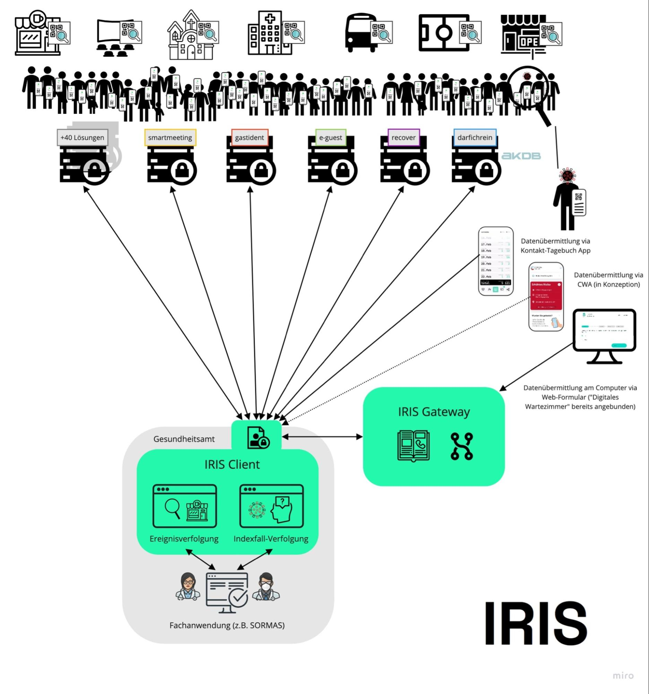

# 2 Kurzübersicht: Wie funktioniert IRIS?

IRIS besteht aus:

 * Zentralen Komponenten, die eine dezentrale Verbindung zwischen der Applikation und dem Gesundheitsamt vermitteln. Hier sind alle teilnehmenden digitalen Lösungen „registriert“. Über die dezentralen Verbindungen werden alle Anfragen aus den Gesundheitsämtern an die angeschlossenen Lösungen übertragen und entsprechend auch deren Daten entgegengenommen. 
 * Einer Benutzerschnittstelle in den Gesundheitsämtern (Client), über die Mitarbeitende die erfassten Daten der Bürger*innen und Einrichtungen anfragen, abrufen und filtern können. Hier wird eine Sicherheitsbarriere zwischen dem Internet und dem Netz des Gesundheitsamts aufgebaut.

_Die Grafik zeigt die Anwendungsvielfalt anhand unterschiedlicher Einrichtungen und unterschiedlicher Optionen eines Corona-Infizierten, digital bei der Kontaktverfolgung zu unterstützen._

