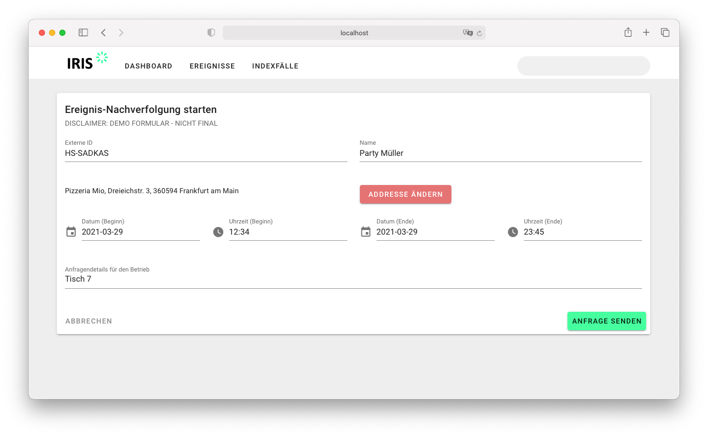

## 3.2 Funktionsüberblick Ereignis-Nachverfolgung

Im Bereich Ereignis-Nachverfolgung bietet IRIS die Möglichkeiten:

* Eine neue Ereignis-Nachverfolgung zu starten
* Offene Ereignis-Nachverfolgungen einzusehen
* Übertragene Daten aus einer Ereignis-Nachverfolgung zur Weiterbearbeitung zu übernehmen

")
_Starten einer Ereignis-Nachverfolgung (Screenshot enthält Beispiel- oder Testdaten)_

### 3.2.1 Starten einer neuen Ereignis-Nachverfolgung

Nach dem Starten einer neuen Ereignis-Nachverfolgung kann der Mitarbeitende des Gesundheitsamts eine einfach zu nutzende Suchfunktion zum Auffinden der Einrichtungen aufrufen.

*Alle Einrichtungen, die digital über die angeschlossenen Lösungsanbieter Kontaktdaten erfassen, sind in einem digitalen Verzeichnis hinterlegt. Entsprechend genügen wenige Buchstaben, um eine Liste verfügbarer Orte anzeigen zu lassen. Beispiel: „Eiscafe Venezia“ könnte sicherlich über 50 Mal gelistet sein.

")
_Suche nach einem Betrieb (Screenshot enthält Beispiel- oder Testdaten)_

* Durch Anzeige der Adresse des Betriebs/der Einrichtung kann in IRIS der passende Eintrag ausgewählt werden. 
* Zur Abfrage müssen nun noch Datum und  Zeitfenster der zu übermittelnden Gästeliste eingegeben werden, optional kann auch noch eine Textnachricht an den Betrieb übermittelt werden. 

_Anfrage bei einem Betrieb (Screenshot enthält Beispiel- oder Testdaten)_

* Durch Anklicken von „Absenden“ wird die Einrichtung zur Herausgabe der Daten aufgefordert. (Dies passiert im Hintergrund durch eine Anfrage an den Lösungsanbieter, der die Daten verschlüsselt speichert. Der Lösungsanbieter leitet die Anfrage an den Einrichtung weiter – damit dieser eine Freigabe erteilen kann. Hier wird transparent die Information weitergereicht, dass die Anfrage von einem Gesundheitsamt gestartet wurde.)
* Die Einrichtung muss die Datenfreigabe erteilen, diese Freigabe ermöglicht dem Lösungsanbieter die Verschlüsselung der Daten für das anfragende Gesundheitsamt anzupassen, so dass nur dieses die Daten auch wieder entschlüsseln kann. 

### 3.2.2 Prüfen offener Ereignis-Nachverfolgungen

* In einer übersichtlichen Liste werden gerade alle vom Gesundheitsamt angefragten Ereignis-Nachverfolgungen gelistet. 
* Hier ändert sich der Status eines Eintrags, sobald eine angefragte  Einrichtung die Daten für das Gesundheitsamt freigegeben hat.
* Eine Filter- und Sortierfunktion erleichtert die Übersicht.

")
_Offene Ereignis-Nachverfolgungen (Screenshot enthält Beispiel- oder Testdaten)_

### 3.2.3 Weiterbearbeitung bereitgestellter Daten

Die freigegebenen Daten einer Einrichtung können in IRIS zur Voransicht geöffnet werden.

* In der Voransicht hat der Mitarbeitende des Gesundheitsamts die Möglichkeit, die enthaltenen Kontakte manuell an- oder abzuwählen. Dies ist deshalb erforderlich, weil es z.B. doppelte Einträge oder andere Unstimmigkeiten geben kann. So kann das Gesundheitsamt eine übersichtliche Vorauswahl treffen.
* Insbesondere ist eine Abwahl wichtig, da nicht alle zum selben Zeitpunkt anwesenden Personen automatisch Kontakte ersten oder zweiten Grades sind. In der Regel sind Einrichtungen in Bereiche (z.B. Tische bei der Gastronomie) unterteilt. Hier liegt es im Ermessen des Gesundheitsamtsmitarbeitenden zu entscheiden, welche Daten ins nachgelagerte System übernommen werden sollten. Es steht natürlich auch frei, alle Einträge der Liste zu übernehmen.
* Nach der Anwahl der zu übernehmenden Daten können diese an die nachgelagerte Fachanwendung übergeben werden.
* Hier stehen als Optionen derzeit eine Schnittstelle mit SORMAS und ein JSON/CSV-Export zur Verfügung. In Planung sind mögliche Anbindungen an weitere Systeme wie bspw. Octoware,  Äskulab21, ISGA, Mikado, o.a. bzw. Eigenentwicklungen, sofern diese Anwendungen entsprechende Funktionen haben oder entwickeln.
* In SORMAS werden automatisch die entsprechenden Aufgaben für die Kontaktnachverfolgung zur Weitergabe an entsprechende weitere Mitarbeitende erstellt.Dies erleichtert ggf. die Koordinierung innerhalb des Gesundheitsamts.

")
_Datenauswahl zur Übernahme in die Fachanwendung (Screenshot enthält Beispiel- oder Testdaten)_

