# 4 Typisches Ende-zu-Ende Anwendungsszenario

## 4.1 Beispiel: Wochenende der Familie Schmitz

**Am Samstag ist die Familie unterwegs!**
<table>
  <tr>
   <td>Peter Schmitz bringt Sohn Louis nachmittags zum Fußballtraining und schaut zu. 
     

       Mit seinem Handy fotografiert er einen QR Code am Sportplatz und klickt „Check in“.
   </td>
   <td style="width: 250px;"> 

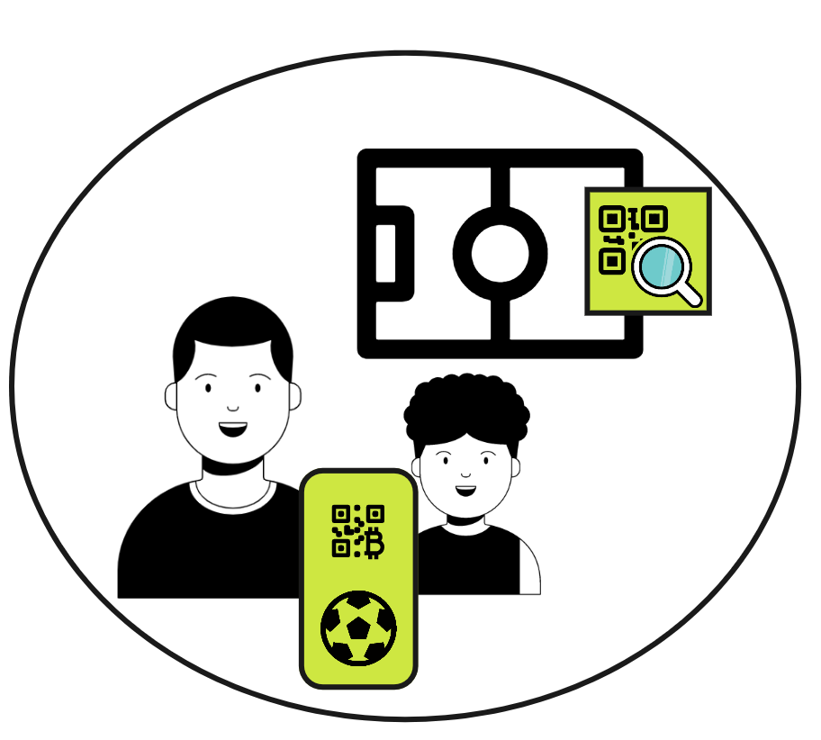

   </td>
  </tr>
   <tr>
   <td>

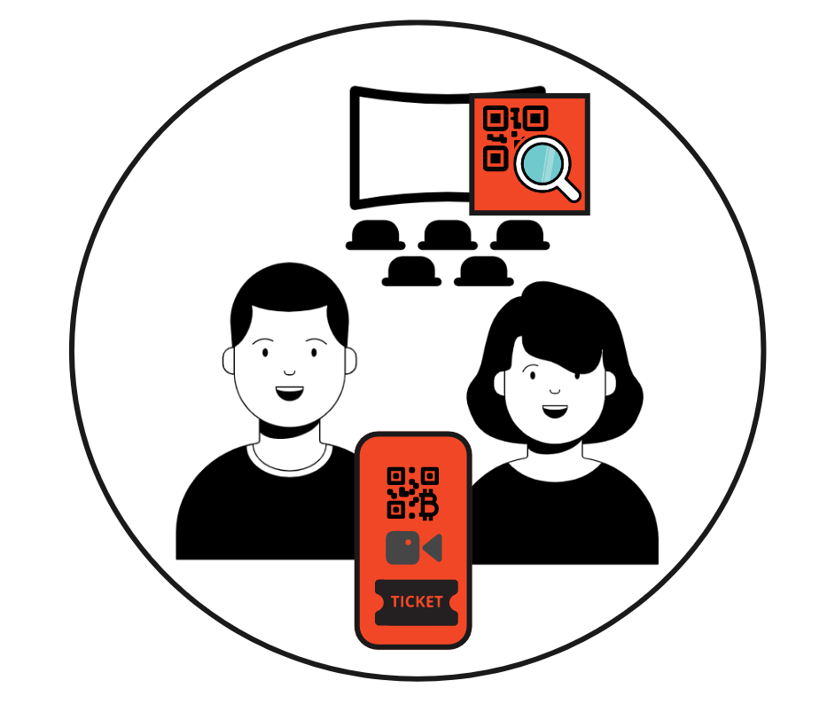

   </td>
   <td>
  Danach geht Peter mit seiner Frau Anouk ins Kino. Mit seinem Handy klickt Peter in der Ticket-App am Sitzplatz im Kino „Platz genommen“
   </td>
  </tr>
  <tr>
   <td>Abends geht die Familie Pizza-Essen in die Pizzeria Mio. Mit seinem Handy fotografiert Peter einen QR-Code am Tisch und klickt „Check-in“
   </td>
   <td style="width: 250px;"> 

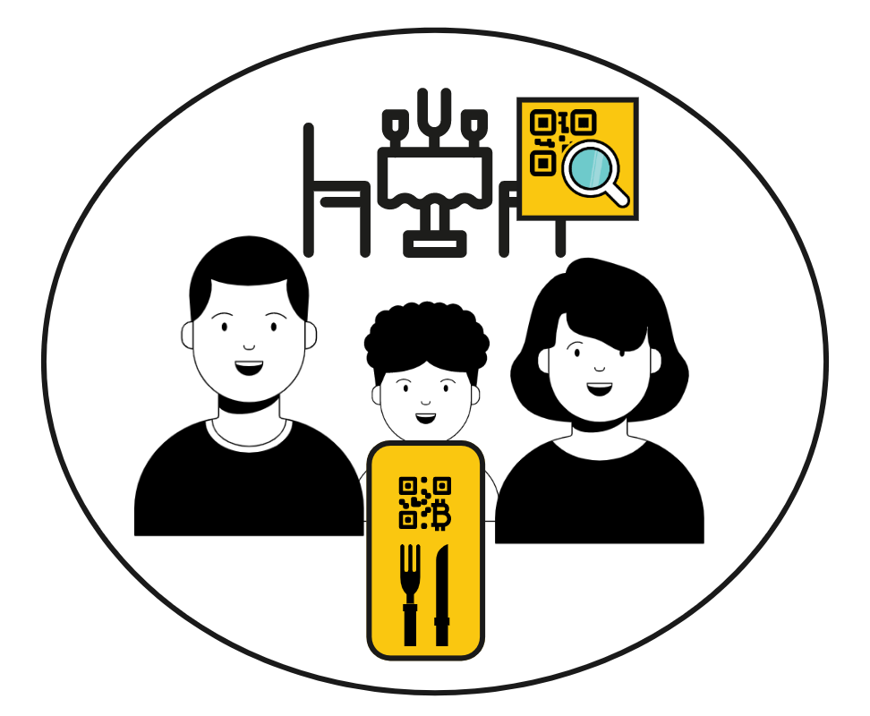

   </td>
  </tr>
</table>

**Sonntag**
<table>
  <tr>
   <td> Am Morgen besucht Peter Schmitz ein Testzentrum und wird Corona-Positiv getestet.
   </td>
   <td style="width: 250px;"> 

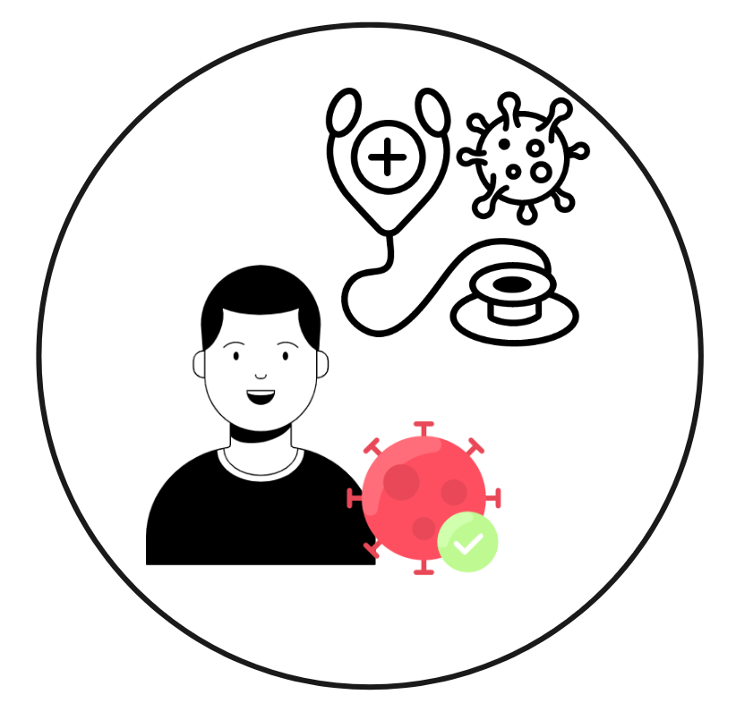

   </td>
  </tr>
   <tr>
   <td style="width: 250px;">

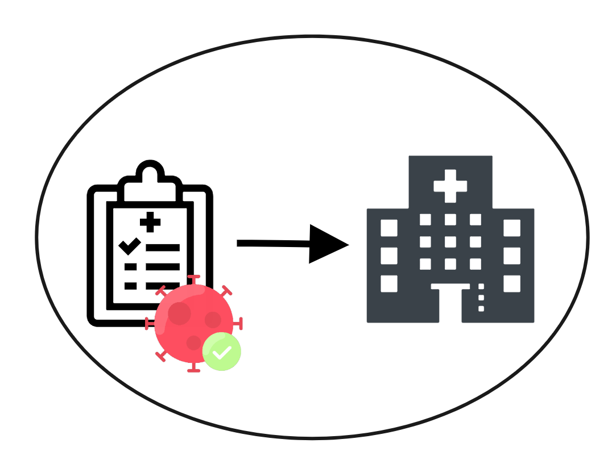

   </td>
   <td>
  Über das ans Testzentrum angeschlossene Labor wird das zuständige Gesundheitsamt durch die bestehenden Systeme informiert und im dortigen System als “Indexfall” erfasst. 
   </td>
  </tr>
  </table>

## 4.2 Ablauf: Peter Schmitz ist Corona-positiv 

#### Gesundheitsamt ruft Peter an

<table>
  <tr>
   <td>Ein/e GesundheitsaufseherIn im Gesundheitsamt kontaktiert Peter zunächst telefonisch. Peter wird offiziell unter häusliche Isolation (Quarantäne) gestellt.

Hier wird Peter medizinisch zu Symptomen befragt und es findet eine kurze Beratung statt, Peter wird aber auch um Angabe/Verifikation seiner E-Mail-Adresse gebeten, und er bekommt einen Token mitgeteilt.
   </td>
   <td style="width: 250px;">
    

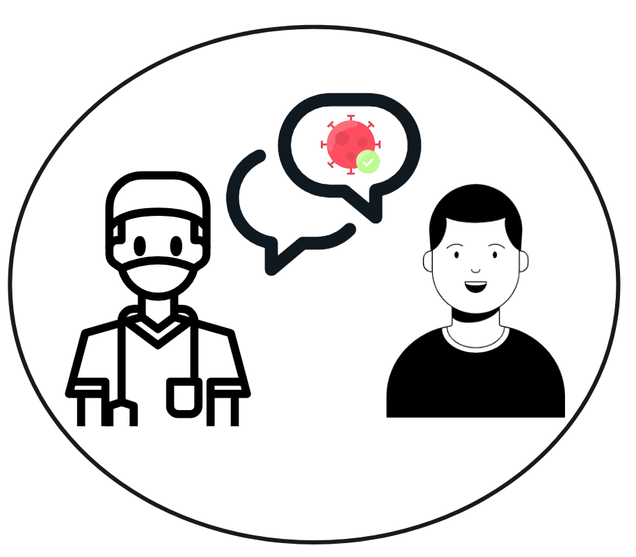

   </td>
  </tr>
</table>

#### Gesundheitsamt fordert Infos zu Kontakten der letzten Tage

<table>
  <tr>
   <td>Unter Peters registrierter Indexfall-Nummer startet die/der GesundheitsaufseherIn in der IRIS-Oberfläche die Indexfall-Verfolgung. 

Peter erhält eine E-Mail, die ihn bittet, Angaben zu Kontakten der letzten Tage zu machen. In der E-Mail befindet sich ein Link.
   </td>
   <td style="width: 250px;">

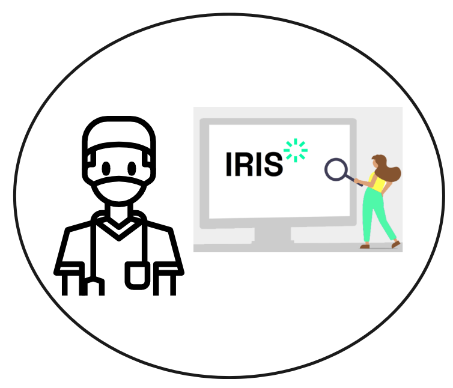

   </td>
  </tr>
</table>

#### Peter übermittelt die Daten über ein Web-Formular am Computer

<table>
  <tr>
   <td style="width: 250px;">

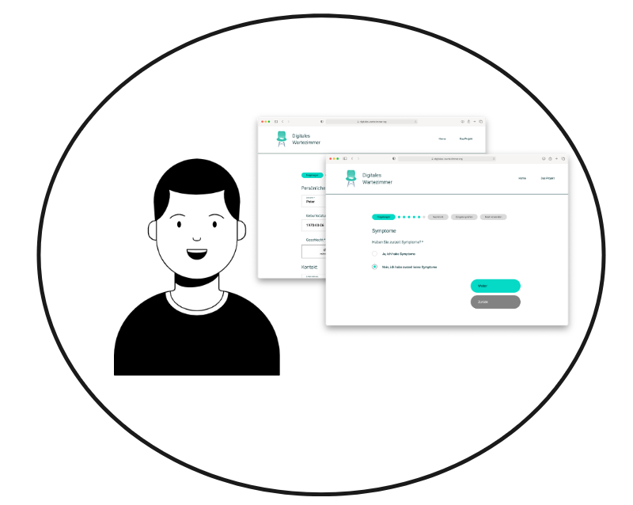

   </td>
   <td>Da Peter keine Kontakttagebuch-App verwendet, kann er alle Informationenüber über ein sicheres Web-Formlar (“Digitales Wartezimmer”) eingeben und die Daten mit seinem Token fürs Gesundheitsamt freigeben. 

Würde Peter eine Kontakttage- buch-App (z.B. Coronika) nutzen, ginge das auch sehr einfach darüber und bald sogar auch über die Corona-Warn-App.

Über den Token wird auch sichergestellt, dass das Gesundheitsamt die Daten eindeutig zu Peters Fall zuordnen kann.
   </td>
  </tr>
</table>

#### Gesundheitsamt kann die Daten abrufen

<table>
  <tr>
   <td>Die/der GesundheitsaufseherIn wird nun innerhalb von IRIS informiert, dass Peters Daten vorliegen. Er sieht eine Übersicht aller Kontakte und Orte und kann selber entscheiden, welche davon Relevanz haben. 

Dies sind in unserem Fall: 
* Direktkontakte: Anouk und Louis 
* Kontaktorte (Einrichtungen):  Sportplatz, Kino, Pizzeria
   </td>
   <td style="width: 250px;">

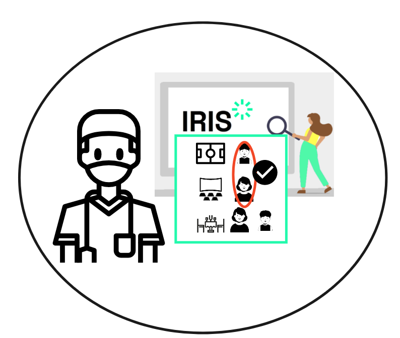

   </td>
  </tr>
</table>

#### Gesundheitsamt kann Peters Daten sichten & übernehmen

<table>
  <tr>
   <td style="width: 250px;">

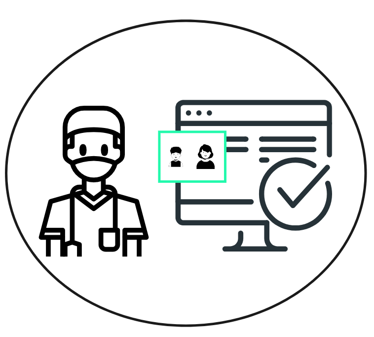

   </td>
   <td>Die/der GesundheitsaufseherIn überführt die ausgewählten Daten in das nachgelagerte Software-System. 

Weitere Prozesse werden aus diesem angestoßen: Gespräch mit Anouk, ggfs. Absonderungsbescheide für Anouk & Louis und die Aufforderung zum Test.
   </td>
  </tr>
</table>

#### Gesundheitsamt überprüft die Orte, an denen sich Peter aufgehalten hat

<table>
  <tr>
   <td>
    Die/der GesundheitsaufseherIn kann nun erneut IRIS nutzen, um Informationen darüber abzufragen, wer sich zu der betreffenden Zeit ebenfalls an den besuchten Orten aufgehalten hat. 

Obwohl an allen Aufenthaltsorten entsprechende Hygienekonzepte umgesetzt sind, interessiert in Peters Fall besonders die Pizzeria, da Peter selbst angegeben hatte, dass es dort an der Theke etwas enger zuging.
   </td>
   <td style="width: 250px;">

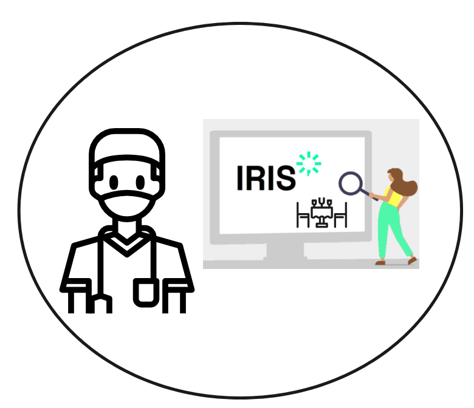

   </td>
  </tr>
</table>

#### Gesundheitsamt fordert Infos von der Pizzeria an

<table>
  <tr>
   <td style="width: 250px;">

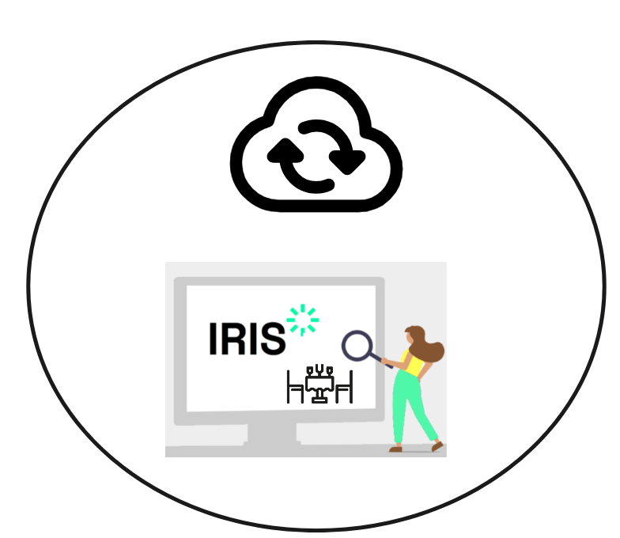

   </td>
   <td>Hierzu startet die/der Gesundheits- aufseherIn in IRIS eine neue “Ereignis-Nachverfolgung”. Eine intuitiv zu bedienende Suchmaske ermöglicht das schnelle Finden über den Namen - denn IRIS funktioniert wie eine Internet-Suche: 

Alle angebundenen Lösungen stellen ein Register der deutschlandweit digital angebundenen Begegnungsorte zur Verfügung. Bei Eingabe von “Pizzeria Mio” erscheinen 12 Einträge, die/der GesundheitsaufseherIn kann anhand des Ortes die richtige auswählen.
   </td>
  </tr>
</table>

<table>
  <tr>
   <td>Nun grenzt die/der GesundheitsaufseherIn noch die richtige Uhrzeit ein und startet die Abfrage. Im Hintergrund kontaktiert IRIS nun den den Lösungsanbieter, mit dem die Pizzeria Mio ihre Gästedaten erfasst.

Die digitale Lösung wiederum kontaktiert automatisch die Pizzeria Mio, dass eine Anfrage vom Gesundheitsamt vorliegt. Pizzeria Mio erteilt gemäß Mitwirkungspflicht eine Freigabe für die Daten – und diese werden mit dem Schlüssel des anfragenden GA verschlüsselt und durch eine von IRIS vermittelte Verbindung übertragen. So sieht auch der Betrieb die Daten nicht, nur das anfragende Gesundheitsamt kann die Daten entschlüsseln.
   </td>
   <td style="width: 250px;">

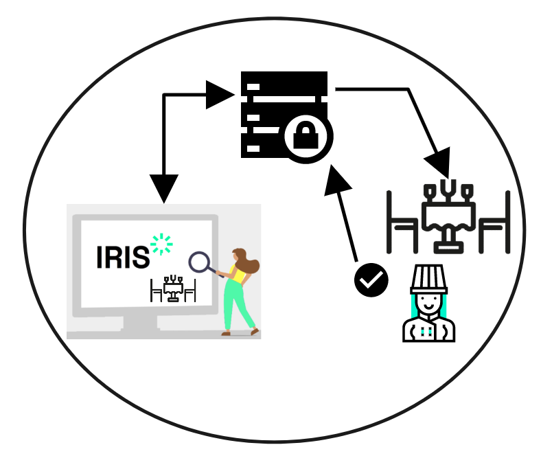

   </td>
  </tr>
</table>

#### Gesundheitsamt kann die Daten der Pizzeria abrufen

<table>
  <tr>
   <td style="width: 250px;">

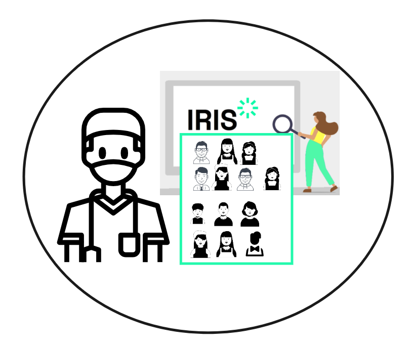

   </td>
   <td>Die/der GesundheitsaufseherIn wird nun wieder innerhalb von IRIS informiert, dass die Daten aus der Pizzeria vorliegen. 

Durch Anklicken werden diese für die/den GesundheitsaufseherIn entschlüsselt – und er/sie kann alle Besucher sehen, die zur gleichen Zeit wie Peter in der Pizzeria waren.
   </td>
  </tr>
</table>

#### Gesundheitsamt kann Daten aus der Pizzeria sichten & übernehmen

<table>
  <tr>
   <td>Erneut kann die/der GesundheitsaufseherIn nun selber entscheiden, welche der Daten ins nachgelagerte System übertragen werden sollen. Es wird sichtbar, dass Peter mit Anouk und Louis im Barbereich gesessen hat. 

Ebenfalls im Barbereich waren zur selben Zeit zwei weitere Gäste und der Bar-Mitarbeitende. Diese wählt die/der GesundheitsaufseherIn aus, um sie ins nachgelagerte System zu überführen.
   </td>
   <td style="width: 250px;"> 

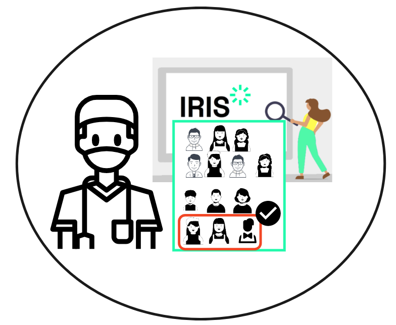

   </td>
  </tr>
</table>

