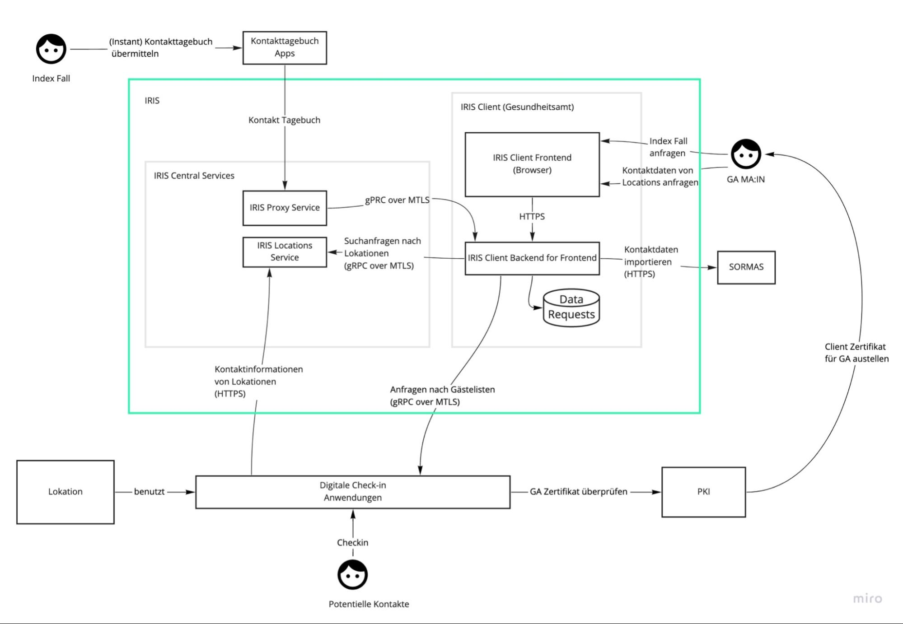

# 5 Wie wird IRIS betrieben?

## 5.1 Technische Betreibergrafik

_C2-Container-Diagramm_

## 5.2 Technische Informationen

### 5.2.1 Gateway

Die zentrale Komponente wird einmal gehostet*. Es dient als Vermittler von dezentralen Verbindungen zwischen Apps und den IRIS–Clients in den Gesundheitsämtern, um die verschlüsselten Daten weiterzugeben, und verteilt diese an die IRIS-Clients weiter. 

Das Gateway hält zudem einen nur für Gesundheitsämter zugänglichen Suchindex vor, in dem an IRIS-kompatible Apps angeschlossene Betriebe und Einrichtungen hinterlegt sind. Hierüber können die Gesundheitsämter elektronische Datenanfragen an den Betrieb bzw. die Einrichtung senden, welche vom Gateway dann automatisch übermittelt werden. Oft liegen die angefragten Daten dem Gesundheitsamt dann binnen weniger Minuten vor.

Das Gateway verfügt über einen öffentlichen Endpunkt, welcher aus dem Internet zugänglich sein muss.

Außerdem verfügt das Gateway über einen privaten Endpunkt, welche für die Clients zugänglich sein muss. Dieser Endpunkt sollte idealerweise nicht aus dem Internet erreichbar sein, darf es aber aufgrund der verwendeten Authentifizierung der Clients durch Client-Zertifikate auch sein.

Bei dem Gateway handelt es sich um Applikationen, die als Docker Images bereitgestellt werden.

    _*Das Gateway wird in einem staatlichen RZ (AKDB) gehostet._

### 5.2.2 Client

Den IRIS-Client gibt es für jedes Gesundheitsamt ein Mal. Die Clients können zentral in einem Rechenzentrum gehostet werden, solange sichergestellt ist, dass aus dem Gesundheitsamt auf den Client zugegriffen werden kann. 

Wenn ein Gesundheitsamt SORMAS verwendet, muss sichergestellt sein, dass der Client auf SORMAS zugreifen kann. Da die REST-APIs der SORMAS-Instanzen derzeit i.d.R. aus dem Internet zugänglich sind, sollte dies keine besondere Herausforderung darstellen. Der Zugriff auf SORMAS erfolgt per vorhandener REST-API.

Sollte das Gesundheitsamt eine andere Fachanwendung zur Weiterbearbeitung der Daten verwenden, so muss auch diese entsprechend erreichbar sein .

Da der IRIS-Client die vom Gateway erhaltenen Daten entschlüsselt und die Mitarbeiter im Gesundheitsamt auf den Client per Web-Oberfläche zugreifen, ist eine Firewall, die den Zugriff durch Dritte verhindert empfehlenswert, aber nicht zwingend notwendig, da der Client selbstverständlich eine Authentifizierung (Login) verwendet.

Bei dem Client handelt es sich um Applikationen, die als Docker Images bereitgestellt werden.

## 5.3 Installation, Support, Weiterentwicklung

Die Installation der Iris-Clients für Gesundheitsämter kann erfolgen durch:

* Den Betreiber des kommunalen Rechenzentrums, in dem der Client betrieben werden soll
* Einen „IRIS Trusted Partner“, der in der Regel auch noch weitere digitale Services bereitstellt, gerne erteilen wir hier weitere Auskünfte
* Einen empfohlenen Anbieter, gerne erteilen wir hier weitere Auskünfte
* Für weitere Funktionsbedarfe: sprechen Sie uns an, bzw. wenden Sie sich auch gern an das Entwicklungsteam auf GitHub. Dort gibt es (in Kürze) auch ein Forum.
* Weitere Unterlagen werden aktuell erstellt und stehen in Kürze bereit

## 5.4 Datenschutz- und Sicherheitskonzept

Ein umfassendes IRIS Datenschutzkonzept, die Risikoabschätzung sowie die geplanten Penetrationstest sind in aktuell (Stand 17.05.21) in Umsetzung. Wir werden hier versuchen so viel wie möglich bereits parallel zur Fertigstellung der Entwicklung zu erstellen.

Viele der angebundenen digitalen Lösungen sind bereits seit bis zu 12 Monaten in Betrieb und entsprechende datenschutzrechtliche Prüfungen und Bewertungen liegen vor.

Im Rahmen der Anbindung findet ein Onboarding-Prozess statt, bei dem grundlegende technische Fragen und Daten- sowie IT-Sicherheitskonzepte abgefragt werden. Außerdem verpflichten sich die Verantwortlichen der anzuschließenden Lösungen den Code of Conduct einzuhalten.

IRIS übernimmt keinerlei inhaltliche Prüfung der Unterlagen. Die Anbindung der Applikationen leitet sich aus den CoronaSchutzVO der Länder ab.

## 5.5 Anbindung von weiteren digitalen Lösungen 

Die vorläufige Spezifikation der API und Schnittstellen-Spezifikation zum Anbinden weiterer digitaler Lösungen ist verfügbar unter folgendem Link:
[https://github.com/iris-connect/eps](https://github.com/iris-connect/eps) 

die Dokumentation des Anschlusses unter https://iris-connect.github.io/eps/docs/

## 5.6 Expertise des IRIS Entwicklerteams

Das Entwickler-Team hinter IRIS setzt sich cross-funktional zusammen und besitzt eine breite praktische Erfahrung und detaillierte Kenntnisse in den Bereichen:

* Umsetzung von CoronaSchVO-konformen Kontaktdatenerfassungs-Lösungen, welche persönliche Daten verarbeiten
* Datenschutz und IT-Sicherheit
* Implementierung und Roll-out von reichweitenstarken Kontakterfassungs-Lösungen mit direkter Anbindung an das Gateway (in Kooperation mit weiteren Lösungen)
* Kenntnis der Architektur und des Source-Code der Fachanwendung SORMAS zur sicheren, schnellen und störungsfreien Integration von SORMAS mit dem IRIS System (Client/Gateway) und den damit verbundenen Funktionen.
* Kenntnisse über weitere Fachanwendungen wie z.B. BaySIM sowie Prozess- und Datenmigrationen von Bestands- in Zielsysteme
* Arbeitsweise im Gesundheitsamt bei Ausbruchsermittlung und Kontaktpersonen-Nachverfolgung und die verschiedenen Nutzerrollen und Zuständigkeiten, insbesondere beim Einsatz von SORMAS
* Geläufige medizinische und infektionsepidemiologische Terminologie

**_Diese Kombination aus IT-KnowHow mit der praktischen Realität zeichnet IRIS aus._**

# 6 Vertragspartnerin
Vertragspartnerin ist die Björn Steiger Stiftung